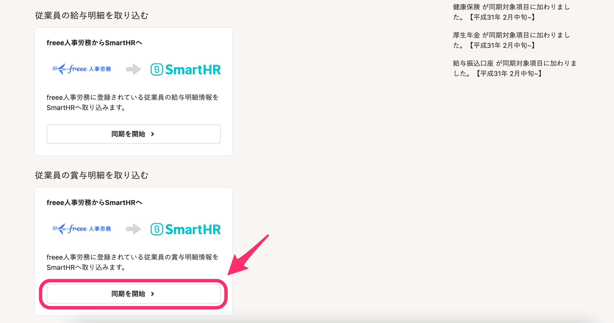
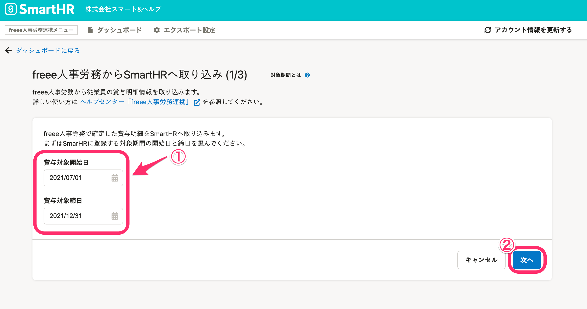
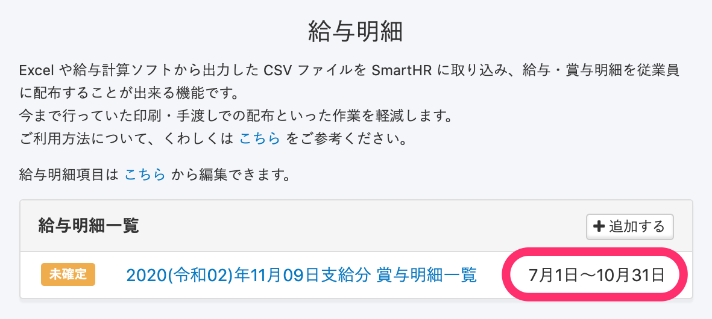
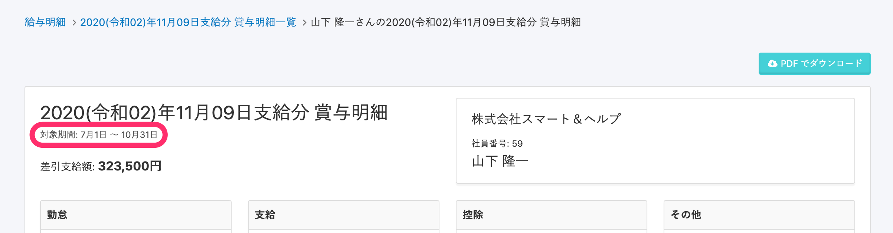
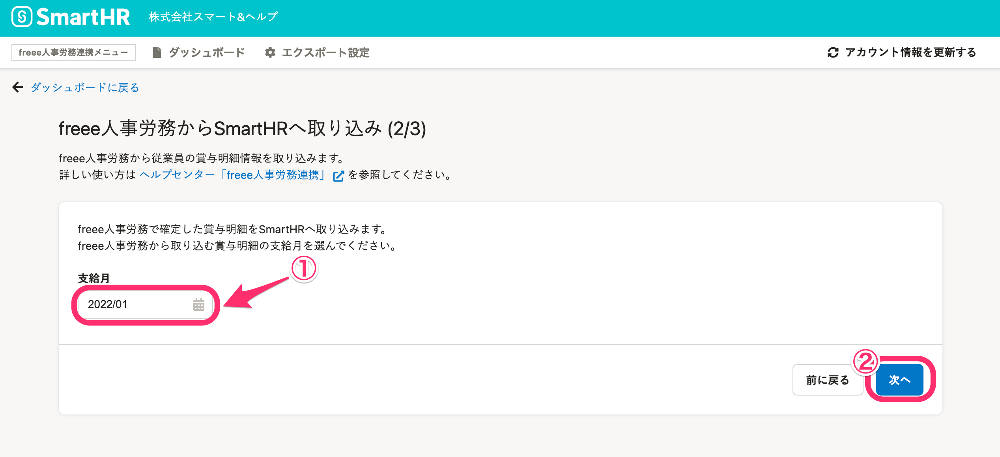
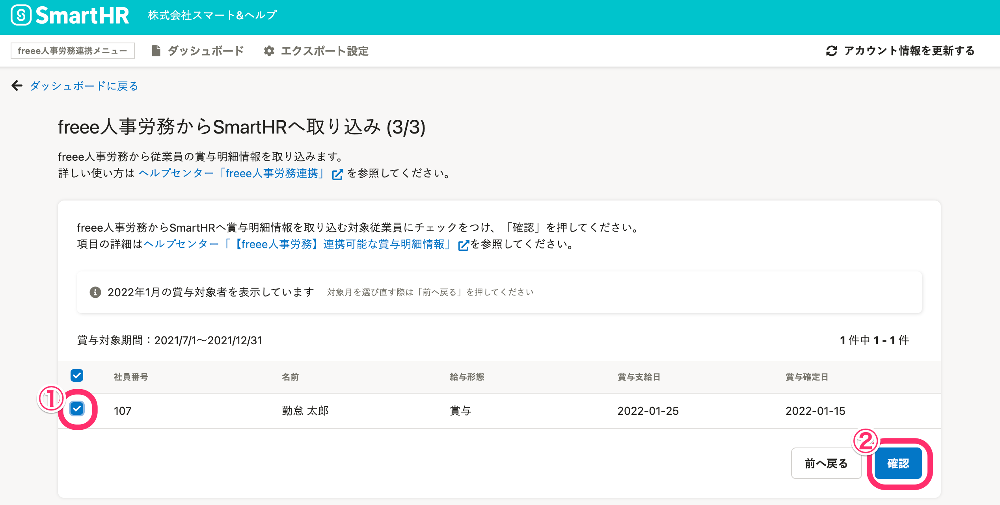
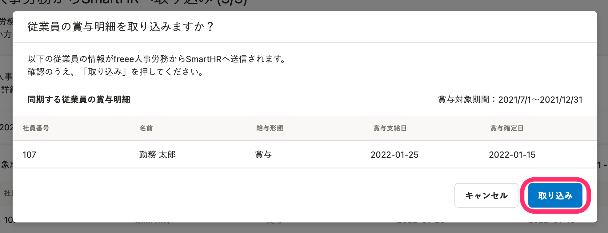
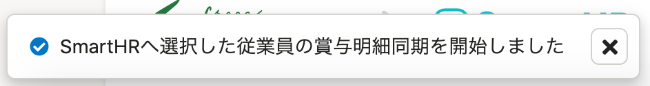
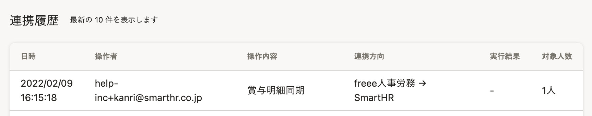
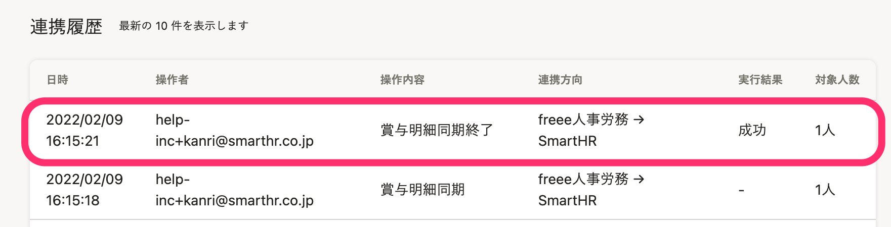

人事労務管理ソフト[freee人事労務](https://www.freee.co.jp/hr/)と連携し、freee人事労務の賞与明細情報をSmartHRへ取り込む手順を説明します。

賞与明細情報を連携するには、事前にインストールと連携設定を済ませてください。

また、連携可能な賞与明細情報は、以下のヘルプページを参照してください。

[【freee人事労務】インストール方法と連携設定（初回設定）](https://knowledge.smarthr.jp/hc/ja/articles/360026262773)

[【freee人事労務】連携可能な賞与明細情報について](https://knowledge.smarthr.jp/hc/ja/articles/360058163214)

:::alert
 **【1】当機能は、freee人事労務の利用プランが「ミニマムプラン」以上の場合に利用できます。** 
有料プランの利用可能期間が終了している場合や、無料お試しプランの利用期間を過ぎている場合は「無料プラン」となり、利用できません。利用プランについては、freee人事労務へお問い合わせください。
 **【2】SmartHRへ取り込めるのは、freee人事労務で確定した賞与明細のみです。** 
未確定の賞与明細は取り込みできないため、事前に確定してから連携してください。
:::

# 1.［機能］>［freee人事労務連携］をクリック

SmartHRにログインし、トップページの左側にある **［機能］>［freee人事労務連携］** をクリックすると、freee人事労務連携ダッシュボード画面に移ります。

# 2.［従業員の賞与明細を取り込む］項目の［同期を開始>］をクリック

freee人事労務連携ダッシュボード画面を下にスクロールし、 **［従業員の賞与明細を取り込む］** 項目にある **［同期を開始>］** をクリックすると、 **［賞与対象開始日と締日］** の設定画面が表示されます。

# 3.［賞与対象開始日］と［賞与対象締日］を指定し、［次へ］をクリック

 **［賞与対象開始日］** と **［賞与対象締日］** を指定し、画面右下にある **［次へ］** をクリックすると、支給月を選択する画面が表示されます。

:::tips
指定した **［賞与対象開始日］** と **［賞与大賞締日］** は、SmartHRで表示している **［対象期間］**  に反映され、給与明細一覧画面や賞与明細画面では以下の通り表示されます。
■給与明細一覧画面での表示

■賞与明細画面での表示

:::

# 4.［支給月］を指定し、［次へ］をクリック

 **［支給月］** を指定し、画面右下にある **［次へ］** をクリックすると、対象の従業員を選択する画面が表示されます。

# 5\. 対象の従業員にチェックを入れ、［確認］をクリック

社員番号の左にあるチェックボックスにチェックを入れて対象となる従業員を選択し、画面右下にある  **［確認］** をクリックすると、「従業員の賞与明細を取り込みますか？」というダイアログが表示されます。

従業員の選択画面には、前ページで指定した **［支給月］** に賞与明細がある従業員が表示されます。

内容を確認して **［取り込み］** をクリックすると、freee人事労務連携ダッシュボード画面に切り替わります。

freee人事労務連携ダッシュボード画面左下に「SmartHRへ選択した従業員の賞与明細同期を開始しました」というメッセージが表示され、連携履歴に **［賞与明細同期］** の履歴が表示されます。

# 6\. 画面を更新し、実行結果を確認する

しばらく時間をおいてから、画面を再読み込みしてください。

同期が終了すると、連携履歴に **［賞与明細同期終了］** の履歴が表示され、 **［実行結果］** を確認できます。

また、同期終了後は、管理者の登録メールアドレスへ取り込み結果が記載されたメールが配信されます。

**成功の場合**

トップページにある **［給与明細］** から、選択した従業員の賞与明細が取り込まれていることを確認してください。

取り込んだ賞与明細をSmartHRで確定・公開する手順は、以下のヘルプページを参照してください。

:::related
[給与明細機能とは（従業員への公開と通知）](https://knowledge.smarthr.jp/hc/ja/articles/360026107314#toc--11)
:::

**失敗の場合**

管理者に送られる、取り込み結果が記載されたメールを確認してください。

取り込みに失敗した場合は、失敗となった原因が記載されます。

記載された内容を参考に修正し、再度、取り込んでください。

| 件名 | freee人事労務からSmartHRへ賞与明細の取り込みが失敗しました｜**\[会社名\]** |
| --- | --- |
| 本文 |   いつも SmartHRをご利用いただきありがとうございます。  freee人事労務からSmartHRへの賞与明細の取り込みに失敗しました  \------------------------------------------------- SmartHRに存在しない従業員が指定されています  また、再試行しても解消しない場合は、freee人事労務連携アプリ([https://freee.smarthr.plus](https://freee.smarthr.plus/)) に再度アクセスしてから、画面左上のSmartHRロゴをクリックしてSmartHRトップページの画面右下チャットアイコンよりお問い合わせください。 \------------------------------------------------- ※ freee人事労務連携では、SmartHRとfreee人事労務の仕様の違いにより以下の項目は完全一致の同期とならない場合がございます。あらかじめご了承ください。  【残業実績】 freee人事労務上の「残業手当合計」の内訳を、SmartHRでは「残業代」の支給項目として取り込んでおります。 尚、実績時間の内訳は、勤怠項目に取り込んでおります。  \-------------------------------------------------  このメールは SmartHR をご利用いただいているお客さまに送信しています。 送信専用アドレスのため、ご返信いただいても、ご返事ができません。 あらかじめご了承ください。   |
