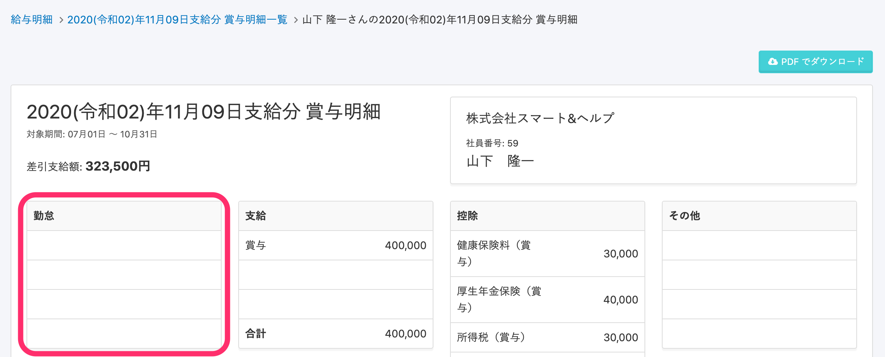

freee人事労務とSmartHR間で同期できる賞与明細情報の項目は以下の通りです。

| SmartHR上の項目名 |  | freee人事労務上の項目名 |
| :-- | :-- | :-- |
| 対象期間 |  | freee人事労務に該当項目なし ※賞与明細連携時に入力する「賞与対象開始日」「賞与対象締日」が該当します。 |
| 差引支給額 |  | 差引支給額 |
| 支給  | 賞与 | 賞与 |
| 控除    | 健康保険料 | 健康保険料 |
| 厚生年金保険料  | 厚生年金保険料 |
| 所得税 | 所得税 |
| 雇用保険料 | 雇用保険料 |
| 介護保険料 | 介護保険料 |
| その他課税対象支給額    |  | 総支給額  |

また、勤怠情報は連携されませんが、SmartHRの賞与明細（給与明細）のフォーマットの仕様上、勤怠の項目が空白で表示されます。

freee人事労務から連携する賞与明細情報に「SmartHRに登録されていない給与明細項目」があった場合は、取り込みと同時に、給与明細項目も自動で登録されます。

:::tips
ただし、取り込みと同時に登録した項目の値が「0」の場合、SmartHRは給与明細項目の設定上、デフォルトで（0円の場合には表示しない）の状態で取り込まれます。
項目の表示/非表示など、登録された給与明細項目の設定手順については以下のヘルプページを参照してください。
:::
:::related
[給与明細項目を設定する](https://knowledge.smarthr.jp/hc/ja/articles/360026265193)
:::
