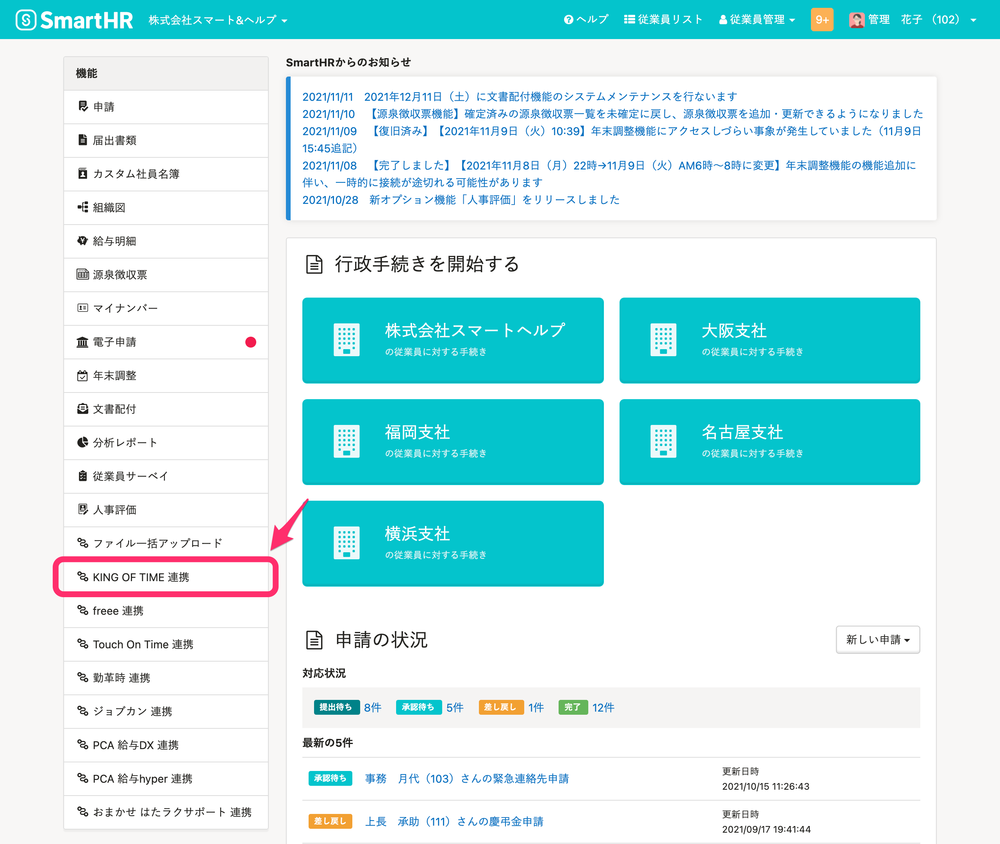
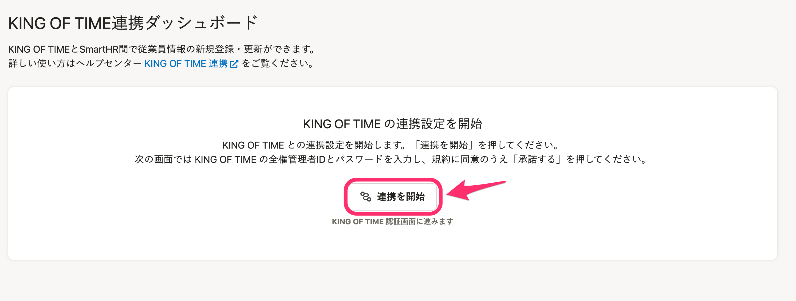
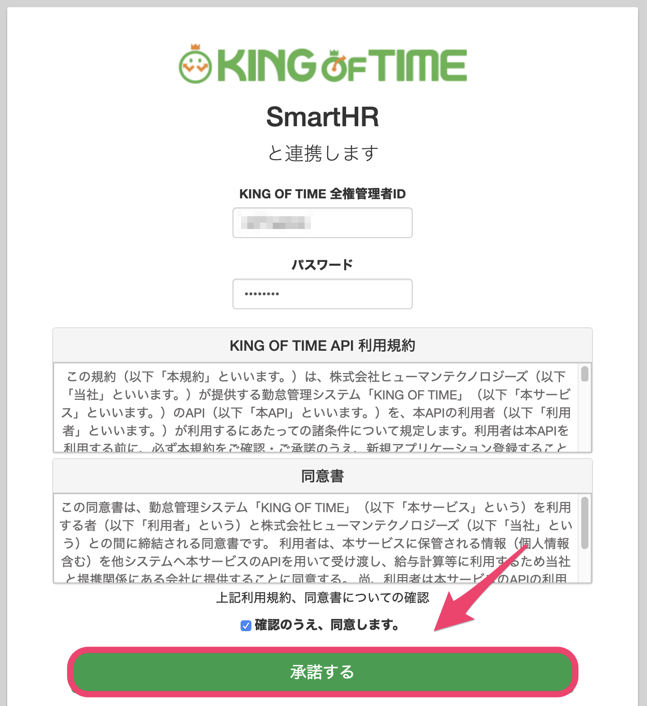
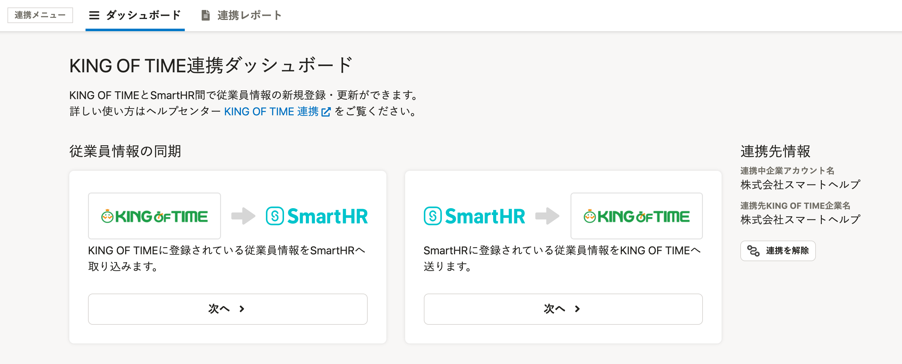

勤怠管理システム[KING OF TIME（キングオブタイム）](https://www.kingtime.jp/)と連携し、従業員情報の新規登録や更新が可能です。

初回のみ、下記の設定が必要です。

# 1\. ［外部システム連携］で、KING OF TIME 連携をインストール

管理者アカウントでSmartHRにログインし、 **［共通設定］>［外部システム連携］>［アプリケーション連携］** にある、KING OF TIME 連携の **［インストール］** をクリックすると、連携機能がインストールされます。

詳しくは下記のヘルプページを参照してください。

:::related
[他社のアプリケーションをインストールする](https://knowledge.smarthr.jp/hc/ja/articles/4405252726041)
:::

# 2\. トップページの［機能］にある［KING OF TIME 連携］をクリック

トップページ左側の **［機能］** 欄にある **［KING OF TIME 連携］** をクリックすると、連携画面が表示されます。

初回はアカウント情報の連携が必要なため、 **［**  **連携を開始］** をクリックして、KING OF TIMEの連携画面に進んでください。

# 3\. アカウントを連携する

KING OF TIMEの連携画面で、 **［KING OF TIME 全権管理者ID］** と **［パスワード］** （KING OF TIMEのパスワード）を入力し、規約に同意したうえで、  **［承諾する］** をクリックすると、アカウントが連携されます。

下記の画面が表示されたら、連携成功です。

実際に従業員情報を取り込む手順は下記のヘルプページを参照してください。

:::related
[【KING OF TIME】従業員情報を連携する](https://knowledge.smarthr.jp/hc/ja/articles/4403626515225)
:::
