勤怠管理システム[KING OF TIME（キングオブタイム）](https://www.kingtime.jp/)と連携し、従業員情報の新規登録や更新ができます。
連携対象となる従業員情報および、初回利用時に必要な連携設定については下記のヘルプページを参照してください。

:::related
[【KING OF TIME】連携可能な従業員情報](https://knowledge.smarthr.jp/hc/ja/articles/360026263633)
[【KING OF TIME】連携設定（初回のみ）](https://knowledge.smarthr.jp/hc/ja/articles/360026104974)
:::
:::alert
- KING OF TIMEのメンテナンス時間帯（8:30～10:00、17:30～18:30）は、連携機能を利用できません。
- 従業員情報の更新は、社員番号をキーにして連携します。
:::

# KING OF TIMEからSmartHRに取り込む

## 1\. SmartHRに管理者権限でログインする

SmartHRに管理者権限でログインします。

## 2.［KING OF TIME連携］をクリック

トップページ左の **［機能］** にある **［KING OF TIME連携］** をクリックすると、 **［KING OF TIME連携］** 画面に移ります。

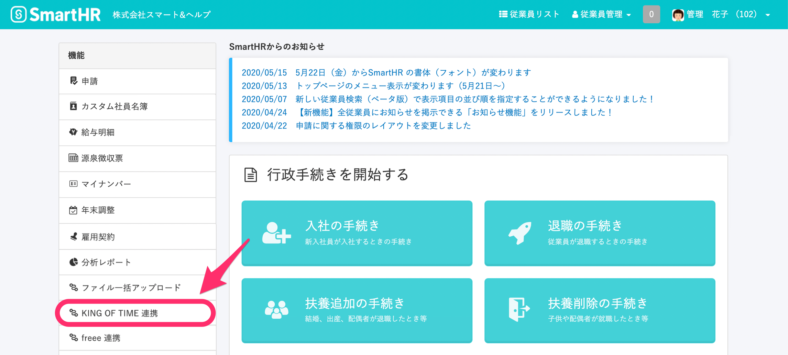

## 3\. KING OF TIME→SmartHRの［次へ >］をクリック

KING OF TIME→SmartHRの **［次へ >］** をクリックすると、従業員情報取得基準日の設定画面に移ります。

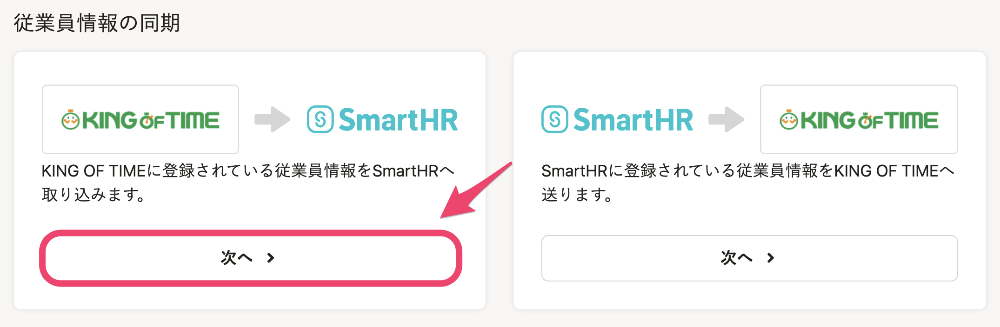

## 4\. 従業員情報取得基準日を指定して［次へ］をクリック

従業員情報取得基準日を指定して **［次へ］** をクリックすると、KING OF TIMEから従業員情報を取得します。

このタイミングでは、KING OF TIMEに登録されている従業員情報の一覧を取得するだけで、SmartHRへの取り込みは行なわれません。

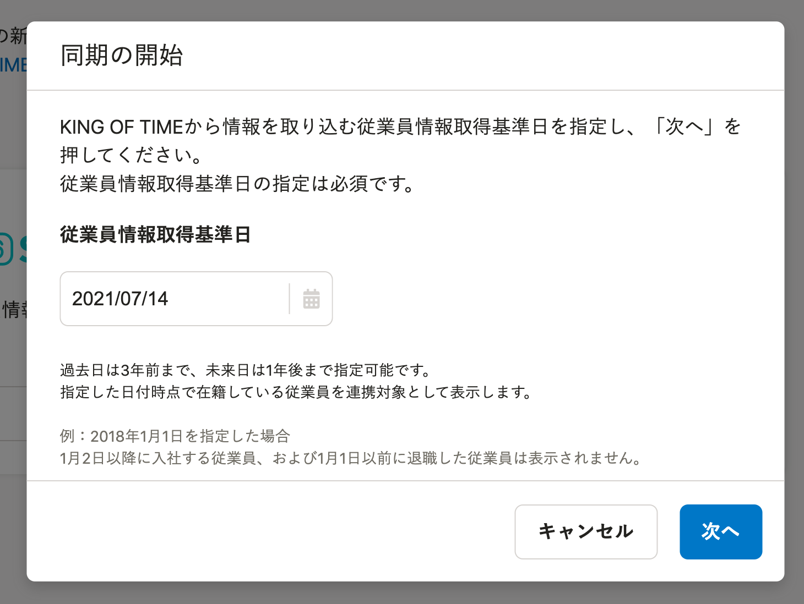

たとえば2018年1月1日を指定した場合、2018年1月2日以降に入社する従業員、および2018年1月1日以前に退職した従業員は表示されません。

## 5\. 従業員情報を取得後、［同期を開始→］をクリック

KING OF TIMEから、連携対象の従業員情報を取得する際、一定の時間がかかります。

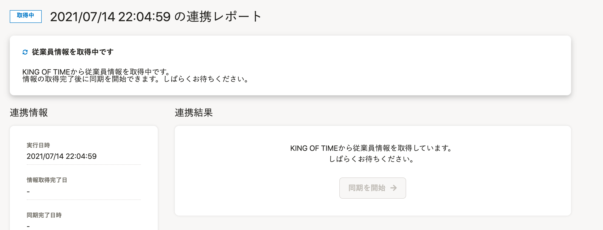

ステータスが **［取得中］** から **［同期待ち］** になるまでお待ちください。

ステータスが **［同期待ち］** になると、 **［同期を開始→］** をクリックできるようになります。

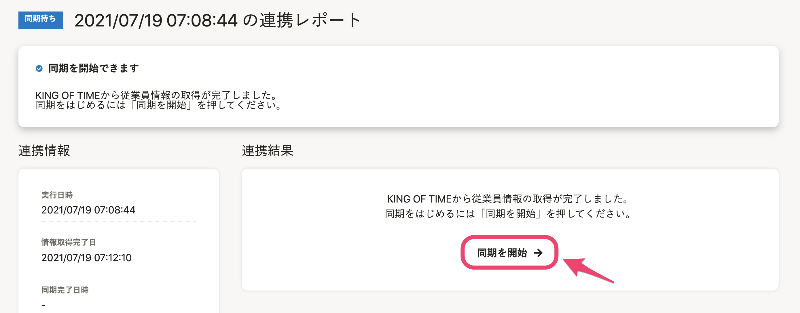

 **［同期を開始→］** をクリックすると、対象の従業員を選択する画面が表示されます。

## 6\. 同期対象の従業員を選択し、［同期を開始］をクリック

KING OF TIMEに登録されている従業員の一覧が表示されます。

SmartHRに情報を取り込む従業員にチェックを入れ、画面下部にある **［同期を開始］** をクリックすると、情報が取り込まれます。

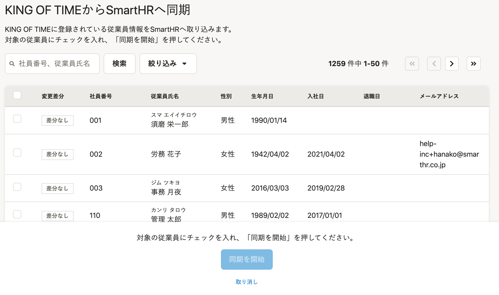

:::tips
従業員の一覧は、変更差分で絞り込みできます。
変更があった従業員のみ同期したい場合などにお使いください。
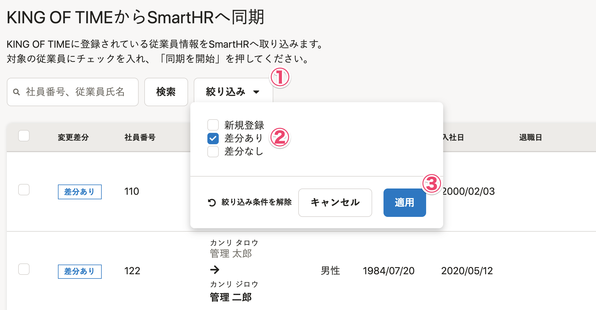
| **変更差分** | **説明** |
| --- | --- |
| 新規登録 | KING OF TIMEに従業員情報があるが、SmartHRにはない。 |
| 差分あり | SmartHRとKING OF TIMEの両方に従業員情報があるが、差分がある。 |
| 差分なし | SmartHRとKING OF TIMEの両方に従業員情報があり、差分がない。 |
:::

SmartHR側に新規で登録する従業員の場合は **［所属事業所］** を選択する必要があります。

この際、1つ前の画面で選択した従業員全員に対して、1つの所属事業所を設定します。

所属事業所が異なる場合は、所属事業者ごとに従業員を選択するか、取り込み後、SmartHR側で設定を変更してください。

# SmartHRからKING OF TIMEに送る

## 1\. SmartHRに管理者権限でログインする

SmartHRに管理者権限でログインします。

## 2.［KING OF TIME 連携］をクリック

トップページ左の **［機能］** にある **［KING OF TIME連携］** をクリックすると、 **［KING OF TIME連携］** 画面に移ります。

## 3\. SmartHR→KING OF TIMEの［次へ >］をクリック

SmartHR→KING OF TIMEの **［次へ >］** をクリックすると、従業員情報取得基準日の設定画面に移ります。

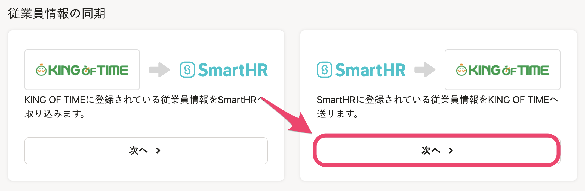

## 4\. 従業員情報取得基準日を指定して［次へ］をクリック

従業員情報取得基準日を指定して **［次へ］** をクリックすると、SmartHRから従業員情報を取得します。

このタイミングでは、SmartHRに登録されている従業員情報の一覧を取得するだけで、KING OF TIMEへの同期は行なわれません。

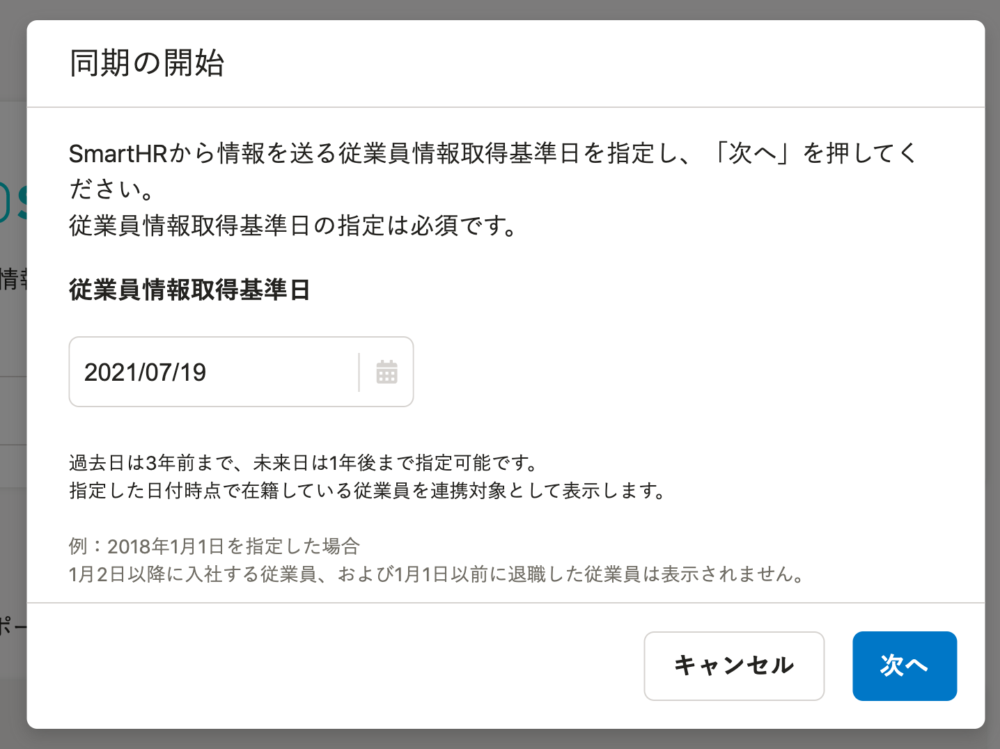

たとえば2018年1月1日を指定した場合、2018年1月2日以降に入社する従業員、および2018年1月1日以前に退職した従業員は表示されません。

## 5\. 従業員情報を取得後［同期を開始→］をクリック

SmartHRに登録されている、連携対象の従業員情報を表示するのには一定の時間がかかります。

ステータスが **［取得中］** から **［同期待ち］** になるまでお待ちください。

ステータスが **［同期待ち］** になると、 **［同期を開始→］** をクリックできるようになります。

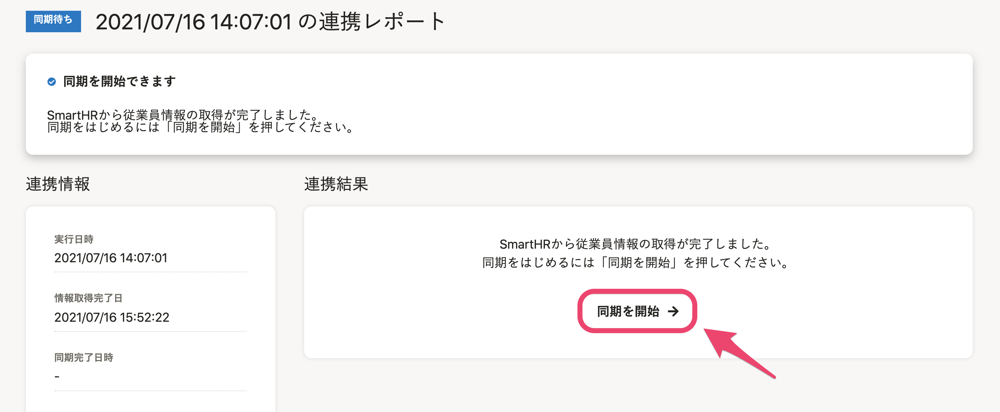

 **［同期を開始→］** をクリックすると、対象の従業員を選択する画面が表示されます。

## 6\. 同期対象の従業員を選択し、［同期を開始］をクリック

SmartHRに登録されている従業員の一覧が表示されます。

KING OF TIMEに情報を送信する従業員にチェックを入れ **［同期を開始］** をクリックすると、情報が送信されます。

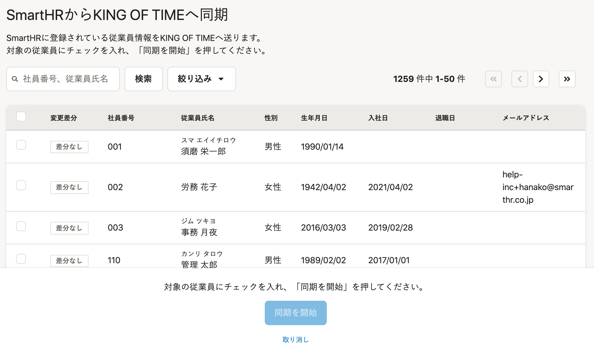

:::tips
従業員の一覧は、変更差分で絞り込みできます。
変更があった従業員のみ同期したい場合などにお使いください。
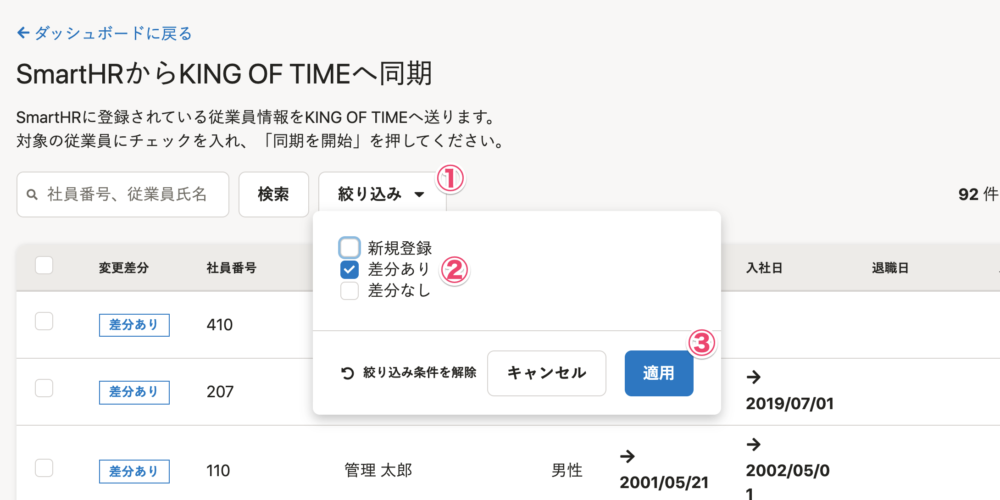
| **変更差分** | **説明** |
| --- | --- |
| 新規登録 | SmartHRに従業員情報があるが、KING OF TIMEにはない。 |
| 差分あり | SmartHRとKING OF TIMEの両方に従業員情報があるが、差分がある。 |
| 差分なし | SmartHRとKING OF TIMEの両方に従業員情報があり、差分がない。 |
:::

KING OF TIME側に新規で登録する従業員の場合は **［所属事業所］** と **［雇用区分］** を選択する必要があります。

この際、1つ前の画面で選択した従業員全員に対して、1つの所属事業所と雇用区分を設定します。

所属事業所や雇用区分が異なる場合は、所属／雇用区分ごとに従業員を選択するか、取り込み後、KING OF TIME側で設定を変更してください。
