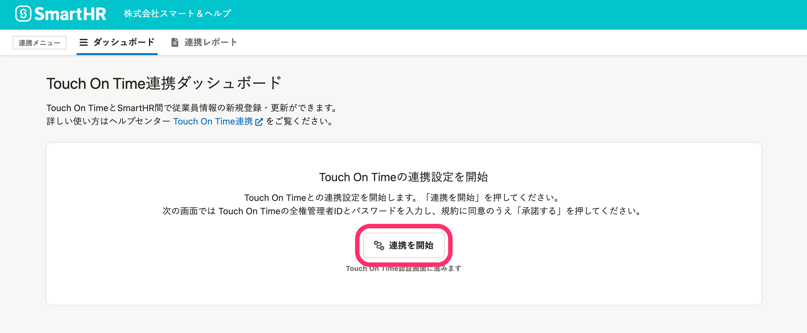
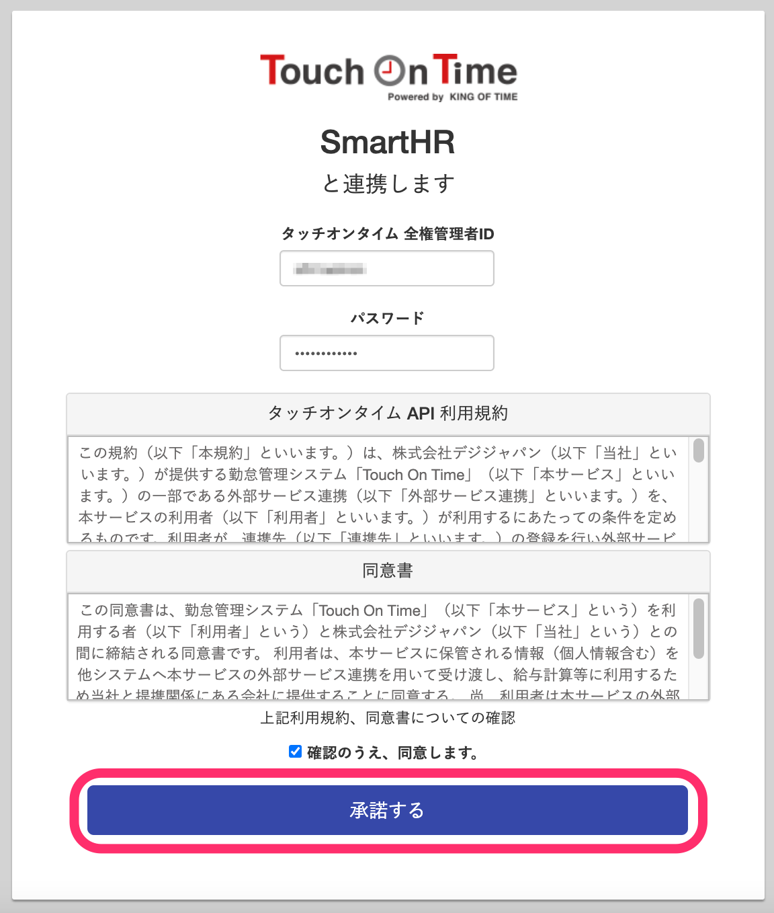
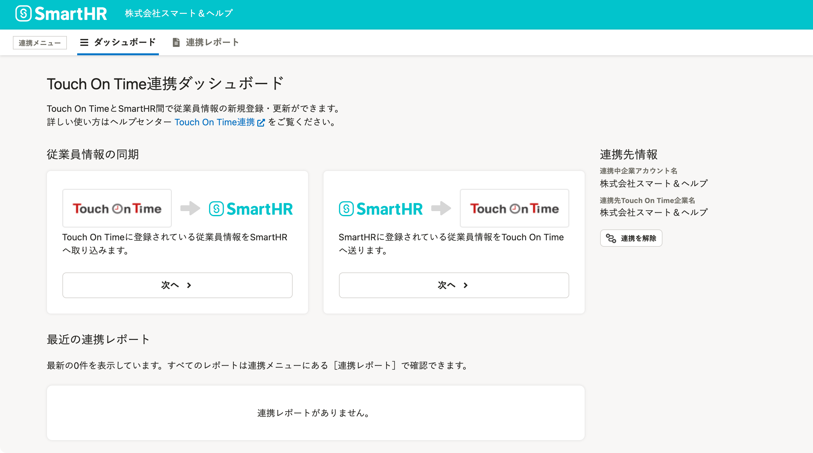

勤怠管理システム[Touch On Time（タッチオンタイム）](https://www.kintaisystem.com/)と連携し、従業員情報の新規登録や更新が可能です。

初回のみ、下記の設定が必要です。

# 1.［外部システム連携］で、Touch On Time 連携をインストール

管理者アカウントでSmartHRにログインし、 **［共通設定］>［外部システム連携］>［アプリケーション連携］** にある、Touch On Time 連携の **［インストール］** をクリックすると、連携機能がインストールされます。

詳しくは下記のページを参照してください。

:::related
[他社のアプリケーションをインストールする](https://knowledge.smarthr.jp/hc/ja/articles/4405252726041)
:::

# 2\. トップページの［機能］にある［Touch On Time 連携］をクリック

トップページ左側の **［機能］** 欄にある **［Touch On Time 連携］** をクリックすると、Touch On Time連携ダッシュボードが表示されます。

 **［連携を開始］** をクリックすると、Touch On TimeとSmartHRの連携設定画面が表示されます。

# 3\. アカウントを連携する

 **［タッチオンタイム 全権管理者ID］** と **［パスワード］** （Touch On Timeのパスワード）を入力し、規約と同意書に同意するチェックを入れて **［承諾する］** をクリックすると、アカウントが連携されます。

Touch On Time連携ダッシュボードが表示されたら、連携成功です。

従業員情報を取り込む手順は下記のヘルプページを参照してください。

:::related
[【Touch On Time】従業員情報を連携する](https://knowledge.smarthr.jp/hc/ja/articles/4411971273113)
:::
