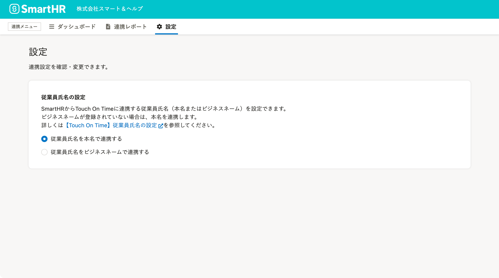

SmartHRからTouch On Timeに従業員情報を送る際、従業員氏名を本名で連携するか、ビジネスネームで連携するかを設定できます。

従業員氏名をビジネスネームで連携したい場合は設定を変更してください。本名で連携する場合はデフォルト設定のままで使えます。

:::alert
この設定は、Touch On TimeからSmartHRに従業員情報を取り込む際には適用されません。
Touch On Timeの従業員情報にはSmartHRのビジネスネームに相当する項目がないため、従業員の氏名は本名で連携します。
:::

# 1.［設定］をクリック

Touch On Time連携ダッシュボードの **［連携メニュー］** にある **［設定］** をクリックすると、設定画面が表示されます。

# 2\. 任意の内容を選択する

 **［従業員氏名を本名で連携する］［従業員氏名をビジネスネームで連携する］** のいずれかを選択してください。

操作した内容は自動で保存されます。

:::alert
 **［従業員氏名をビジネスネームで連携する］** 設定にしていても、SmartHRにビジネスネームが登録されていない場合は本名を連携します。
また、設定を更新しても、すでに完了している連携内容には反映されません。設定更新後の連携から適用します。
:::

設定した内容は「SmartHRからTouch On Timeへ同期」画面上でも確認できます。

内容を確認したうえで、同期してください。

