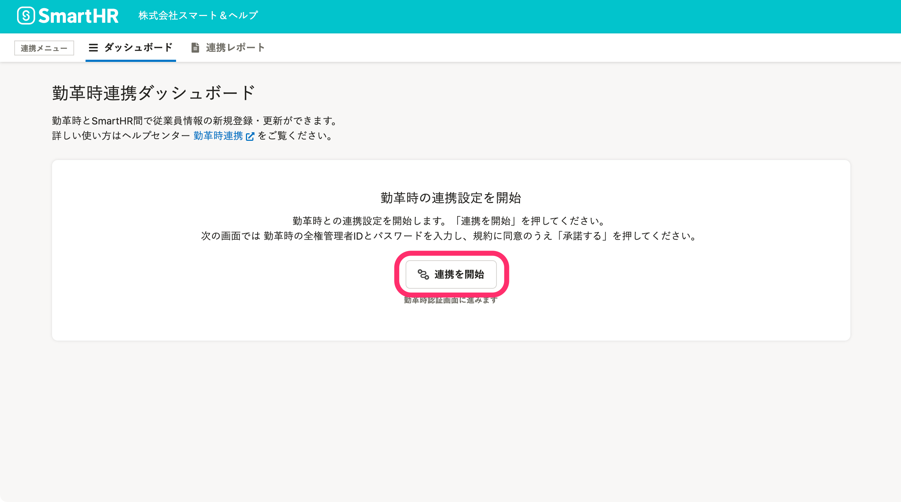
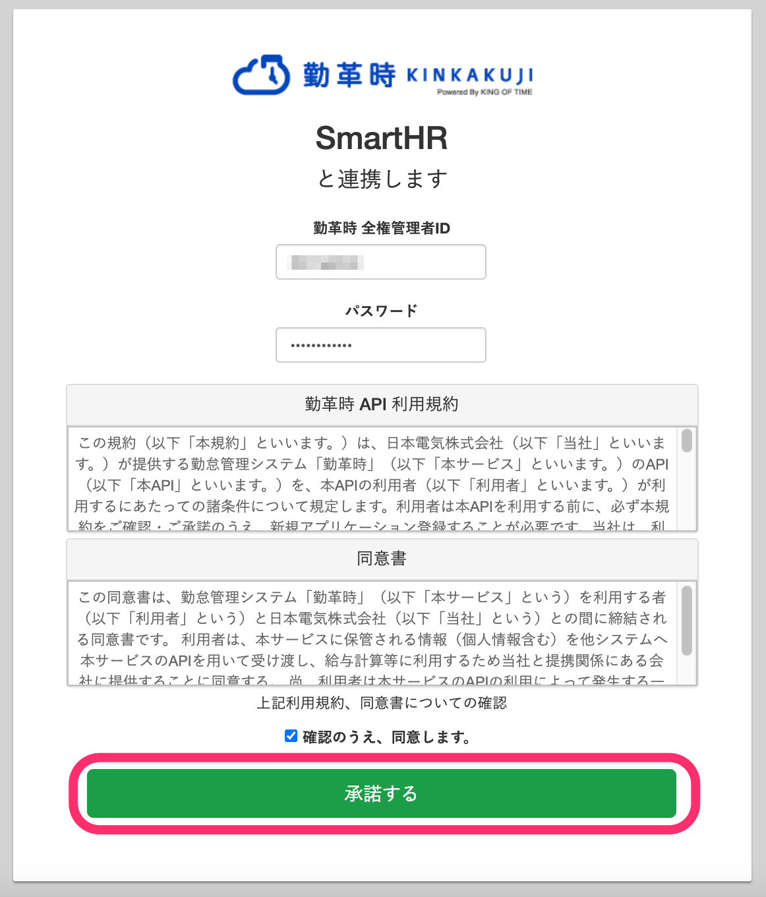
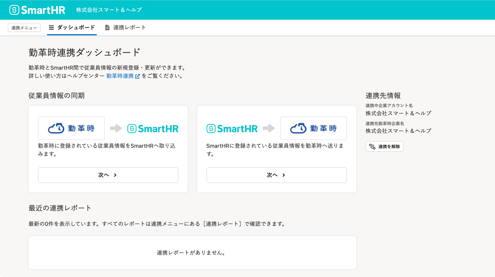

勤怠管理システム[勤革時（きんかくじ）](https://jpn.nec.com/king-of-time/index.html)と連携し、従業員情報の新規登録や更新が可能です。

初回のみ、下記の設定が必要です。

# 1\. ［外部システム連携］で、勤革時をインストール

管理者アカウントでSmartHRにログインし、 **［共通設定］>［外部システム連携］>［アプリケーション連携］** にある、勤革時 連携の **［インストール］** をクリックすると、連携機能がインストールされます。

詳しくは下記のヘルプページを参照してください。

:::related
[他社のアプリケーションをインストールする](https://knowledge.smarthr.jp/hc/ja/articles/4405252726041)
:::

# 2\. トップページの［機能］にある［勤革時 連携］をクリック

トップページ左側の **［機能］** 欄にある **［勤革時 連携］** をクリックすると、勤革時連携ダッシュボードが表示されます。

 **［連携を開始］** をクリックすると、勤革時連携設定画面が表示されます。

# 3\. アカウントを連携する

勤革時の画面で、 **［勤革時 全権管理者ID］** と **［パスワード］** （勤革時のパスワード）を入力し、利用規約と同意書に同意したうえで、 **［**  **承諾する］** をクリックすると、アカウントが連携されます。

勤革時連携ダッシュボードが表示されたら、連携成功です。

従業員情報の連携手順は下記のヘルプページを参照してください。

[【勤革時】従業員情報を連携する](https://knowledge.smarthr.jp/hc/ja/articles/4411971255065)
