勤怠管理システム [勤革時（きんかくじ）](https://jpn.nec.com/king-of-time/index.html)と連携し、従業員情報の新規登録や更新ができます。
連携対象となる従業員情報や、初回利用時に必要な連携設定については、下記のヘルプページを参照してください。

:::related
[【勤革時】連携可能な従業員情報について](https://knowledge.smarthr.jp/hc/ja/articles/360026262513)
[【勤革時】連携設定（初回のみ）](https://knowledge.smarthr.jp/hc/ja/articles/360026262533)
:::
:::alert
- 勤革時のメンテナンス時間（8:30〜10:00、17:30〜18:30）は、連携機能を利用できません。
- 従業員情報の更新は、社員番号をキーにして連携します。
:::

# 勤革時からSmartHRに取り込む

## 1\. SmartHRに管理者権限でログインする

SmartHRに管理者権限でログインします。

## 2\. ［勤革時連携］をクリック

トップページ左の **［機能］** にある **［勤革時連携］** をクリックすると、 勤革時連携ダッシュボードが表示されます。

## 3\. 勤革時→SmartHRの［次へ >］をクリック

勤革時→SmartHRの **［次へ >］** をクリックすると、従業員情報取得基準日の設定画面に移ります。

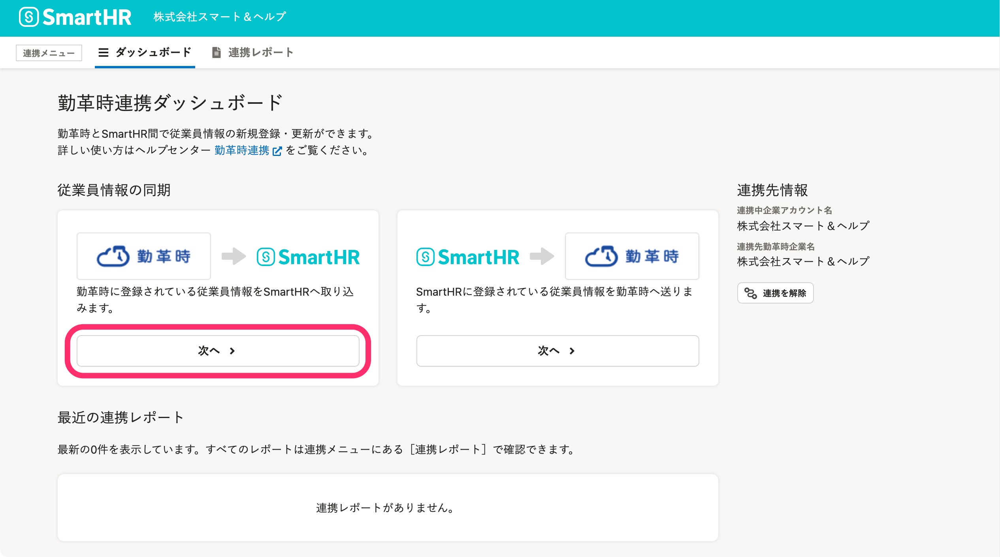

## 4\. 従業員情報取得基準日を指定して［次へ］をクリック

従業員情報取得基準日を指定して **［次へ］** をクリックすると、勤革時から従業員情報を取得します。

このタイミングでは、勤革時に登録されている従業員情報の一覧を取得するだけで、SmartHRへの取り込みは行なわれません。

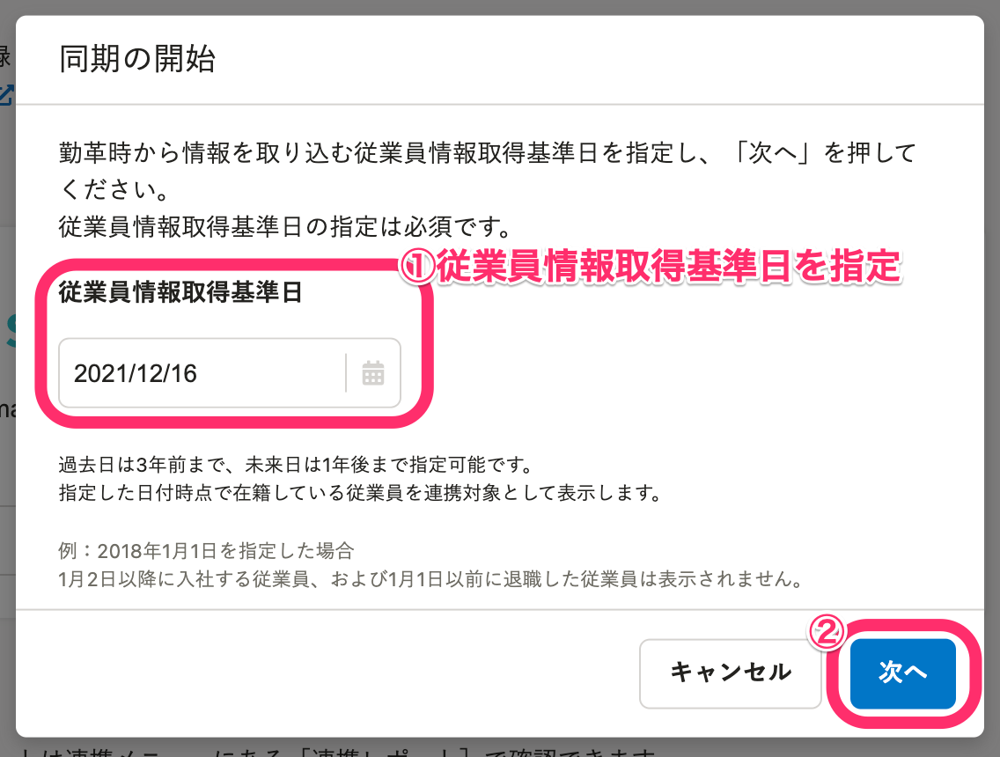

:::tips
過去日は3年前まで、未来日は1年後まで指定可能です。
指定した日付時点で在籍している従業員を連携対象として表示します。
例：2022年1月1日を指定した場合、2022年1月2日以降に入社する従業員、および2022年1月1日以前に退職した従業員は表示されません。
:::

## 5\. 従業員情報を取得後、［同期を開始→］をクリック

勤革時から連携対象の従業員情報を取得するには、一定の時間がかかります。

 **［連携レポート］** で状況を確認してください。

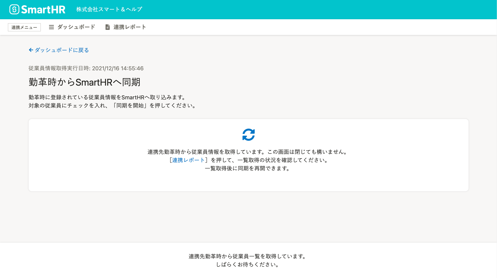

連携レポートの詳細画面で連携ステータスが **［同期待ち］** になると、 **［同期を開始→］** をクリックできるようになります。

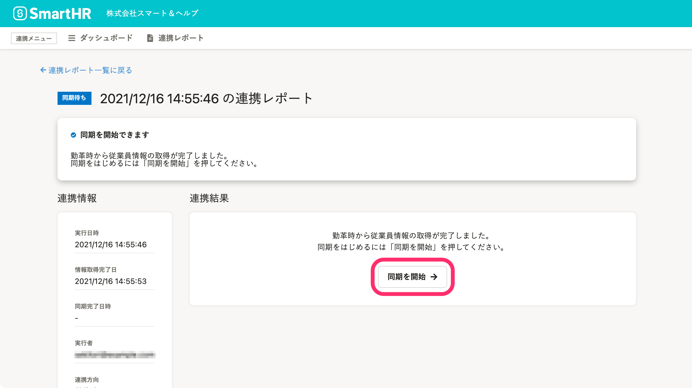

 **［同期を開始→］** をクリックすると、対象の従業員を選択する画面が表示されます。

## 6\. 同期対象の従業員を選択し、［同期を開始］をクリック

勤革時に登録されている従業員の一覧が表示されます。

SmartHRに情報を取り込む従業員にチェックを入れ、画面下部にある **［同期を開始］** をクリックすると、従業員情報が取り込まれます。

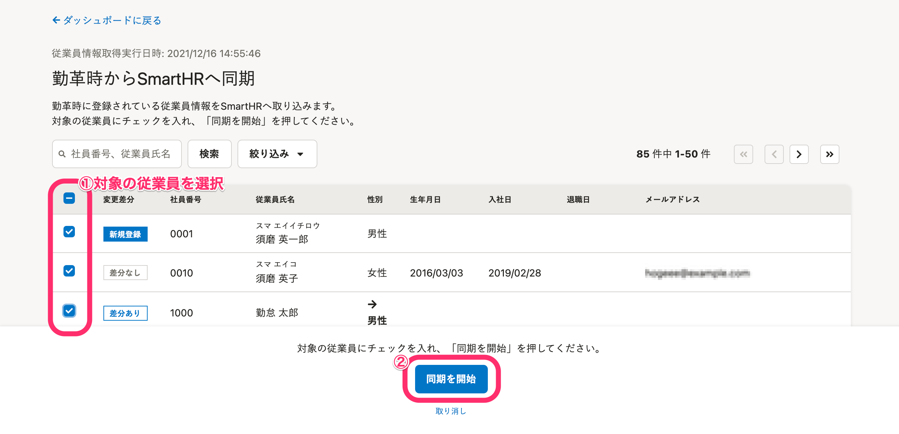

:::tips
従業員一覧は、変更差分で絞り込みできます。
 **［絞り込み］** をクリックし、絞り込み条件を選択して **［適用］** をクリックしてください。
変更があった従業員のみ同期したい場合などにお使いください。
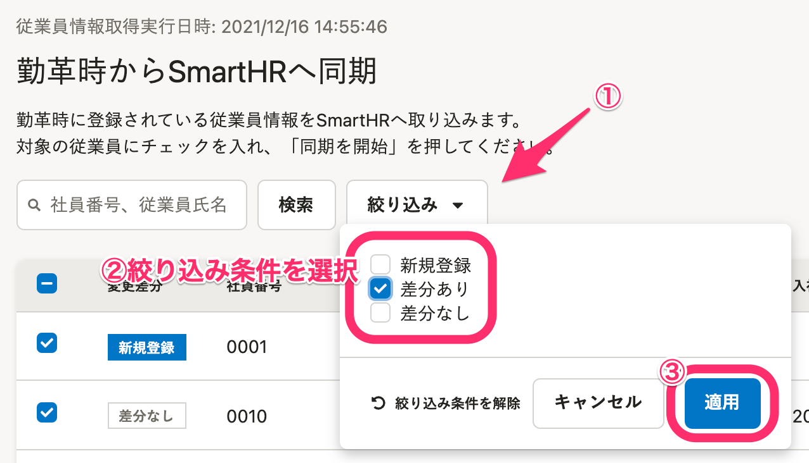
変更差分の種類は以下の通りです。
| **変更差分** | **説明** |
| --- | --- |
| 新規登録 | 勤革時に従業員情報があるが、SmartHRにはない。 |
| 差分あり | SmartHRと勤革時の両方に従業員情報があり、差分がある。 |
| 差分なし | SmartHRと勤革時の両方に従業員情報があり、差分がない。 |
:::

### 選択した従業員が新規登録の場合

SmartHRに従業員情報を新規登録するにあたり、 **［所属事業所］** の設定が必要です。

新規登録の従業員に対して、一律の **［所属事業所］** を適用します。

 **［所属事業所］** を選択して **［同期］** をクリックしてください。

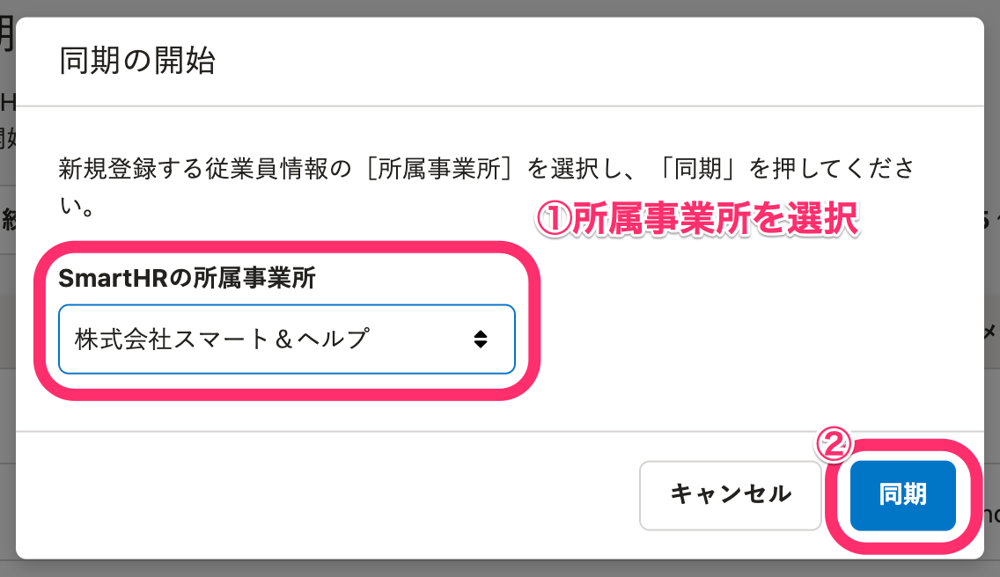

:::alert
所属事業所が異なる従業員は一括で取り込めません。
同じ事業所ごとに従業員の取り込みをするか、一括取り込み後にSmartHRで該当従業員の所属事業所を変更してください。
なお、 **［所属事業所］** は新規登録時のみに設定できます。更新（変更）はできません。
:::

# SmartHRから勤革時に送る

## 1\. SmartHRに管理者権限でログインする

SmartHRに管理者権限でログインします。

## 2.［勤革時連携］をクリック

トップページ左の **［機能］** にある **［勤革時 連携］** をクリックすると、Touch On Time連携ダッシュボードが表示されます。

## 3\. SmartHR→勤革時の［次へ >］をクリック

SmartHR→勤革時の **［次へ >］** をクリックすると、従業員情報取得基準日の設定画面に移ります。

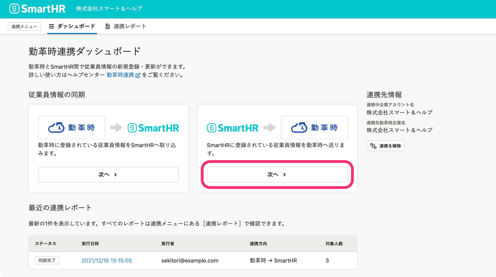

## 4\. 従業員情報取得基準日を指定して［次へ］をクリック

従業員情報取得基準日を指定して **［次へ］** をクリックすると、SmartHRから従業員情報を取得します。

このタイミングでは、SmartHRに登録されている従業員情報の一覧を取得するだけで、勤革時への同期は行なわれません。

:::tips
過去日は3年前まで、未来日は1年後まで指定可能です。
指定した日付時点で在籍している従業員を連携対象として表示します。
例：2022年1月1日を指定した場合、2022年1月2日以降に入社する従業員、および2022年1月1日以前に退職した従業員は表示されません。
:::

## 5\. 従業員情報を取得後［同期を開始→］をクリック

SmartHRに登録されている連携対象の従業員情報を取得するには一定の時間がかかります。

 **［連携レポート］** で状況を確認してください。

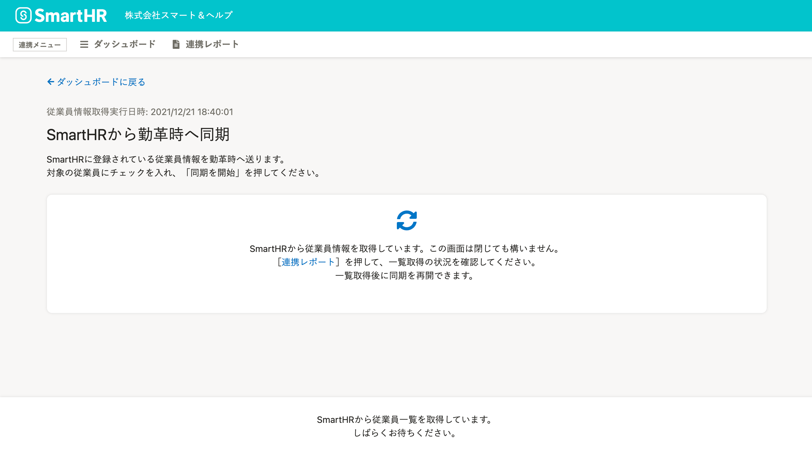

ステータスが **［同期待ち］** になると、 **［同期を開始→］** をクリックできるようになります。

 **［同期を開始→］** をクリックすると、対象の従業員を選択する画面が表示されます。

## 6\. 同期対象の従業員を選択し、［同期を開始］をクリック

SmartHRに登録されている従業員の一覧が表示されます。

勤革時に情報を送信する従業員にチェックを入れ **［同期を開始］** をクリックすると、情報が送信されます。

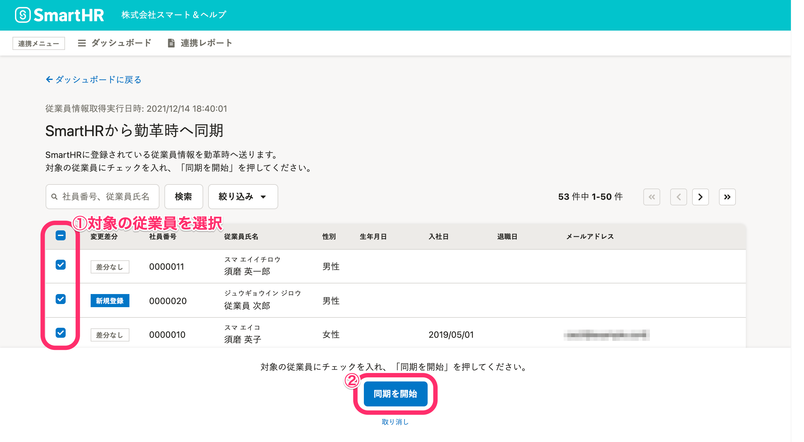

:::tips
従業員の一覧は、変更差分で絞り込みできます。
変更があった従業員のみ同期したい場合などにお使いください。
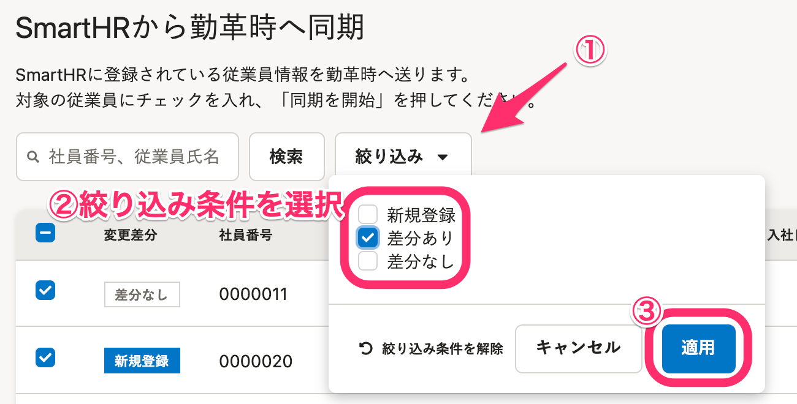
| **変更差分** | **説明** |
| --- | --- |
| 新規登録 | SmartHRに従業員情報があるが、勤革時にはない。 |
| 差分あり | SmartHRと勤革時の両方に従業員情報があり、差分がある。 |
| 差分なし | SmartHRと勤革時の両方に従業員情報があり、差分がない。 |
:::

### 選択した従業員が新規登録の場合

勤革時に従業員情報を新規登録するにあたり、 **［所属事業所］** と **［雇用区分］** の設定が必要です。

新規登録の従業員に対して、一律の **［所属事業所］［雇用区分］** を適用します。

プルダウンメニューから **［所属事業所］** と **［雇用区分］** を選択して **［同期］** をクリックしてください。

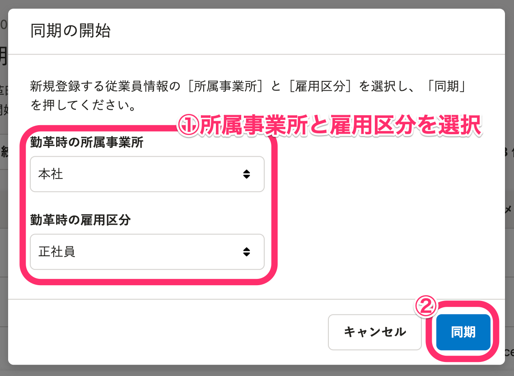

:::alert
所属事業所が異なる従業員は一括で取り込めません。
所属事業所や雇用区分が異なる場合は、所属／雇用区分ごとに従業員を選択するか、取り込み後、勤革時側で設定を変更してください。
なお、 **［所属事業所］** と **［雇用区分］** は新規登録時のみに設定できます。更新（変更）はできません。
:::

# 連携結果の確認方法

 **［連携メニュー］** にある **［連携レポート］** をクリックすると、これまでに実行した従業員情報の同期結果（連携結果）を確認できます。

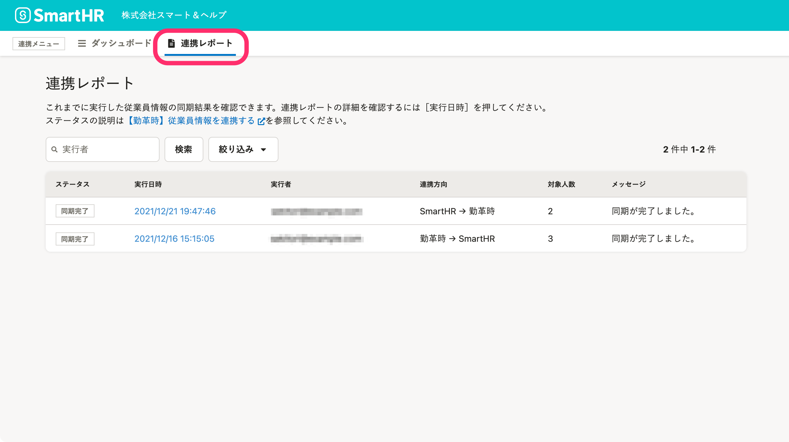

また、勤革時連携ダッシュボードの画面下部にある **［最近の連携レポート］** では、最新の10件分を確認できます。

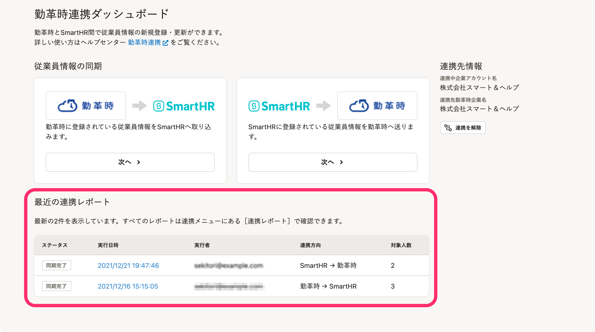
