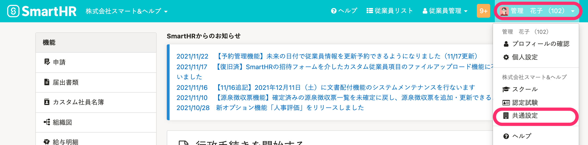
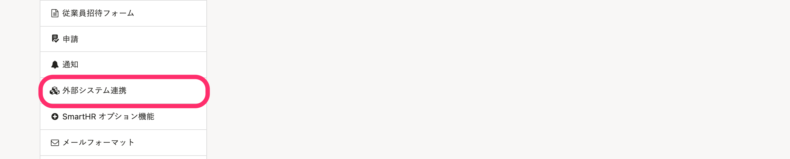
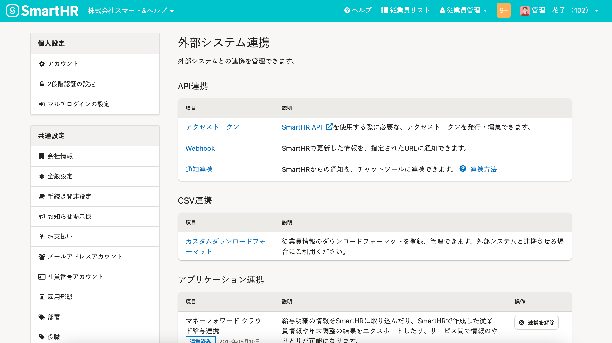
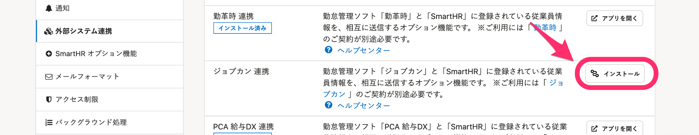
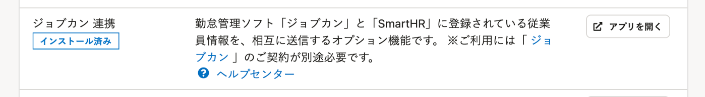
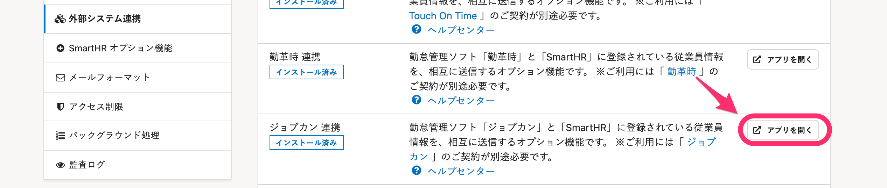
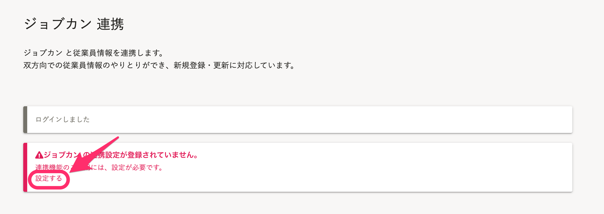
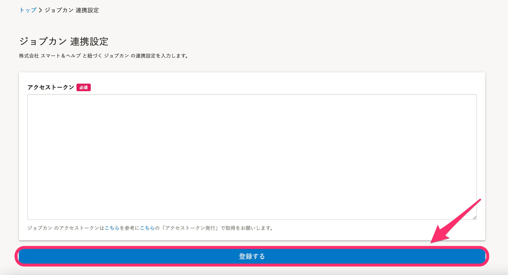
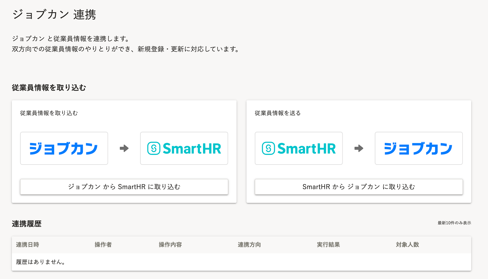

勤怠管理システム[ジョブカン](https://jobcan.ne.jp/)と連携し、従業員情報の新規登録や更新が可能です。

連携可能な従業員情報については、以下のヘルプページで確認してください。

:::related
[【ジョブカン】連携可能な従業員情報について](https://knowledge.smarthr.jp/hc/ja/articles/360026103614)
:::

初回のみ、下記の設定が必要です。

# 1\. ジョブカンのアクセストークンを用意する

ジョブカンのアクセストークンを用意してください。

ジョブカンのアクセストークンの取得方法について、詳しくは以下のヘルプページを参照してください。

:::related
[SmartHRと連携できますか？｜勤怠管理（ジョブカン）](https://jobcan.zendesk.com/hc/ja/articles/360000275981)
:::

# 2.［共通設定］>［外部システム連携］をクリック

画面右上の **［アカウント名▼］** \> **［共通設定］** をクリックします。

画面左下にある **［外部システム連携］** をクリックすると、 **［外部システム連携］** 画面が表示されます。

# 3\. ［アプリケーション連携］>［ジョブカン 連携］>［インストール］をクリック

 **［アプリケーション連携］** にある **［ジョブカン連携］** の **［インストール］** をクリックすると、アプリがインストールされます。

オプション機能のインストールについて、詳しくは以下のヘルプページを参照してください。

:::related
[SmartHRオプション機能をインストールする](https://knowledge.smarthr.jp/hc/ja/articles/360026262553)
:::

インストールが終わると **［インストール］** が **［アプリを開く］** に変わります。

# 4\. ［アプリを開く］をクリック

 **［アプリを開く］** をクリックすると、ジョブカン連携ページが表示されます。

# 5\. ［設定する］をクリック

 **［設定する］** をクリックすると、ジョブカン連携の設定画面が表示されます。

# 6\. ジョブカンのアクセストークンを入力し、［登録する］をクリック

手順1で用意したジョブカンのアクセストークンを入力し、 **［登録する］** をクリックすると、連携が設定されます。

以下の画面が表示されたら設定完了です。

実際に従業員情報を取り込む手順は、以下のヘルプページを参照してください。

:::related
[【ジョブカン】従業員情報を取り込む](https://knowledge.smarthr.jp/hc/ja/articles/360026103634)
:::
