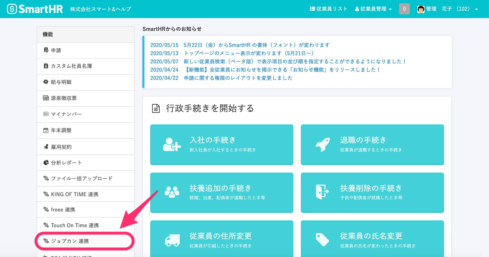
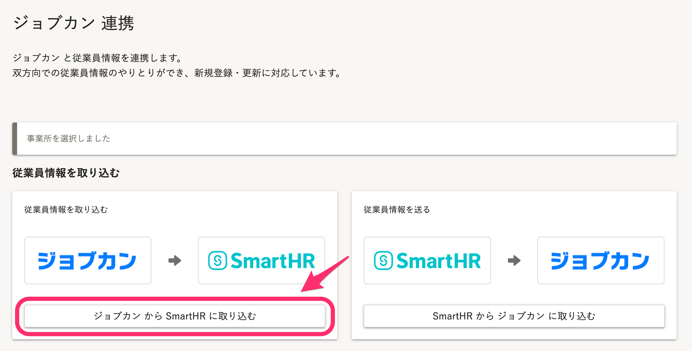
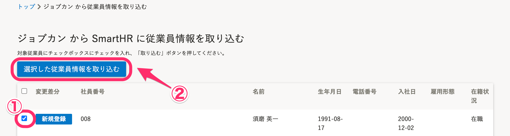
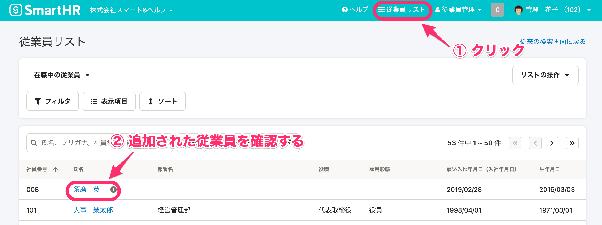
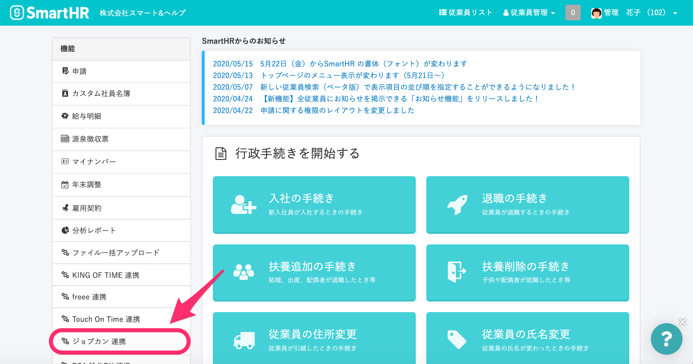
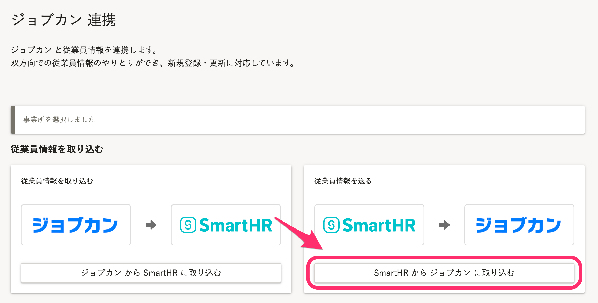
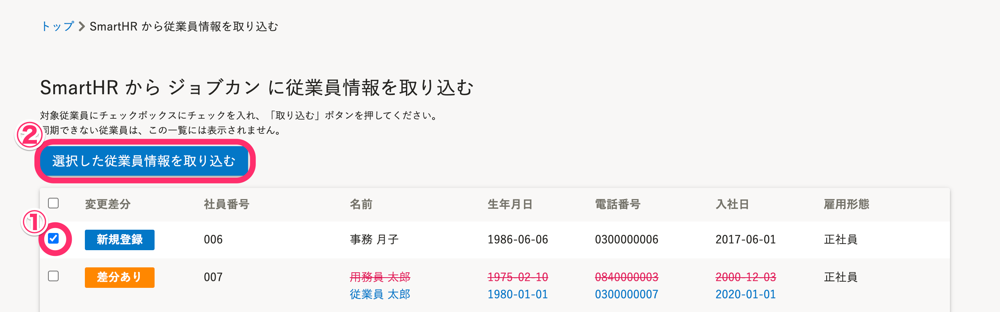
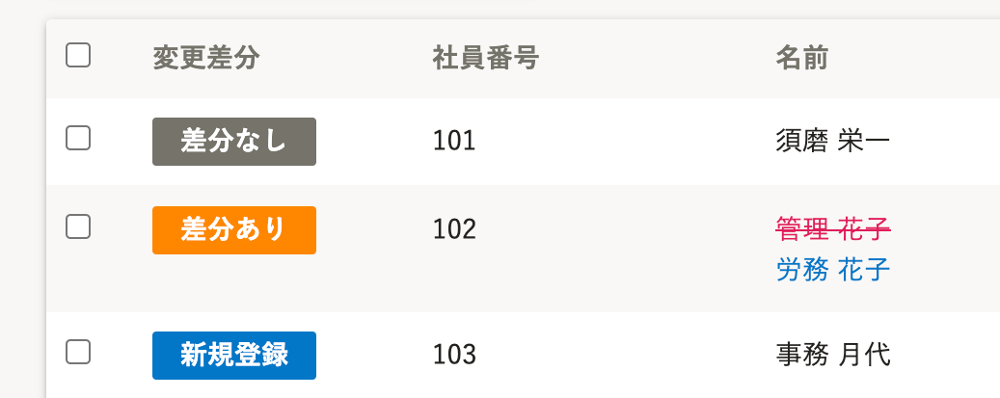

勤怠管理システム ジョブカン と連携し、従業員情報の新規登録や更新が可能です。

連携対象となる従業員情報は下記のヘルプページでご確認ください。

:::related
[【ジョブカン】連携可能な従業員情報について](https://knowledge.smarthr.jp/hc/ja/articles/360026103614)
:::

ご利用にあたっては、[連携設定（初回のみ）](https://knowledge.smarthr.jp/hc/ja/articles/360026103594)が必要です。

:::alert
・従業員情報の更新は、社員番号をキーにして更新されます。
・ご利用にあたっては、SmartHRの管理者権限が必要です。
:::

# ジョブカン ⇒ SmartHR に取り込む

## 1\. トップページの \[機能\] にある \[ジョブカン連携\] をクリック

SmartHRに管理者権限でログインし、トップページの **\[機能\]** 欄にある **\[ジョブカン連携\]** をクリックすると、ジョブカンとの連携画面が表示されます。

## 2\. \[ジョブカンからSmartHRに取り込む\] をクリック

**\[ジョブカンからSmartHRに取り込む\]** をクリックすると、従業員の選択画面が表示されます。

## 3\. 取り込む従業員にチェックを入れ、 \[選択した従業員情報を取り込む\] をクリック

取り込みたい従業員にチェックを付け、**\[選択した従業員情報を取り込む\]** をクリックすると取り込みが開始します。

## 4\. 取り込みの完了を確認する

取り込みが終わると、管理者宛に通知が届き、連携履歴にも結果が表示されます。

失敗した取り込みがある場合は、通知メールより該当の社員番号とエラー内容を確認・対応のうえ、再度取り込みをお試しください。

## 5\. SmartHRの \[従業員リスト\] で従業員情報の取り込みを確認する

SmartHRの **\[従業員リスト\]** をひらくと、任意の従業員情報が取り込まれていることを確認できます。

# SmartHR ⇒ ジョブカンに取り込む

## 1\. トップページの \[機能\] にある \[ジョブカン連携\] をクリック

SmartHRに管理者権限でログインし、トップページの **\[機能\]** 欄にある **\[ジョブカン連携\]** をクリックすると、ジョブカンとの連携画面が表示されます。

## 2\. \[SmartHRからジョブカンに取り込む\] をクリック

**\[SmartHRからジョブカンに取り込む\]** をクリックすると、従業員の選択画面が表示されます。

## 3\. 取り込む従業員にチェックを入れ、 \[選択した従業員情報を取り込む\] をクリック

取り込みたい従業員にチェックを付け、**\[選択した従業員情報を取り込む\]** をクリックすると取り込みが開始します。

## 4\. 取り込みの完了を確認する

取り込みが終わると、管理者宛に通知が届き、連携履歴にも結果が表示されます。

失敗した取り込みがある場合は、通知メールより該当の社員番号とエラー内容を確認・対応のうえ、再度取り込みをお試しください。

## 5\. ジョブカンで従業員情報の取り込みを確認する

ジョブカン側に任意の従業員情報が取り込まれていることをご確認ください。

# 変更差分のステータスについて

従業員の登録状況によって、下図3つのステータスにわかれます。

- **差分なし**
    - ジョブカン ⇔ SmartHR間で、連携対象となる従業員情報に差分がない状態です。
- **差分あり**
    - 赤字 + 取り消し線 がついたものが古い情報、緑の文字で書かれたものが新しい情報になります。
    - 緑の文字の情報がジョブカン取り込まれ、上書き更新されます。
- **新規登録**
    - ジョブカンにまだ従業員情報が登録されていない従業員情報です。
    - 一覧に書かれた情報がすべて連携先システムに取り込まれます。

