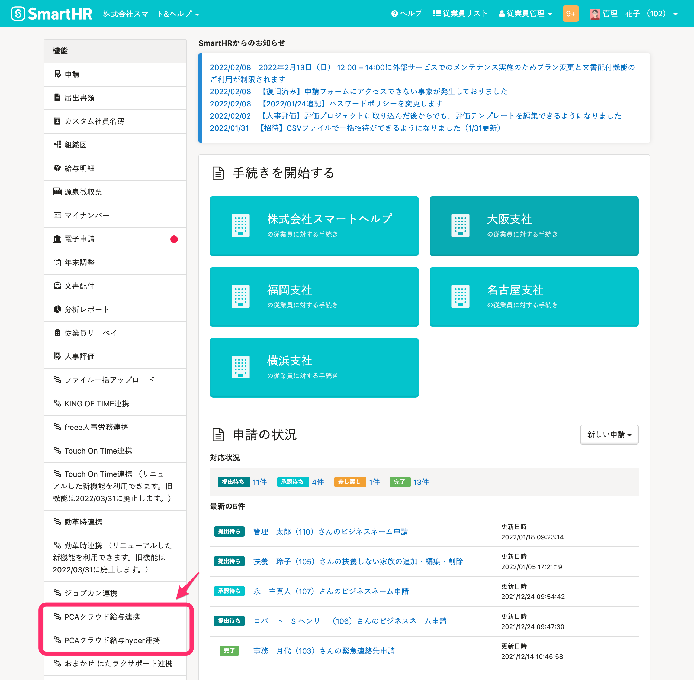
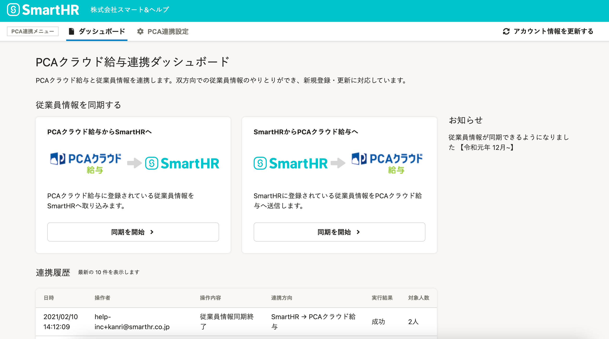
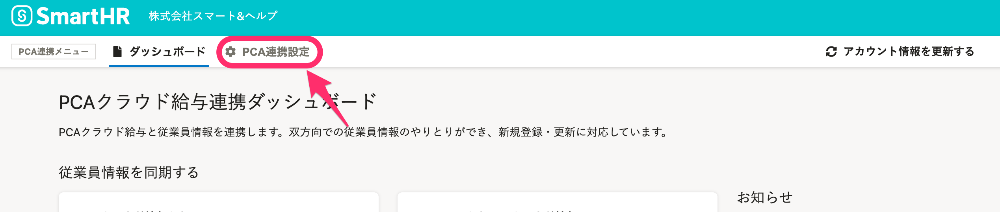

PCAクラウド給与／PCAクラウド給与hyperと連携し、従業員情報の新規登録や更新が可能です。

初回のみ、下記の設定が必要です。

:::tips
SmartHRで連携設定をする前に、PCAクラウドWeb-API（有償）を有効化している必要があります。
PCAクラウドWeb-APIを有効化する場合は、PCAもしくは代理店の貴社担当者までお問い合わせください。
仕様については下記のページを参照してください。
[PCAクラウドWeb-API無償公開サイト](https://pca.jp/area_product/prosaas_webapi.html)
:::

# 1.［外部システム連携］で、PCAクラウド給与／PCAクラウド給与hyperをインストール

管理者アカウントでSmartHRにログインし、 **［共通設定］>［外部システム連携］>［アプリケーション連携］** にある、PCAクラウド給与連携、もしくはPCAクラウド給与hyper連携の **［インストール］** をクリックすると、連携機能がインストールされます。

詳しくは下記のヘルプページを参照してください。

:::related
[他社のアプリケーションをインストールする](https://knowledge.smarthr.jp/hc/ja/articles/4405252726041)
:::

# 2\. トップページの［機能］にある［PCAクラウド給与連携］もしくは［PCAクラウド給与hyper連携］をクリック

トップページ左側の **［機能］** 欄にある **［PCAクラウド給与連携］** もしくは **［PCAクラウド給与hyper連携］** をクリックすると、連携機能の画面が表示されます。

# 3\. 連携に必要な情報を入力し、［連携開始］をクリック

連携機能の画面では、初回のみ、IDやパスワードの入力が求められます。

必要情報を入力して **［連携開始］** をクリックすると、PCAクラウド給与／PCAクラウド給与hyper連携ダッシュボード画面が表示されます。

:::tips
 **［PCAサービスID］** と **［PCAサービスパスワード］** は、PCAクラウドお申し込み時に提供される「利用通知書」に記載されています。
 **［PCAアプリユーザー名］** と **［PCAアプリパスワード］** は、上記サービスID・パスワードとは別の、PCAアプリケーション利用時に使用するID・パスワードを入力してください。
:::

# 4\. 連携設定完了を確認する

正しく設定ができると、画像のように、PCAクラウド給与やPCAクラウド給与hyperのロゴが含まれる画面が表示されます。

:::tips
PCA連携の設定を変更したい場合は、連携画面上部にある **［PCA連携設定］** から、再度設定を行なってください。

:::
