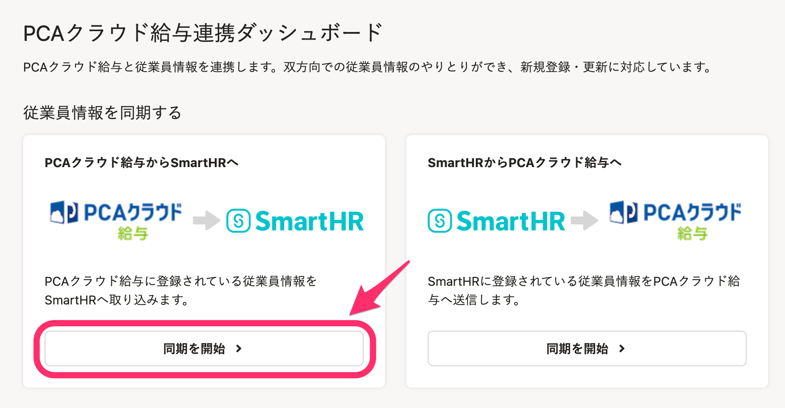
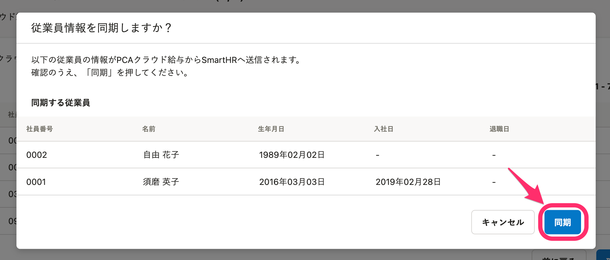

PCAクラウド給与／PCAクラウド給与hyperと連携すると、従業員情報の新規登録や更新ができます。

初回のみ必要な連携設定が完了していない場合は、下記のヘルプページを参照してください。

[【PCAクラウド給与／hyper】連携設定（初回のみ）](https://knowledge.smarthr.jp/hc/ja/articles/360041146073)

:::tips
このページでは「PCAクラウド給与」連携画面をもとに手順を案内していますが、操作手順はPCAクラウド給与hyper利用時も同じです。
:::

# PCAクラウド給与からSmartHRへ従業員情報を同期する

## 1\. PCAクラウド給与からSmartHRへの［同期を開始>］をクリック

PCAクラウド給与との連携ダッシュボードの左側にある、PCAクラウド給与からSmartHRへの **［同期を開始>］** をクリックすると、データ領域の選択画面が表示されます。

## 2\. データ領域を選択し、［次へ］をクリック

従業員情報の同期対象とするデータ領域を選択して **［次へ］** をクリックすると、対象従業員の選択画面が表示されます。

## 3\. 同期する従業員を選択し、［確認］をクリック

同期する従業員にチェックを入れ、画面右下の **［確認］** をクリックすると、確認のダイアログが表示されます。

## 4\. 同期する情報を確認して、［同期］をクリック

同期する従業員情報が一覧で確認できます。

問題がなければ、 **［同期］** をクリックして同期を実行してください。

連携可能な従業員情報については、下記のヘルプページを参照してください。

:::related
[【PCAクラウド給与／hyper】連携可能な従業員情報](https://knowledge.smarthr.jp/hc/ja/articles/360040752454)
:::

## 5\. 結果を確認する

同期が始まると、連携ダッシュボード画面に戻ります。

操作内容や実行結果は、画面下部の **［連携履歴］** に表示されます。

# SmartHRからPCAクラウド給与へ従業員情報を同期する

## 1\. SmartHRからPCAクラウド給与への［同期を開始>］をクリック

PCAクラウド給与との連携ダッシュボードの右側にある、SmartHRからPCAクラウド給与への **［同期を開始>］** をクリックすると、データ領域の選択画面が表示されます。

## 2\. データ領域を選択し、［次へ］をクリック

従業員情報の同期対象とするデータ領域を選択して **［次へ］** をクリックすると、対象従業員の選択画面が表示されます。

## 3\. 同期する従業員を選択し、［確認］をクリック

同期する従業員にチェックを入れ、画面右下の **［確認］** をクリックすると、確認のダイアログが表示されます。

## 4\. 同期する情報を確認して、［同期］をクリック

同期する従業員情報が一覧で確認できます。

問題がなければ、右下の **［同期］** をクリックして同期を実行してください。

## 5\. 結果を確認する

同期が始まると、連携ダッシュボード画面に戻ります。

操作内容や実行結果は、画面下部の **［連携履歴］**  に表示されます。

