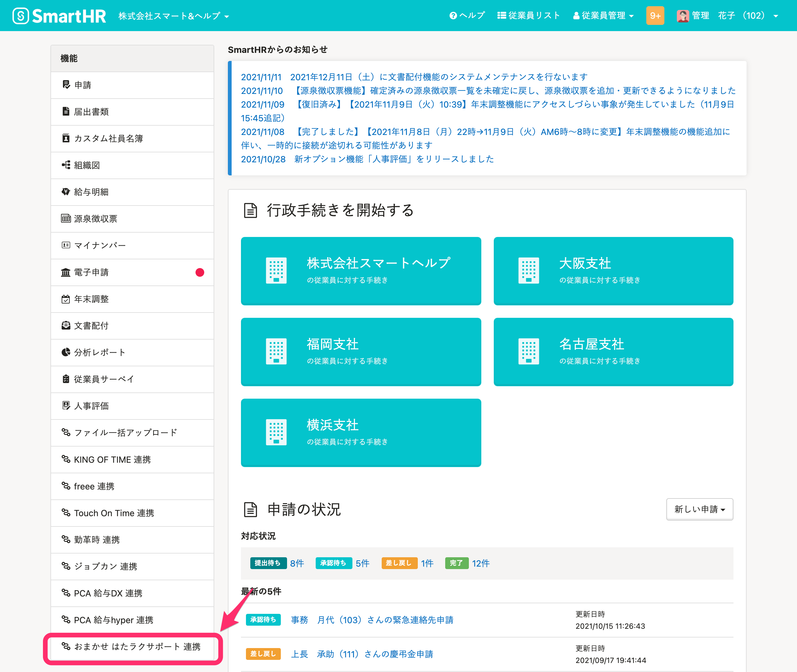
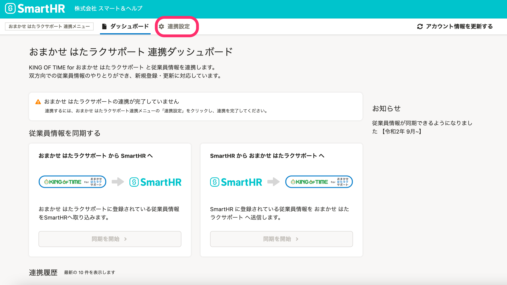
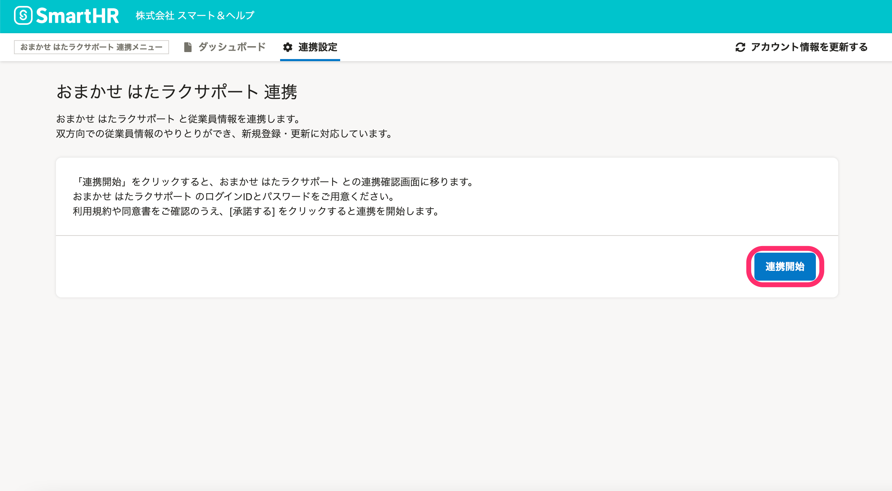
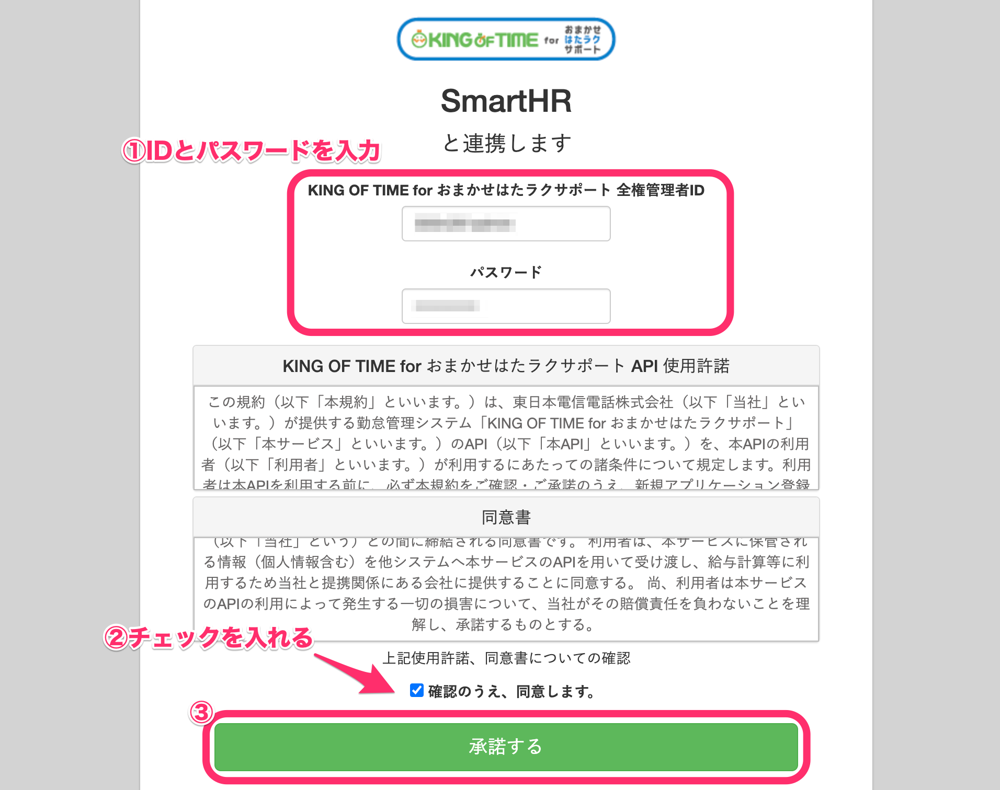
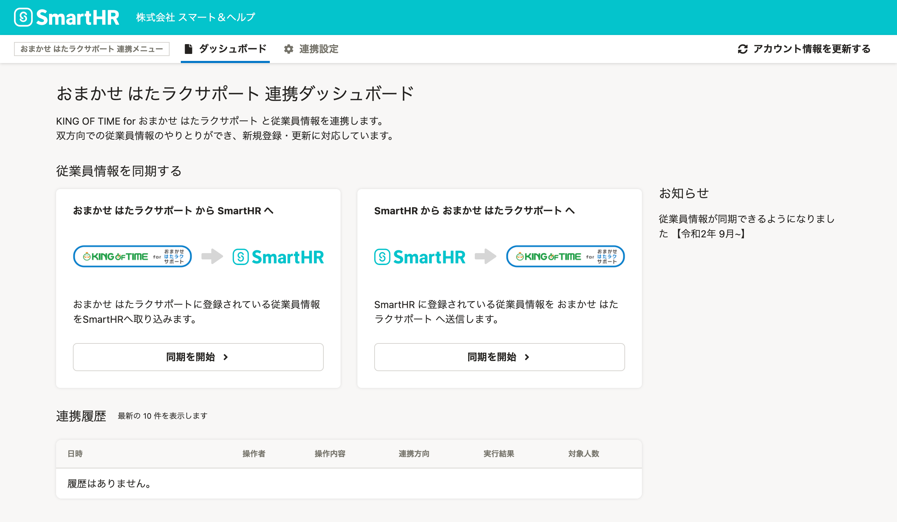

勤怠管理システム[おまかせ はたラクサポート（KING OF TIME for おまかせ はたラクサポート）](https://business.ntt-east.co.jp/service/ohs/)と連携し、従業員情報の新規登録や更新が可能です。

初回のみ、下記の設定が必要です。

# 1\. ［外部システム連携］で、おまかせ はたラクサポートをインストール

管理者アカウントでSmartHRにログインし、 **［共通設定］>［外部システム連携］>［アプリケーション連携］** にある、おまかせ はたラクサポート 連携の **［インストール］** をクリックすると、オプション機能がインストールされます。

詳しくは下記のヘルプページをご覧ください。

:::related
[他社のアプリケーションをインストールする](https://knowledge.smarthr.jp/hc/ja/articles/4405252726041)
:::

# 2\. トップページの［機能］にある［おまかせ はたラクサポート 連携］をクリック

トップページ左側の **［機能］** 欄にある **［おまかせ はたラクサポート 連携］** をクリックすると、おまかせ はたラクサポート 連携ダッシュボードに移ります。

# 3\. ［連携設定］>［連携開始］をクリック

画面上部の おまかせ はたラクサポート連携メニューにある **［連携設定］** をクリックします。

 **［連携開始］** をクリックすると、おまかせ はたラクサポートとの連携確認画面に移ります。

# 4\. IDとパスワードを入力し、同意のチェックを入れて［承諾する］をクリック

 **［KING OF TIME for おまかせはたラクサポート 全権管理者ID］** と **［パスワード］** （おまかせ はたラクサポートのパスワード）を入力し、使用許諾と同意書に同意するチェックを入れて **［承諾する］** をクリックすると、アカウントを連携します。

下記の画面が表示されたら連携成功です。

