勤怠管理システム[おまかせ はたラクサポート（KING OF TIME for おまかせ はたラクサポート）](https://business.ntt-east.co.jp/service/ohs/)と連携し、従業員情報の新規登録や更新ができます。

同期対象となる従業員情報、同期の前に必要な連携設定については、それぞれ下記のヘルプページを参照してください。

:::related
[【おまかせ はたラクサポート】同期可能な従業員情報](https://knowledge.smarthr.jp/hc/ja/articles/360056232274)
[【おまかせ はたラクサポート】連携設定（初回のみ）](https://knowledge.smarthr.jp/hc/ja/articles/360056035933)
:::
:::alert
- おまかせ はたラクサポートのメンテナンス時間帯（8:30～10:00、17:30～18:30）は、連携機能を利用できません。
- 従業員情報の更新は、社員番号をキーにして連携します。
:::

# おまかせ はたラクサポートからSmartHRに同期

## 1\. SmartHRに管理者権限でログインする

SmartHRに管理者権限でログインします。

## 2.［機能］欄にある［おまかせ はたラクサポート連携］をクリック

トップページ左の **［機能］** 欄にある **［おまかせ はたラクサポート連携］** をクリックすると、「おまかせ はたラクサポート 連携ダッシュボード」に移ります。

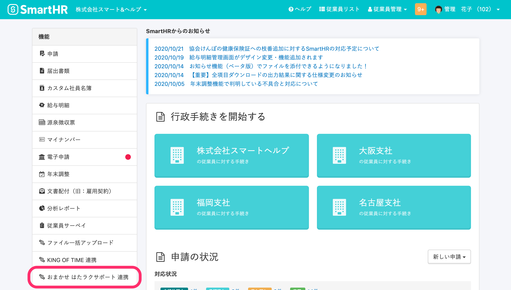

## 3.「おまかせ はたラクサポートからSmartHRへ」の［同期を開始 >］をクリック

「おまかせ はたラクサポートからSmartHRへ」と書かれた項目にある **［同期を開始 >］** をクリックすると、「おまかせ はたラクサポートからSmartHRへ同期(1/3)」と書かれた画面に移ります。

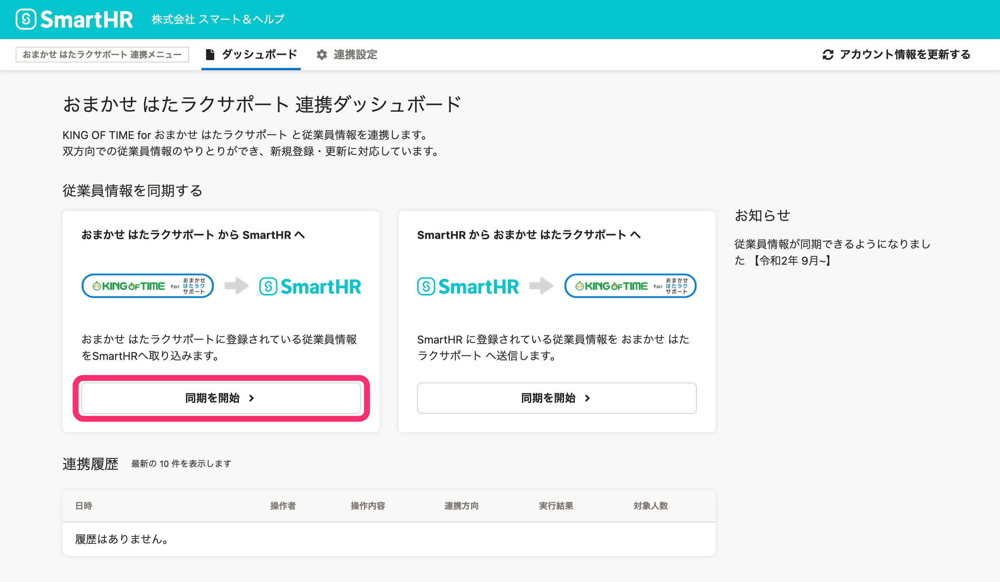

## 4.［おまかせ はたラクサポートの情報取得基準日］を指定し、［次へ］をクリック

 **［おまかせ はたラクサポートの情報取得基準日］** を指定し、 **［次へ］** をクリックすると、「おまかせ はたラクサポートからSmartHRへ同期(2/3)」と書かれた画面に移ります。

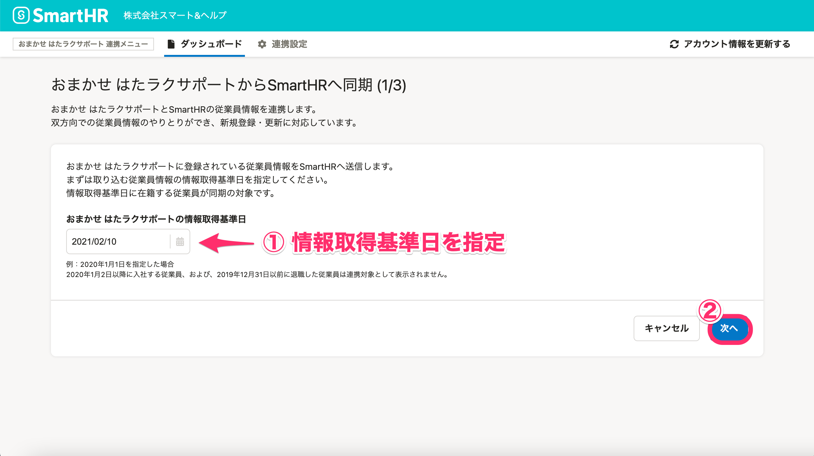

:::tips
同期対象となるのは、おまかせ はたラクサポートの情報取得基準日に在籍する従業員です。
例：2020年1月1日を指定した場合
2020年1月2日以降に入社する従業員、および、2019年12月31日以前に退職した従業員は連携対象として表示されません。
:::

## 5.［SmartHRの所属事務所］を選択し、［次へ］をクリック

 **［SmartHRの所属事業所］** をプルダウンメニューから選択し、 **［次へ］** をクリックすると、「おまかせ はたラクサポートからSmartHRへ同期(3/3)」と書かれた画面に移ります。

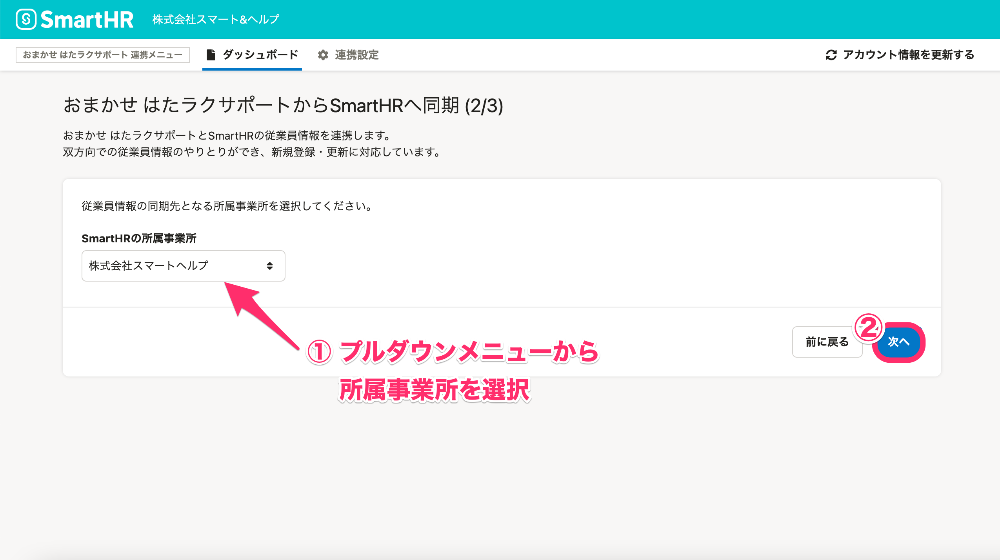

おまかせ はたラクサポートから同期する従業員情報を、どの事業所に含めるかを設定します。

## 6\. 同期する従業員にチェックを入れ、［確認］をクリック

同期する従業員にチェックを入れ、 **［確認］** をクリックすると「従業員情報を同期します」という画面が表示されます。

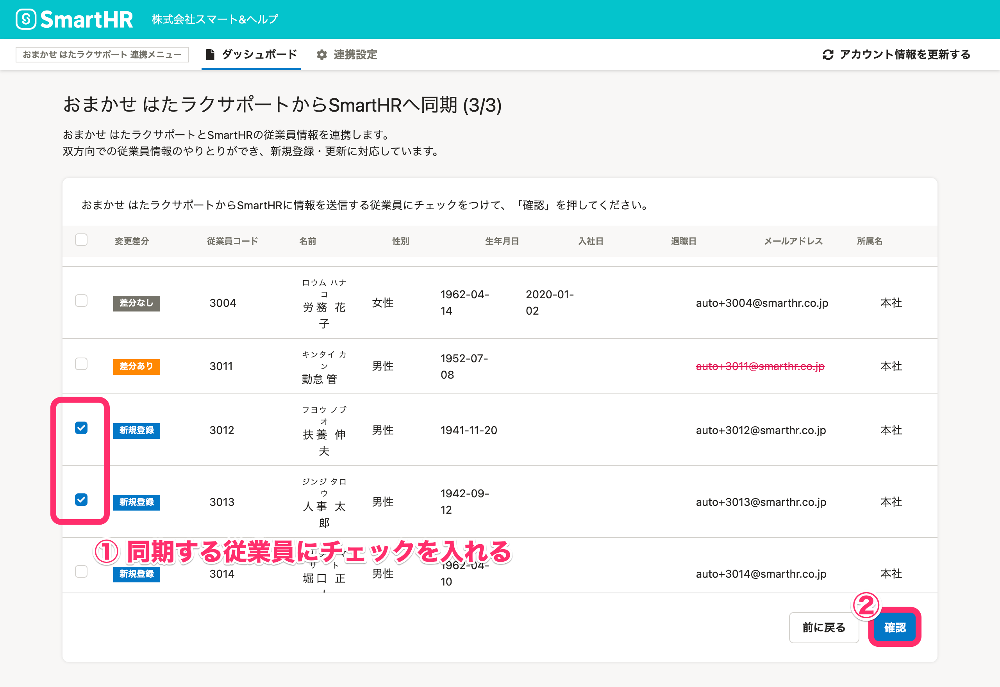

## 7.［同期］をクリック

同期する従業員を確認し、 **［同期］** をクリックすると、おまかせ はたラクサポート連携ダッシュボード画面が表示されます。

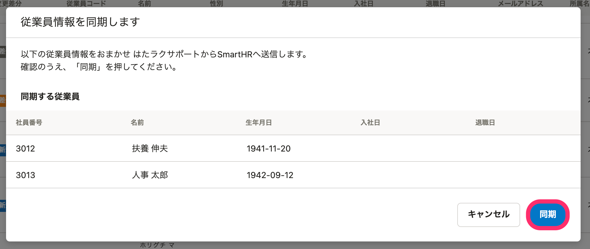

おまかせ はたラクサポート連携ダッシュボードの **［連携履歴］** に同期を実行した日時や操作内容が表示されます。

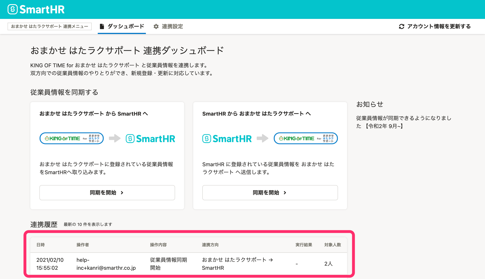

:::tips
従業員情報の同期が完了すると、以下のようなメールで通知されます。
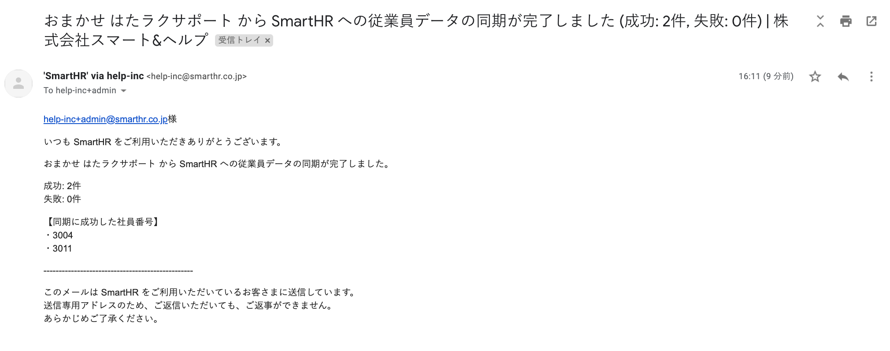
また、おまかせ はたラクサポート連携ダッシュボードの **［連携履歴］** にある **［実行結果］** に結果が表示されます。
画面表示は自動で切り替わらないため、同期後、しばらく時間を置いてからブラウザを更新してください。
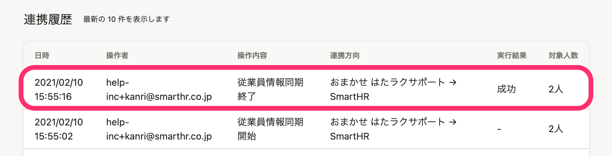
:::

## 8.［従業員リスト］で同期した従業員情報を確認する

 **［従業員リスト］** を開き、従業員情報が取り込まれていることを確認してください。

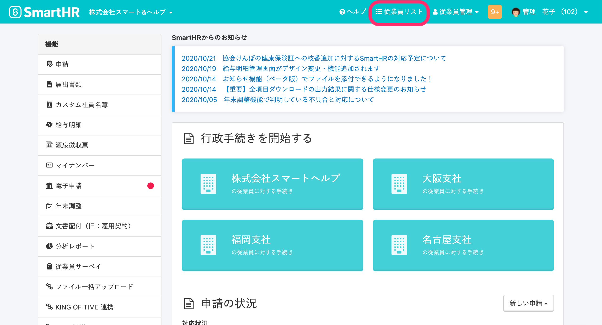

# SmartHRからおまかせ はたラクサポートに同期

## 1\. SmartHRに管理者権限でログインする

SmartHRに管理者権限でログインします。

## 2.［機能］にある［おまかせ はたラクサポート連携］をクリック

トップページ左の **［機能］** にある **［おまかせ はたラクサポート 連携］** をクリックすると、「おまかせ はたラクサポート連携ダッシュボード」に移ります。

## 3.「SmartHRからおまかせ はたラクサポートへ」の［同期を開始 >］ をクリック

「SmartHRからおまかせ はたラクサポートへ」と書かれた項目にある **［同期を開始 >］**  をクリックすると、「SmartHRからおまかせ はたラクサポートへ同期(1/3)」と書かれた画面に移ります。

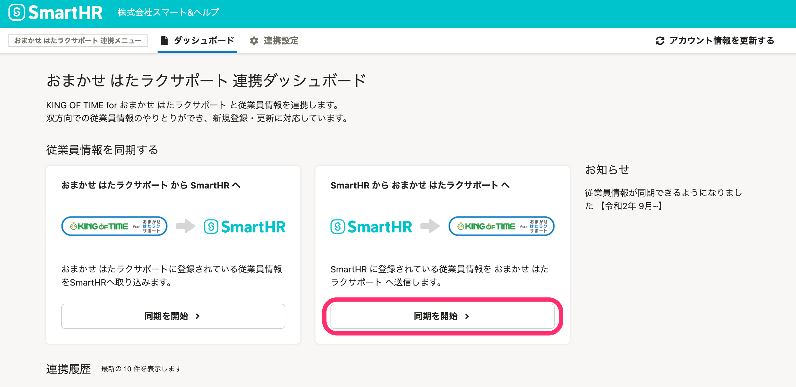

## 4.［SmartHRの情報取得基準日］を指定し、［次へ］をクリック

 **［SmartHRの情報取得基準日］** を指定し、 **［次へ］** をクリックすると、「SmartHRからおまかせ はたラクサポートへ同期(2/3)」と書かれた画面に移ります。

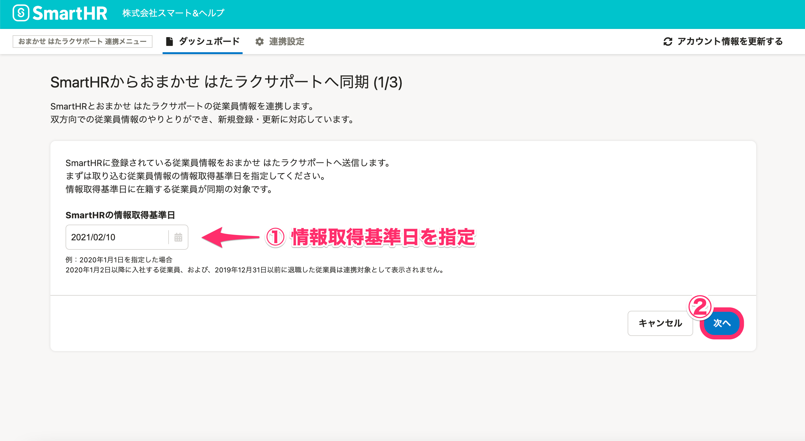

:::tips
同期対象となるのは、SmartHRの情報取得基準日に在籍する従業員です。
例：2020年1月1日を指定した場合
2020年1月2日以降に入社する従業員、および、2019年12月31日以前に退職した従業員は連携対象として表示されません。
:::

## 5.［おまかせ はたラクサポートの所属事業所・雇用区分］を選択し、［次へ］をクリック

 **［おまかせ はたラクサポート の所属事業所］［**  **おまかせ はたラクサポートの雇用区分］** をそれぞれプルダウンメニューから選択し、 **［次へ］** をクリックすると、「おまかせ はたラクサポートからSmartHRへ同期(3/3)」と書かれた画面に移ります。

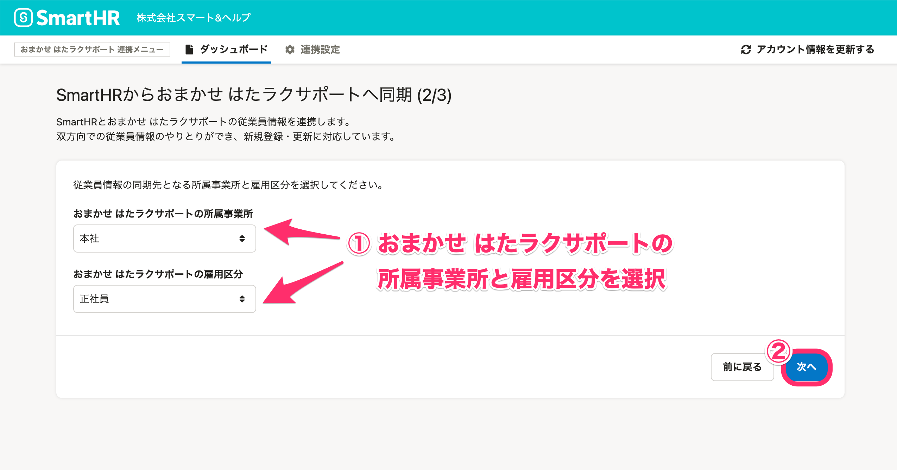

SmartHRからおまかせ はたラクサポートへ同期する従業員情報を、どの事業所・どの雇用区分に含めるかを設定します。

:::tips
従業員全員に対して1つの所属事業所、1つの雇用区分を適用します。
所属事業所や雇用区分が異なる場合は、所属事業所／雇用区分ごとに従業員を選択するか、取り込み後、KING OF TIME側で設定を変更してください。
:::

## 6\. 同期する従業員にチェックを入れ、［確認］をクリック

同期する従業員にチェックを入れ、 **［確認］** をクリックすると「従業員情報を同期します」という画面が表示されます。

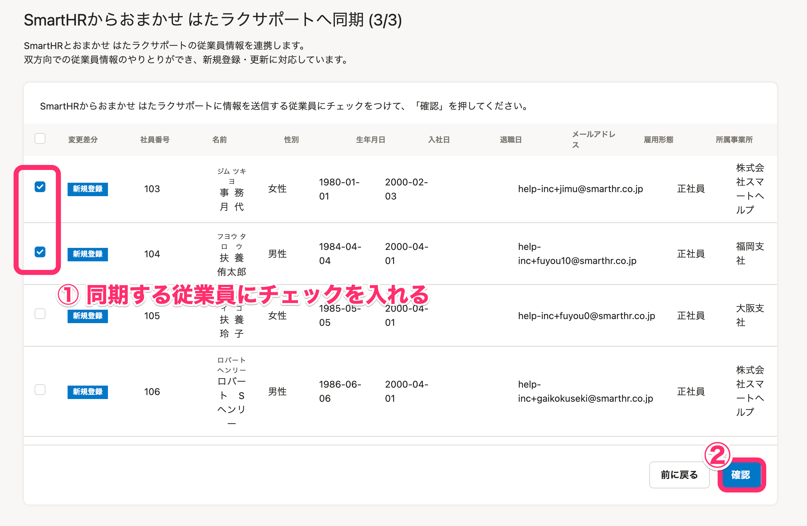

## 7.［同期］をクリック

同期する従業員を確認し、 **［同期］** をクリックすると、おまかせ はたラクサポート連携ダッシュボード画面が表示されます。

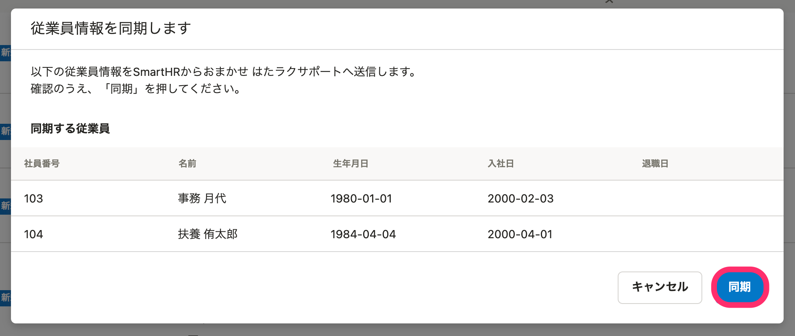

おまかせ はたラクサポート連携ダッシュボードの **［連携履歴］** に同期を実行した日時や操作内容が表示されます。

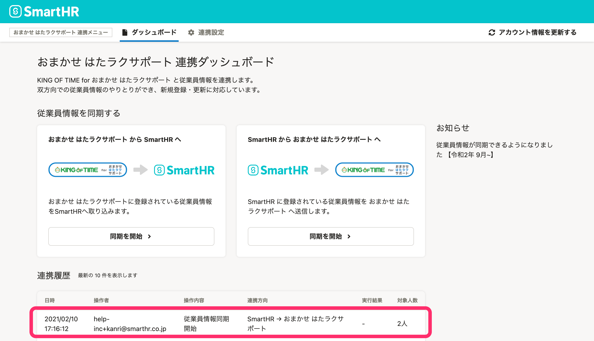

:::tips
従業員情報の同期が完了すると、以下のようなメールで通知されます。
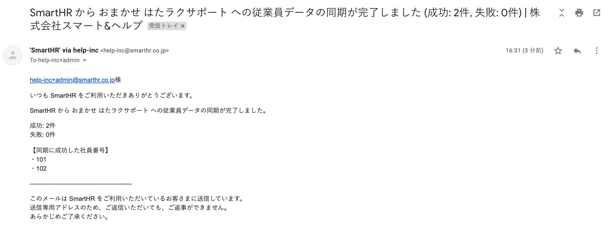
また、おまかせ はたラクサポート連携ダッシュボードの **［連携履歴］** にある **［実行結果］** に結果が表示されます。
画面表示は自動で切り替わらないため、同期後、しばらく時間を置いてからブラウザを更新してください。
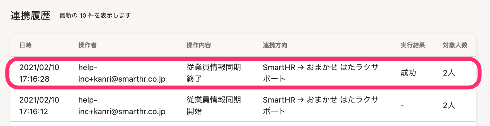
:::

## 8\. おまかせ はたラクサポートで同期した従業員情報を確認する

従業員設定や従業員検索から従業員情報が取り込まれていることを確認してください。

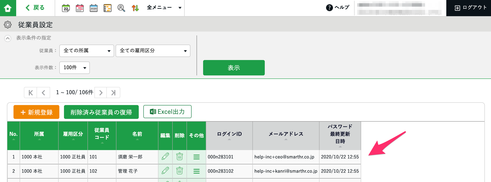

# 従業員情報のステータス

おまかせ はたラクサポート⇔SmartHR間の従業員情報の登録状況によって、下図3つのステータスに分かれます。

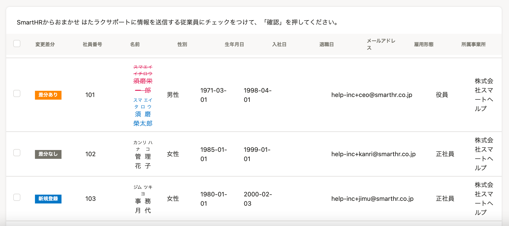

- **差分あり**
    - 連携対象となる従業員情報の以下項目のいずれかに差分がある状態です。
        - 名前
        - 性別
        - 生年月日
        - 入社日
        - 退職日
        - メールアドレス
    - 赤字＋取り消し線がついたものが連携先に登録されている「古い情報」、緑の文字で書かれたものが連携元に登録されている「新しい情報」です。
    - 緑の文字で書かれた情報が連携先に取り込まれ、上書きされます。
- **差分なし**
- - 連携対象となる従業員情報の以下項目に差分がない状態です。
        - 名前
        - 性別
        - 生年月日
        - 入社日
        - 退職日
        - メールアドレス
    - 取り込む対象として選択できません。
- **新規登録**
    - 連携先のシステムに従業員情報が存在しない状態です。
    - 下記の情報が連携先システムに取り込まれます。
        - 従業員コード
        - 名前
        - 性別
        - 生年月日
        - 入社日
        - 退社日
        - メールアドレス
        - 所属事業所
        - 雇用区分（SmartHR→おまかせ はたラクサポートに同期する場合のみ）
