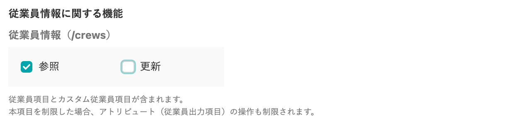
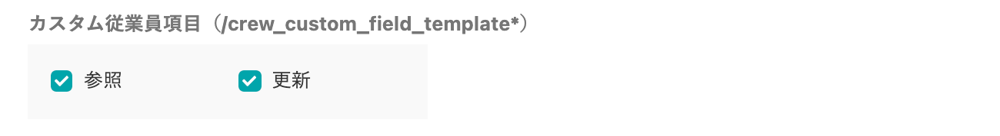

健康管理クラウドサービス [Carely](https://www.carely.jp/?__hstc=67988558.e15ff9b51c14f7f920fdea18d0eee72e.1608605529924.1608605529924.1609987233840.2&__hssc=67988558.17.1609987233840&__hsfp=1803105342) と連携すると、SmartHRからCarelyへワンクリックで従業員情報の同期が可能になります。

当ページでは、SmartHRのアクセストークン発行画面で設定できる「リソースの制限」「アトリビュート（従業員出力項目）の制限」について、正しく情報を連携するために必要な設定を案内します。

連携設定の操作手順については、Carely提供の下記資料をご覧ください。

また、連携設定についてご不明点がある場合は、Carelyへお問い合わせをお願いします。

[従業員データの取込｜【公開用】API連携方法（SmartHR/TeamSpirit/KING OF TIME）](https://docs.google.com/presentation/d/1uTNg19gtqy3OZimcEpvJOV5S69PvDdu4nGHLAZhgi7c/edit)

SmartHRでアクセストークンを発行する手順については、下記のヘルプページでも案内しています。

:::related
[アクセストークンの発行方法](https://knowledge.smarthr.jp/hc/ja/articles/360026266033)
:::

# リソースの制限

下記2項目は指定のとおり設定してください。

その他の項目の設定は任意です。

 **■従業員情報（/crews）** 

**\[参照\]** にチェックをつけてください。

**■カスタム従業員項目（/crew\_custom\_field\_template\*）** 

**\[参照\] \[更新\]** の両方にチェックをつけてください。

# アトリビュート（従業員出力項目）の制限

下記の項目（論理名/物理名）は **\[参照\]** のチェックを外さないようにしてください。

その他の項目の設定は任意です。

- 姓/last\_name
- 名/first\_name
- 姓（カタカナ）/last\_name\_yomi
- 名（カタカナ）/first\_name\_yomi
- 生年月日/birth\_at
- 性別/gender
- メールアドレス/email
- 在籍状況/emp\_status
- 入社年月日/entered\_at
- 退職・解雇・死亡年月日/resigned\_reason
- 社員番号/emp\_code
- 役職/position
- 雇用形態/employment\_type
- 部署/departments
