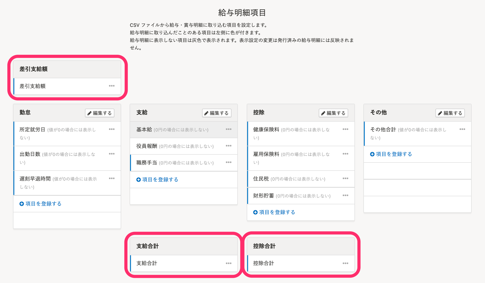
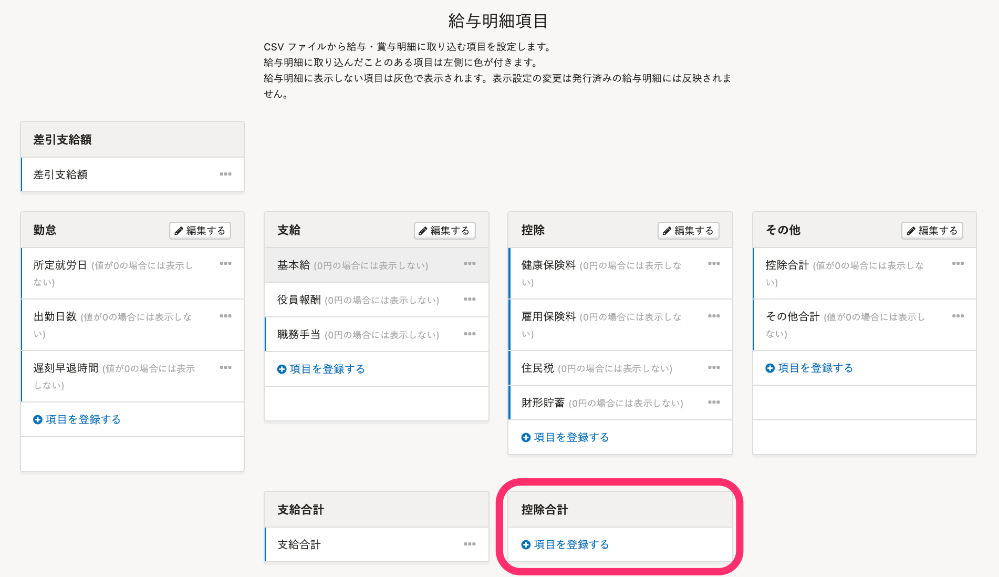

# A. SmartHRの給与明細項目に［差引支給額］［支給合計］［控除合計］が登録されていない可能性があります。

freee人事労務からSmartHRに給与明細を取り込むには、SmartHRの給与明細項目に **［差引支給額］［支給合計］［控除合計］** の3項目がすべて登録されている必要があります。

1つでも未登録の項目がある場合は、取り込みに失敗します。

失敗例：給与明細項目に **［控除合計］** が登録されていない

## 対応方法

同期に失敗する場合、SmartHRの給与明細項目に **［差引支給額］［支給合計］［控除合計］** の3項目がすべて登録されているかを確認のうえ、再度、同期をお試しください。

それぞれの詳しい手順は、以下のヘルプページをご覧ください。

:::related
[給与明細項目を設定する](https://knowledge.smarthr.jp/hc/ja/articles/360026265193)
[【freee](https://knowledge.smarthr.jp/hc/ja/articles/360049679094)[人事労務](https://knowledge.smarthr.jp/hc/ja/articles/360049679094)[】給与明細を連携する](https://knowledge.smarthr.jp/hc/ja/articles/360049679094)
:::
