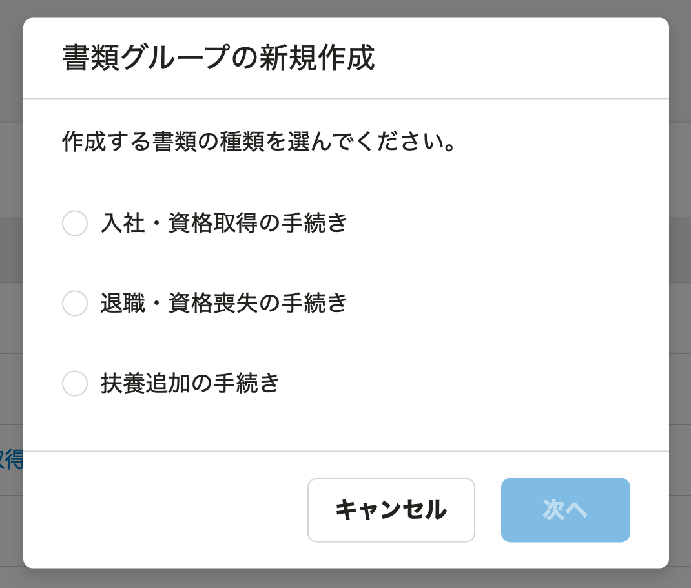
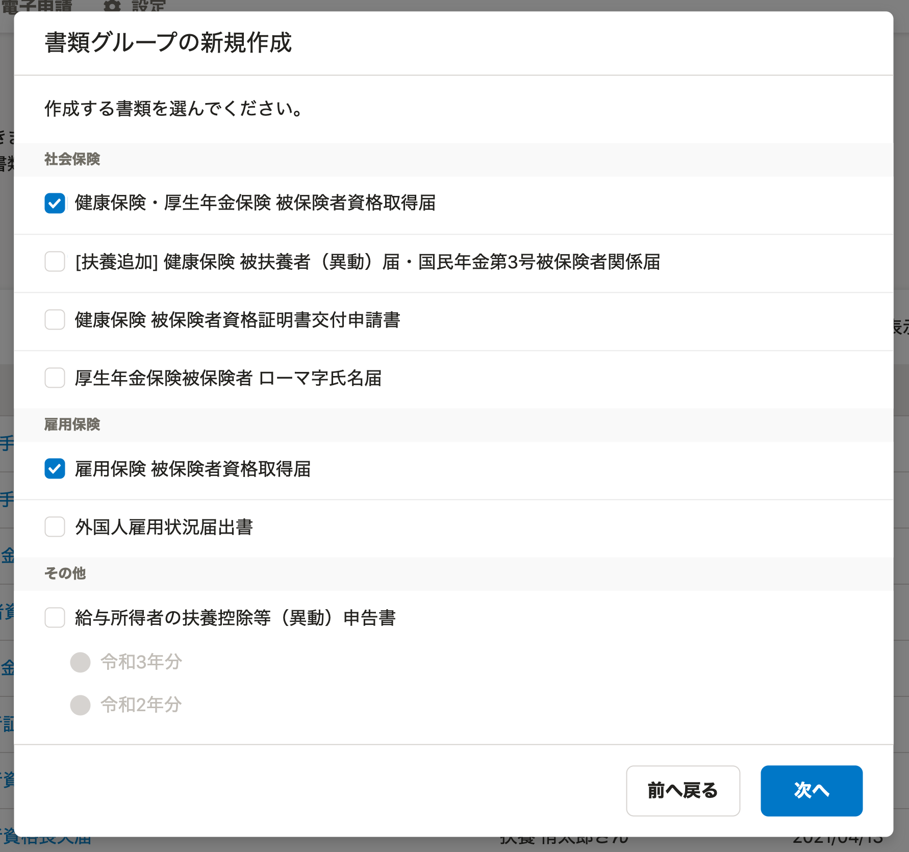
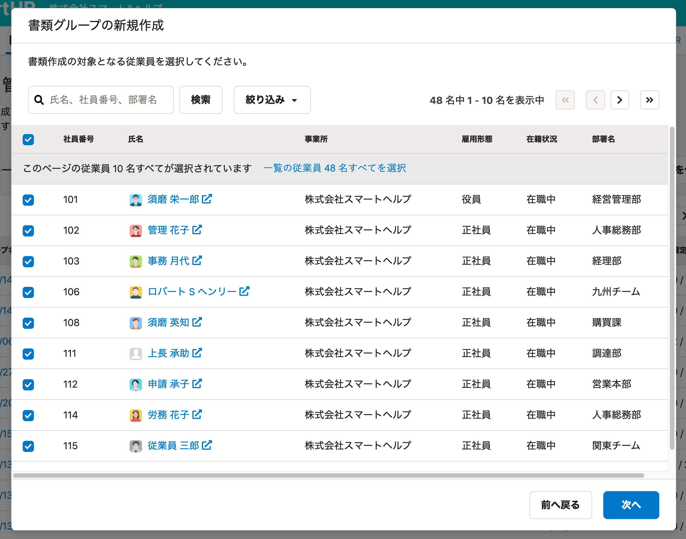
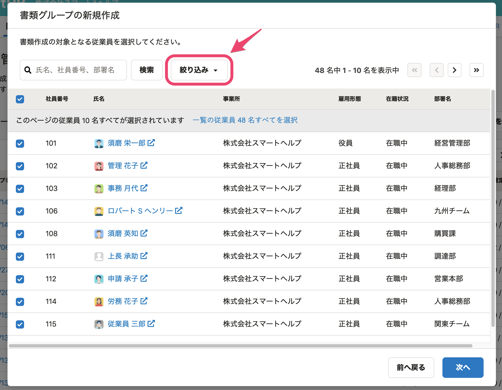
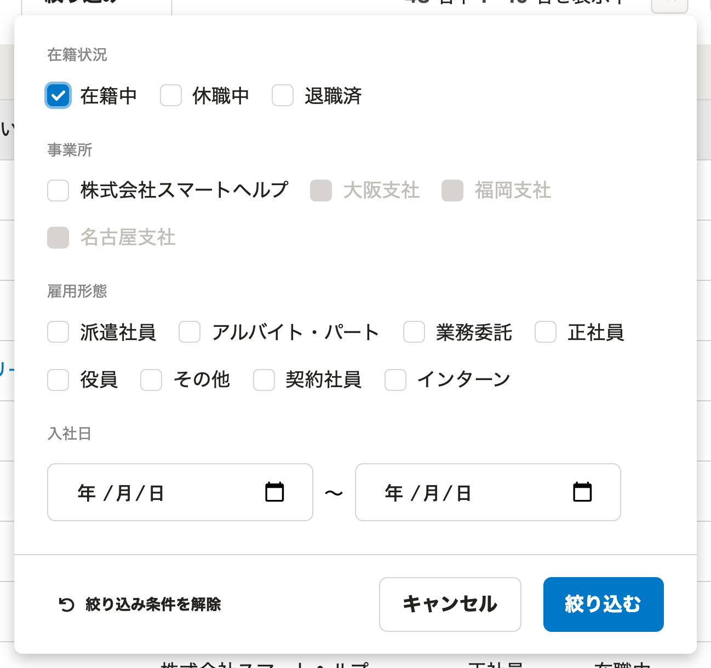

届出書類作成機能では、書類と従業員を自由に組み合わせたグループを作成できます。

# 1\. トップページ左側の［機能］にある［届出書類］をクリック

トップページ左側の **［機能］** にある **［届出書類］** をクリックすると、届出書類管理画面が表示されます。

# 2.［+新しく書類を作成する］をクリック

書類管理画面にある **［＋新しく書類を作成する］** をクリックすると、書類グループの新規作成画面が表示されます。

# 3\. 作成する書類グループの情報を入力

書類グループの新規作成画面は4つのステップにわかれています。

## 3-1. 作成する書類の種類を選ぶ

最初のステップで作成する書類の種類を選び、 **［次へ］** をクリックすると、書類選択画面が表示されます。

## 3-2. 作成する書類を選ぶ

2番目のステップで作成する書類を選び、右下の **［次へ］** をクリックすると、対象従業員選択画面が表示されます。

## 3-3. 対象の従業員を選択する

書類グループの新規作成の3番目のステップでは、書類作成の対象となる従業員を選択してください。

従業員を選択し、右下の **［次へ］** をクリックすると、書類グループの名前を入力する画面が表示されます。

:::tips
対象従業員のリストは、在籍状況や雇用形態、入社日などで絞り込めます。

:::

## 3-4. 書類グループ名を入力し、［作成］をクリック

4番目のステップとしてグループ名を入力し、右下の **［作成］** をクリックすると、書類が作成されます。

書類の作成が完了するまで、すこし時間がかかります。

作成中の画面が表示される場合は、しばらく時間が経ってから、 **［画面を更新］** をクリックしてください。
