届出書類作成機能で作った書類は、書類グループ画面で、書類ごと・従業員ごとのいずれかで確認できます。

また、確認した書類も電子申請も、書類グループ画面から行います。

# 書類情報を確認する

書類グループ画面の表示は、書類ごと・従業員ごとの2種類の表示があり、画面左側にあるアイコンをクリックすると切り替えられます。

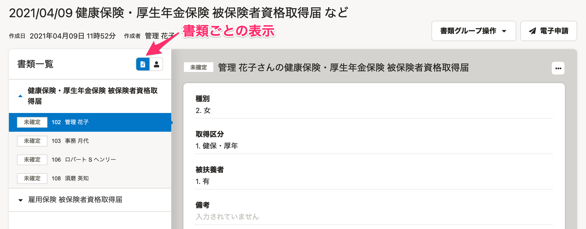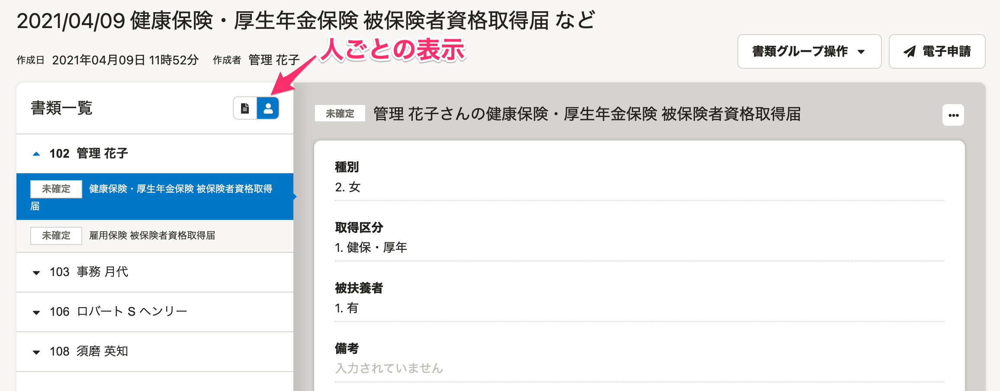

以下では、書類ごとの表示で確認する方法をご案内します。

## 1\. 確認したい書類名をクリック

書類グループ画面左側の  **［書類一覧］**  にある書類名をクリックすると、グループに含まれる従業員のリストが表示されます。

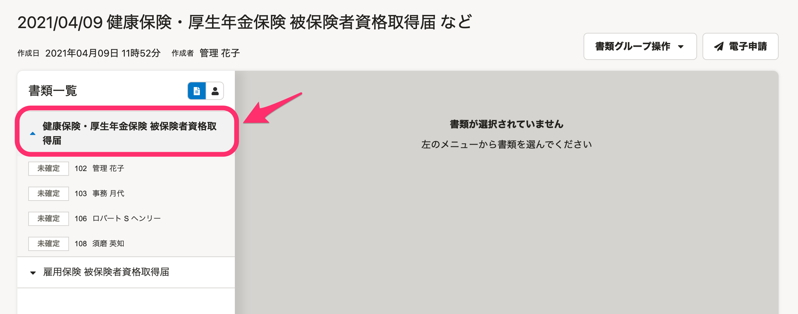

## 2\. 書類の内容を確認したい従業員をクリック

書類名をクリックして表示された従業員名をクリックすると、選択した従業員の書類情報が右側に表示されます。

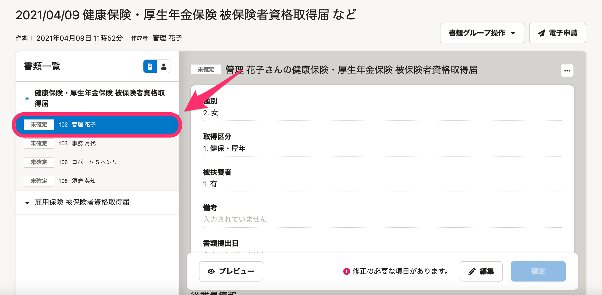

:::tips
書類情報欄の **［プレビュー］** をクリックすると、実際の書類のかたちで確認できます。
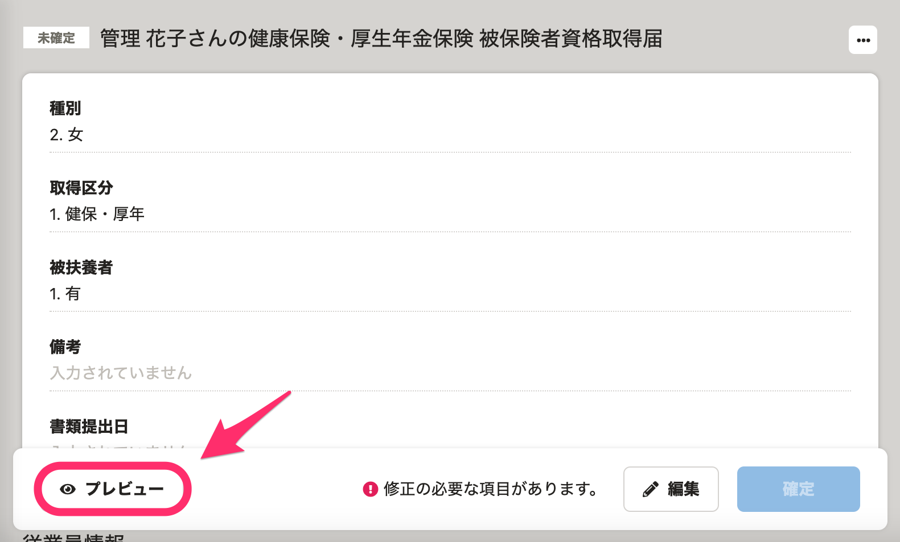
プレビュー画面の右上にある **［ダウンロード］** をクリックすると、個別にPDFファイルのダウンロードもできます。
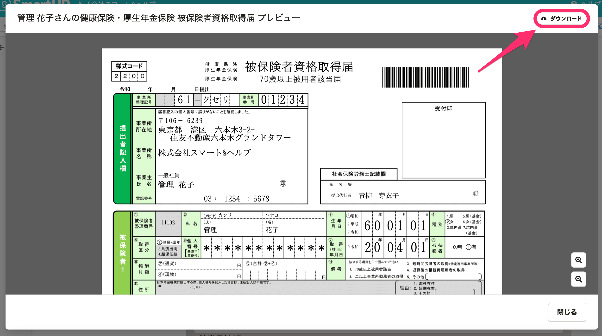
:::

# 書類情報を編集する

書類に使用する情報は、個別に編集できます。

## 1\. 書類情報欄の［編集］をクリック

書類情報欄の下部に表示される **［編集］** をクリックすると、書類情報の編集画面が表示されます。

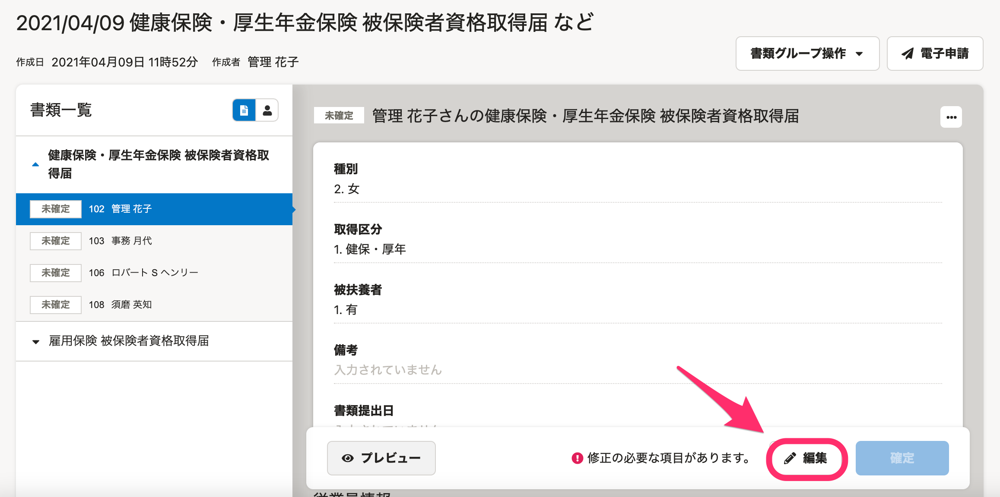

## 2\. 必要な情報を編集し、［保存］をクリック

必要な情報を編集して右下の **［保存］** をクリックすると変更が反映され、書類情報画面に戻ります。

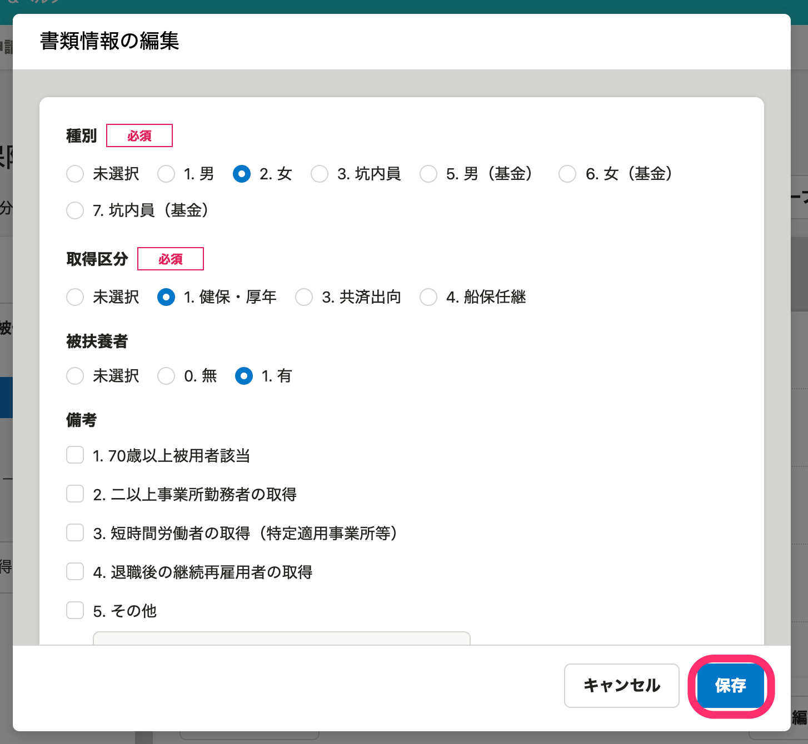

# 従業員情報や会社情報、事業所情報を編集する

書類で使われる従業員情報や会社情報、事業所情報の変更が必要な場合は、画面に表示されているリンクをクリックし、遷移先の編集画面で変更してください。

## 1\. 書類情報欄にある ［従業員情報編集］や［会社情報編集］などをクリック

書類情報欄の  **［従業員情報］**  部分に表示されている  **［従業員情報の編集］**  をクリックすると、従業員情報の編集画面が表示されます。

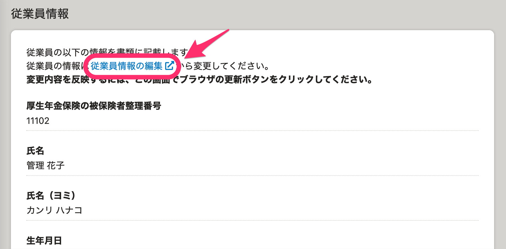

## 2\. 従業員情報などを編集する

従業員情報画面で必要な編集を行なった後、画面右下の **［更新する］** をクリックすると、従業員情報の変更が保存されます。

## 3\. 書類グループ画面を更新する

遷移先の画面で変更した情報は、書類グループ画面で書類情報画面を更新すると、反映されます。

# 書類を確定する

## 1\. 書類情報画面右下の［確定］をクリック

電子申請に必要な情報がすべて揃っている場合、書類画面右下の **［確定］** をクリックできます。

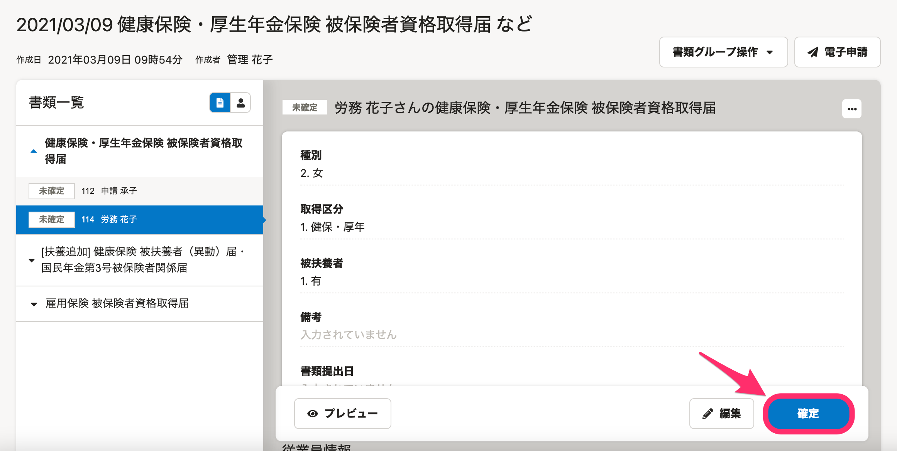

## 2\. 確認画面で［確定］をクリック

 **［確定］** をクリックすると、確認画面が表示されます。

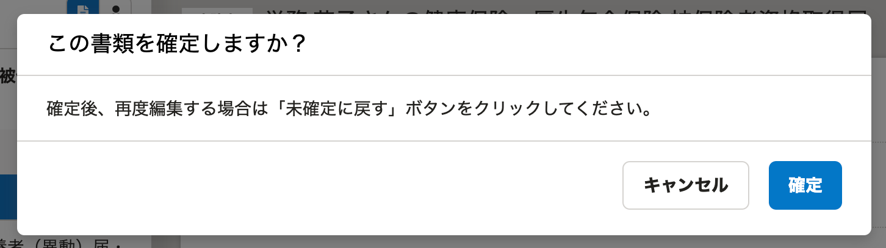

確定した書類は、画面左側のリスト上でも  **［確定済］**  と表示されます。

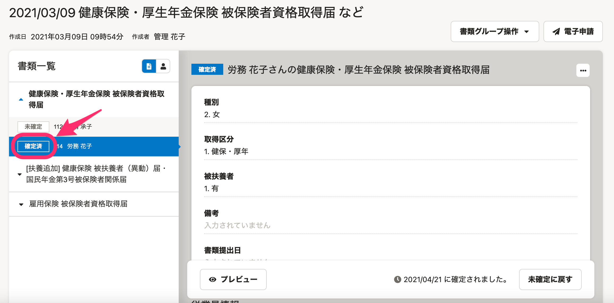

:::tips
未確定状態の書類は、従業員情報などが更新されると、書類にも変更内容が反映されます。
確定状態になった書類は、従業員情報などの更新が反映されなくなり、確定した時点の状態を保持できます。
:::

# 書類グループを削除する

作成した書類グループは、削除もできます。

## 1.［書類グループ操作］メニューにある［削除］をクリック

書類グループ画面右上の **［書類グループ操作］** メニューにある **［削除］** をクリックすると、確認画面が表示されます。

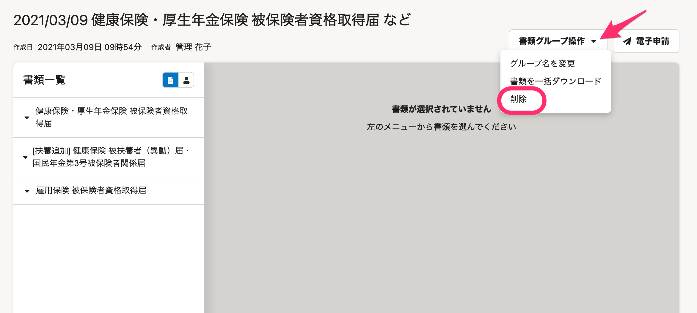

## 2\. 警告内容を確認し、［削除］をクリック

削除した書類グループは、もとに戻せません。

問題がなければ、確認画面右下の **［削除］** をクリックしてください。

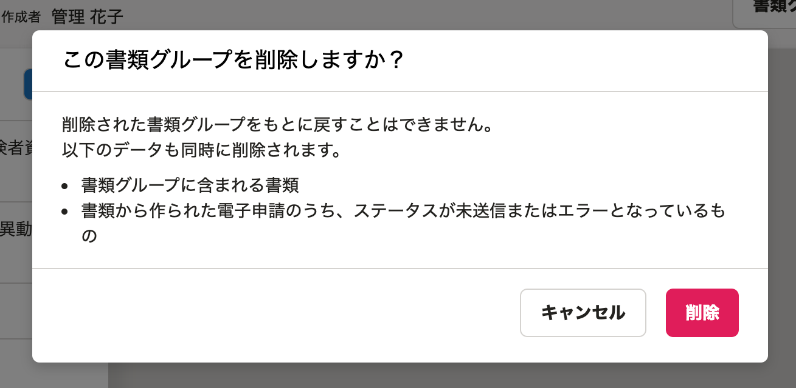
