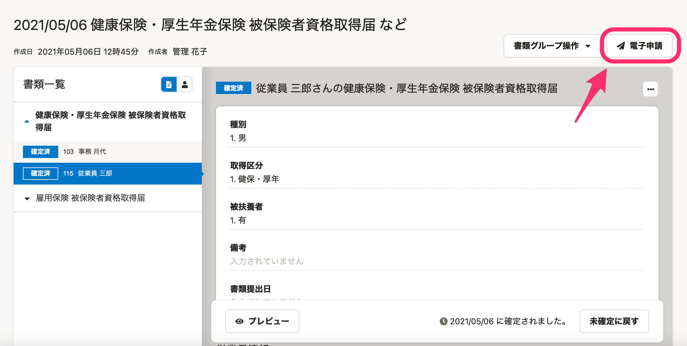
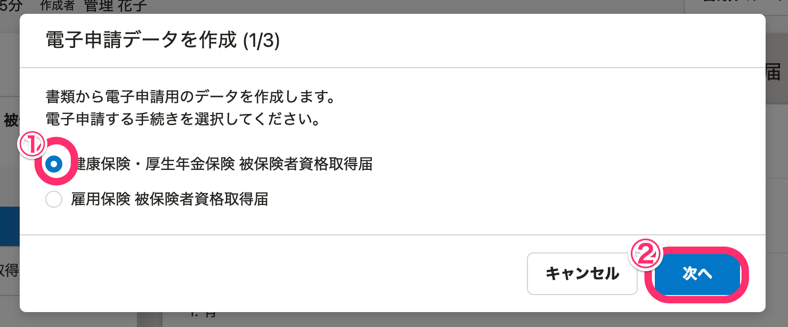
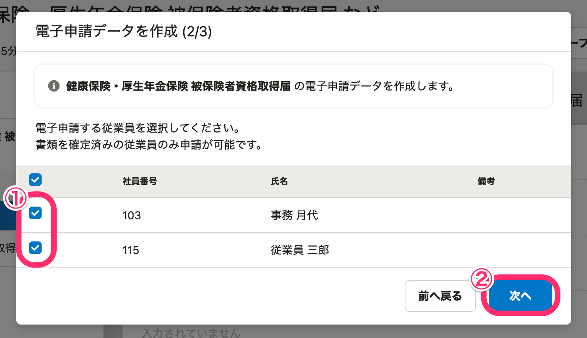
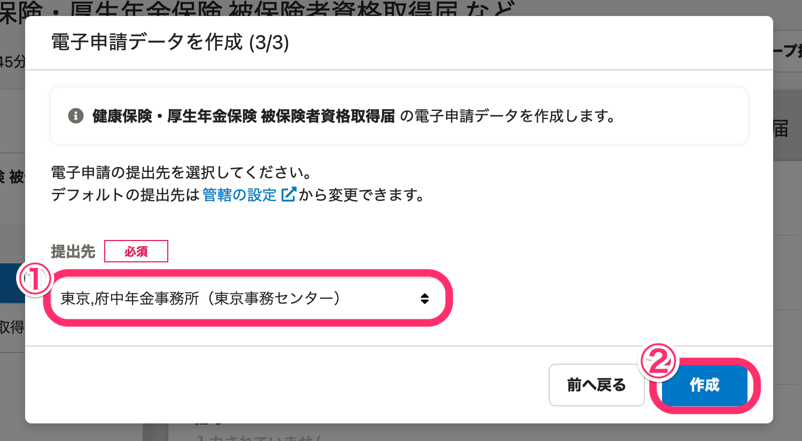
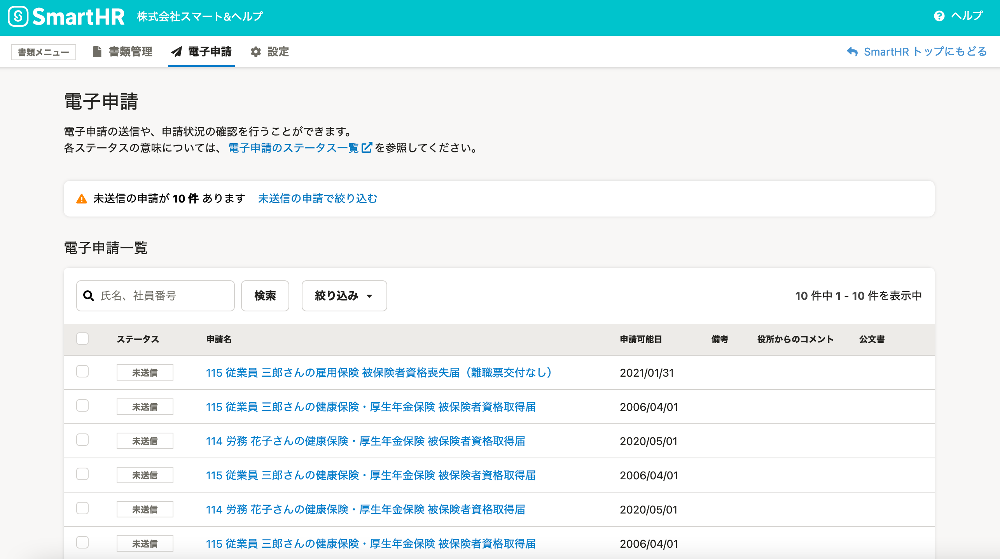

届出書類機能を使って電子申請を作成する際は、書類グループ画面の **［電子申請］** から行ないます。

書類グループに含まれる確定済みの書類の電子申請が可能です。

# 1\. 書類グループ画面右上の［電子申請］をクリック

書類グループ画面右上の **［電子申請］** をクリックすると、電子申請データの作成画面が表示されます。

# 2\. 電子申請したい手続きを選択し、［次へ］をクリック

電子申請データの作成画面では、最初に電子申請する手続きを選択してください。

電子申請を選択して、画面右下の **［次へ］** をクリックすると、対象従業員の選択画面が表示されます。

# 3\. 電子申請する従業員を選択し、［次へ］をクリック

電子申請データ作成の2番目のステップでは、電子申請をする従業員を選択してください。

従業員を選択し、右下の **［次へ］** をクリックすると、提出先選択画面が表示されます。

# 4\. 電子申請の提出先を選択し、［作成］をクリック

電子申請データ作成の3番目のステップでは、電子申請の提出先を選択してください。

提出先を選択して、  **［作成］**  をクリックすると、電子申請が作成され、電子申請一覧に表示されます。

:::tips
電子申請作成後、送信の操作が必要です。
電子申請の送信方法は、以下のヘルプページをご覧ください。
[電子申請を送信する](https://knowledge.smarthr.jp/hc/ja/articles/360050765173)
:::
