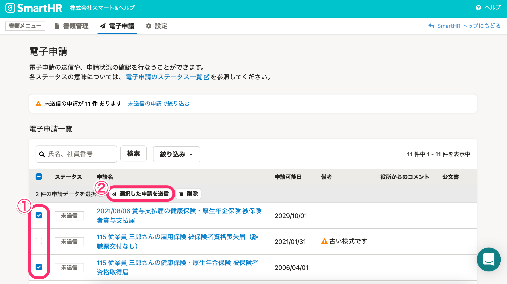
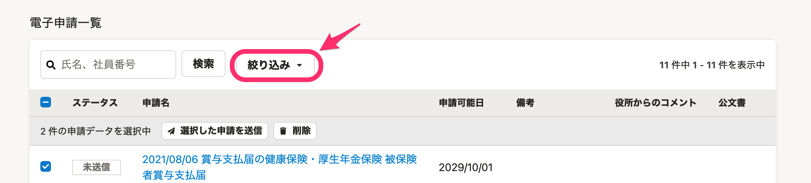
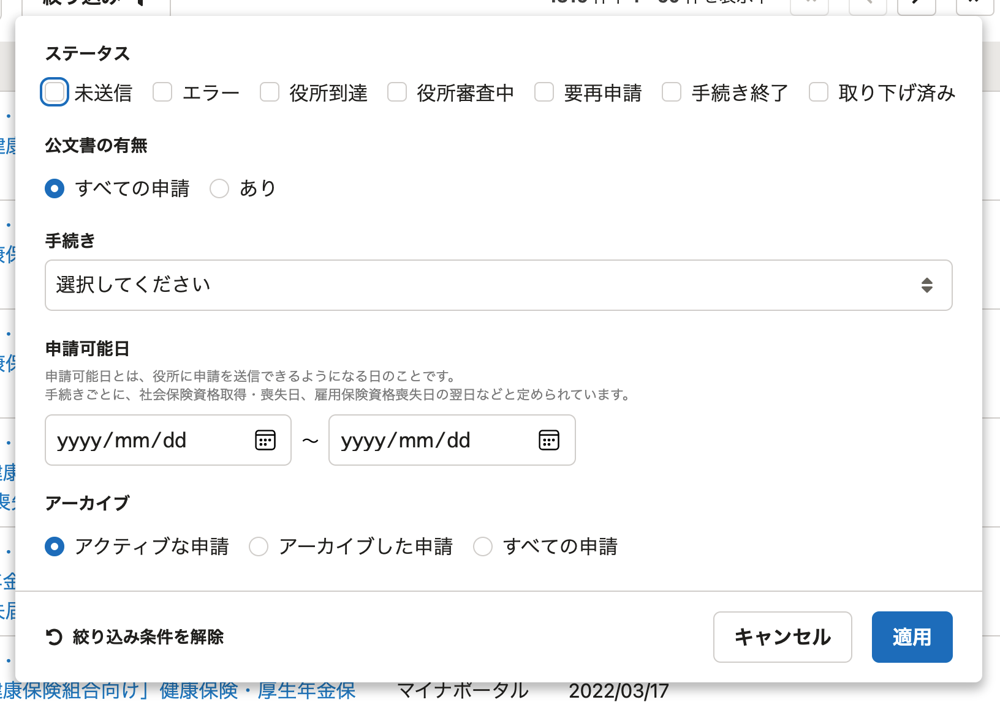
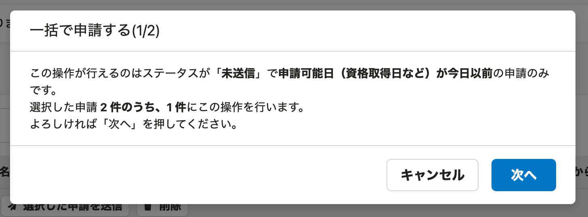
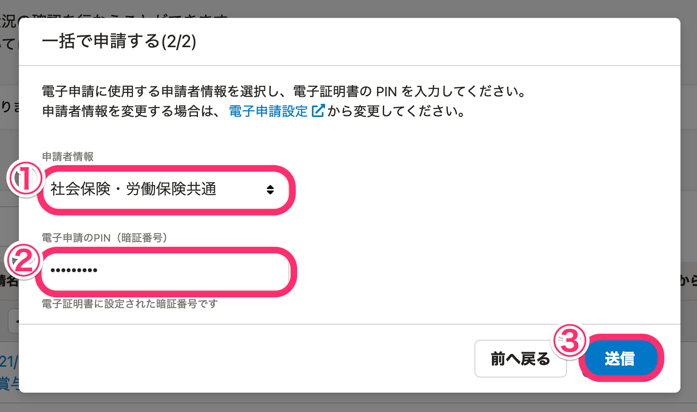

届出書類機能では、複数の電子申請を一括で送信できます。

# 1\. 送信したい電子申請を選択し、［選択した申請を送信］をクリック

電子申請一覧画面で、送信したい申請を選択し、 **［選択した申請を送信］** をクリックすると、確認画面が表示されます。

:::tips
電子申請一覧に表示される申請は、ステータスや手続き、作成日などの条件で絞り込めます。

| 絞り込む項目名 |   概要   |
| --- | --- |
| ステータス |   未送信／エラー／役所到達／役所審査中／要再申請／手続き終了／取り下げ済み という電子申請のステータスで絞り込めます。  各ステータスの意味については、下記のヘルプページをご覧ください。  [【一覧】電子申請の「ステータス」](https://knowledge.smarthr.jp/hc/ja/articles/4410425552537)   |
| 公文書の有無 | すべての申請／あり（＝公文書のある申請）という2つの状態で絞り込めます。 |
| 手続き | 作成した電子申請の手続き名で絞り込めます。 |
| 申請可能日 | 申請可能日を指定した範囲で絞り込めます。 |
| アーカイブ | アクティブな申請（＝アーカイブしてない申請）／アーカイブした申請／すべての申請 という3つの状態で絞り込めます。 |
:::

# 2\. 送信する申請を確認し、［次へ］をクリック

一括で送信できるのは、ステータスが **［未送信］** の申請のみです。

件数の確認をし、 **［次へ］** をクリックすると、申請者情報と電子申請のPINの入力画面が表示されます。

# 3\. 申請者情報の選択と電子申請のPINの入力を行い、［送信］をクリック

一括申請の2番目のステップでは、申請者情報の選択と、電子申請のPIN（暗証番号）を入力します。

選択・入力をして **［送信］** をクリックすると、電子申請が送信され、電子申請一覧画面に戻ります。

