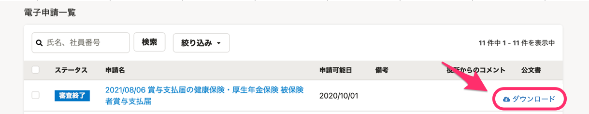
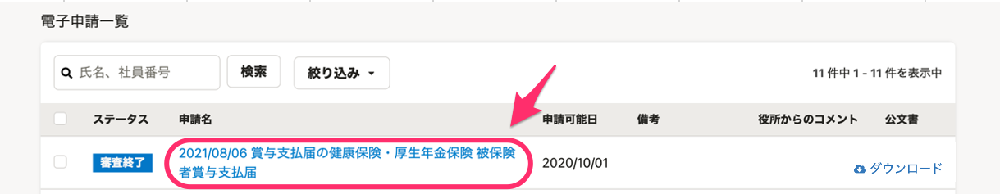
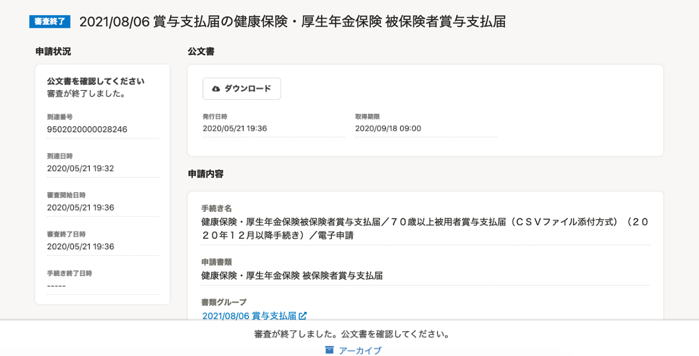

電子申請の申請状況や公文書は、電子申請一覧画面で確認できます。

# 電子申請一覧で確認する

電子申請一覧画面では、電子申請のステータスを確認できます。

各ステータスの意味については、下記のヘルプページをご覧ください。

[【一覧】電子申請の「ステータス」](https://knowledge.smarthr.jp/hc/ja/articles/4410425552537)

また、公文書が戻ってきている場合は、公文書のダウンロードができます。

# 個別に詳細を確認する

申請内容の詳細は、電子申請一覧の申請名をクリックすると確認できます。

## 1\. 電子申請一覧の申請名をクリック

電子申請一覧の申請名をクリックすると、申請内容の詳細画面が表示されます。

## 2\. 電子申請の詳細画面で、詳細を確認する

電子申請の詳細画面では、到達番号や審査開始日時、申請内容などが確認できます。

