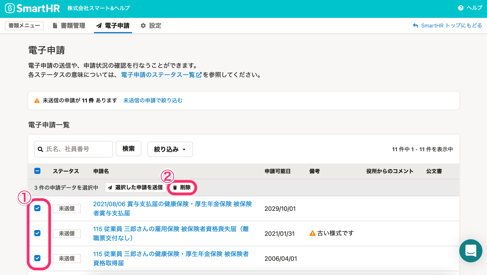
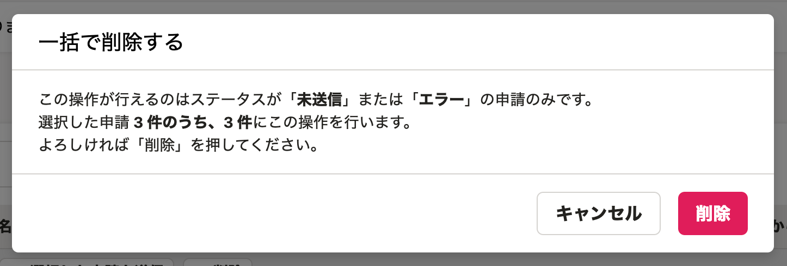
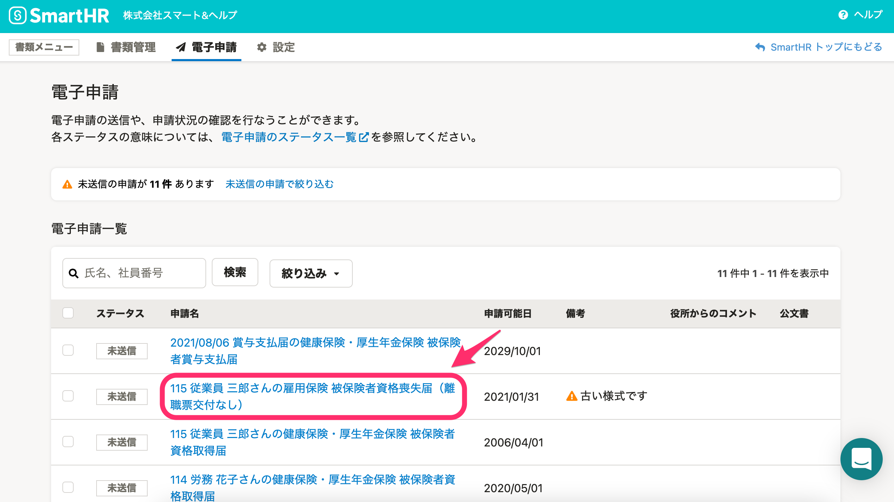
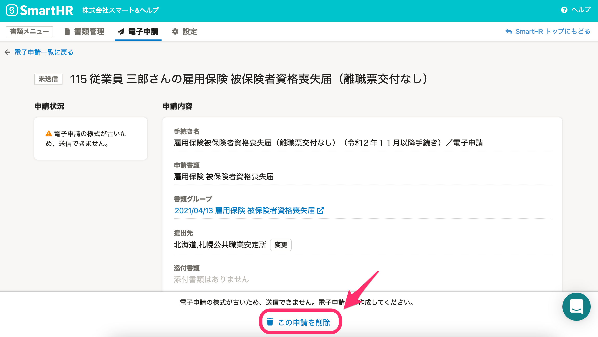
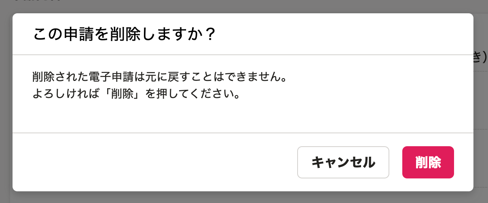

届出書類機能では、電子申請の一括削除・個別削除が可能です。

:::tips
削除できるのは、ステータスが **［未送信］** または **［エラー］** の申請のみです。
:::

# 電子申請を一括で削除する

## 1\. 削除したい電子申請を選択し、［削除］をクリック

電子申請一覧画面で削除したい申請を選択し、 **［削除］** をクリックすると、確認画面が表示されます。

## 2\. 件数を確認し、［削除］をクリック

件数の確認をし、 **［削除］** をクリックすると、電子申請が削除されます。

# 電子申請を個別に削除する　

## 1\. 削除したい電子申請の申請名をクリック

電子申請一覧に表示されている、削除したい申請の申請名をクリックすると、詳細画面が表示されます。

## 2\. ［この申請を削除］をクリック

電子申請詳細画面の下部にある **［この申請を削除］** をクリックすると、確認画面が表示されます。

## 3\. 確認し、［削除］をクリック

 **［削除］** をクリックすると、電子申請が削除されます。

削除した電子申請は、もとに戻すことはできません。

