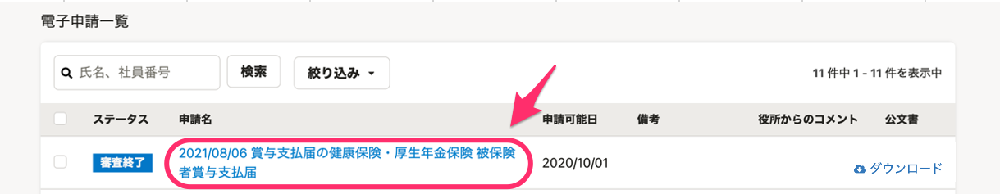
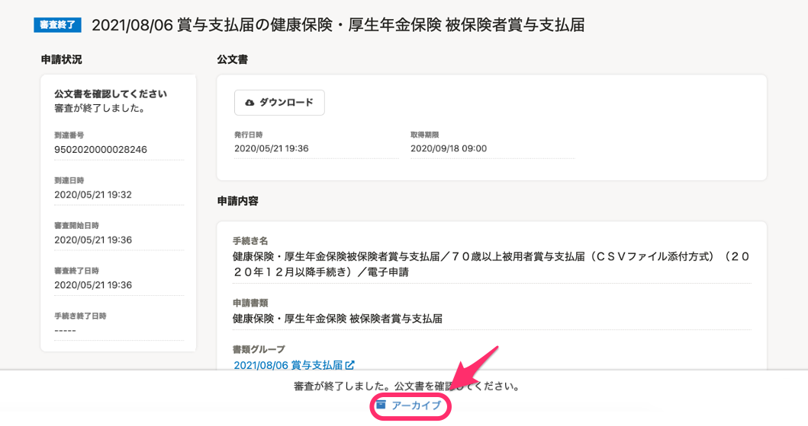
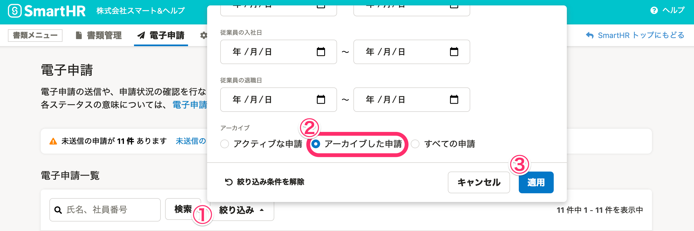

届出書類機能で作成した電子申請は、アーカイブできます。

アーカイブ機能で確認済みの電子申請を非表示にすることで、進行中の電子申請のみを一覧に表示できます。

# 1\. アーカイブしたい電子申請の申請名をクリック

 **［電子申請一覧］** 画面で、アーカイブしたい電子申請の申請名をクリックすると、詳細画面が表示されます。

# 2\. ［アーカイブ］をクリック

電子申請の詳細画面下部に表示されている **［アーカイブ］** をクリックすると、電子申請をアーカイブできます。

## アーカイブした電子申請を確認する

 **［電子申請一覧］** 画面にある **［絞り込み］** をクリックすると、絞り込み条件のダイアログが表示されます。

スクロールし、 **［アーカイブ］>［アーカイブした申請］** にチェックを入れ、 **［適用］** をクリックして下さい。

