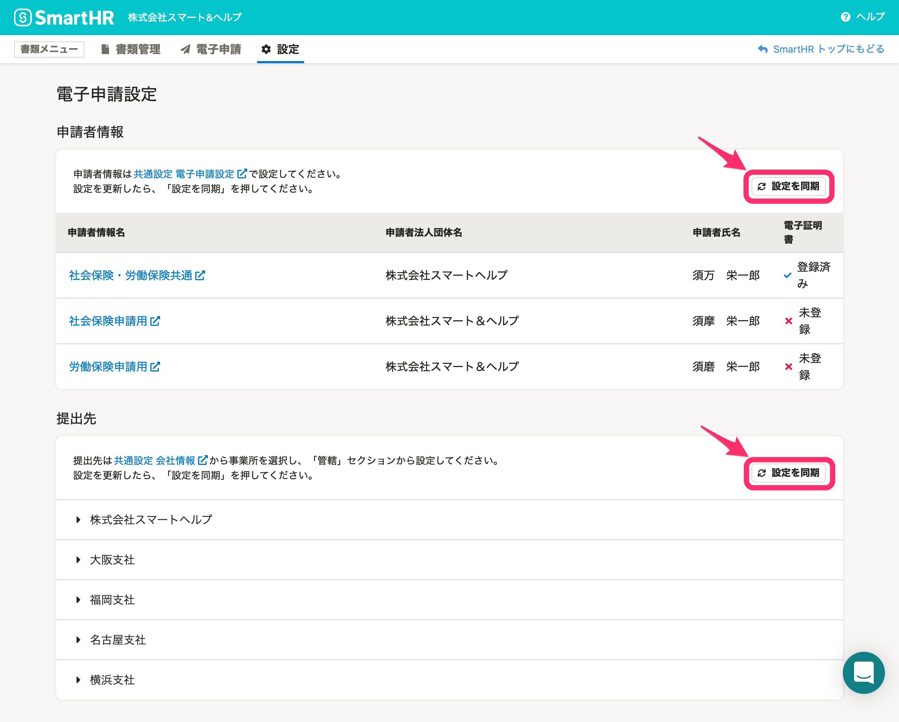

電子申請をする前に、申請者情報と提出先の設定の同期が必要です。

 **［申請者情報］** 欄、 **［提出先］** 欄それぞれの右側にある **［設定を同期］** をクリックすると、SmartHRの共通設定に登録されている情報が同期されます。

申請者情報の登録方法は、下記のヘルプページをご覧ください。

[電子申請申請者と連絡先を設定する](https://knowledge.smarthr.jp/hc/ja/articles/360026104914)

提出先情報の設定方法は、下記のヘルプページをご覧ください。

[電子申請者情報と提出先管轄を設定する](https://knowledge.smarthr.jp/hc/ja/articles/360026104814)
