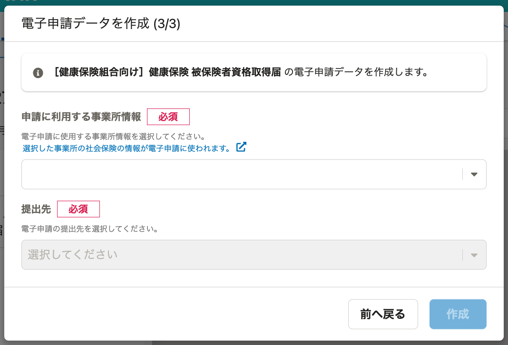

異なる事業所に所属する従業員が混在する場合でも、事業所の社会保険の情報が同じ場合は、電子申請をまとめて作成できます。

一括適用の承認を受けている場合などがこのケースに当たります。

:::related
[一括適用｜日本年金機構](https://www.nenkin.go.jp/service/kounen/tekiyo/jigyosho/20121004.html)
:::

# 対応している手続き

- ［健康保険組合向け］健康保険 被保険者資格取得届
- ［年金事務所向け］厚生年金保険 被保険者資格取得届

# 電子申請をまとめて作成できる条件

同じ書類グループの従業員が所属する事業所の以下の社会保険の情報が一致している場合は、電子申請をまとめて作成できます。

- （厚生年金）事業所整理記号
- （厚生年金）事業所番号
- （健康保険）事業所整理記号

# 電子申請に使われる事業所情報

異なる事業所に所属する従業員が混在する電子申請を作成する際に、［電子申請データを作成(3/3)］画面で［申請に使用する事業所情報］を選択する必要があります。

:::alert
選択した事業所の社会保険情報を電子申請に使います。
選択した事業所においては、社会保険事業所としての届出通りにご登録ください。
:::
