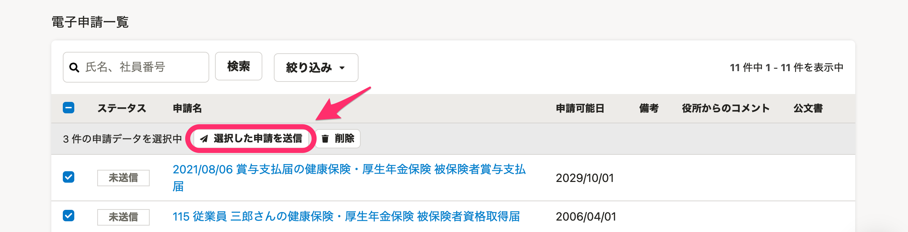
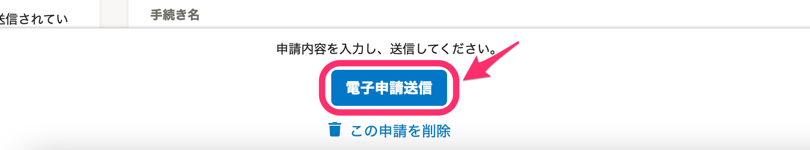
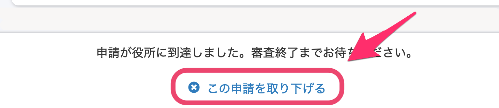

e-Gov（電子申請の総合窓口）のメンテナンス期間は、届出書類機能に含まれる電子申請関連の機能の一部が利用できなくなります。

e-Govのメンテナンス中に利用できない機能は以下の3つです。

# 電子申請一覧画面での申請送信

電子申請一覧画面での一括申請ができなくなります。

# 電子申請詳細画面での申請送信

電子申請詳細画面下部にあるボタンでの、電子申請送信ができなくなります。

# 申請の取り下げ

送信済ステータスの電子申請詳細画面下部にある、申請取り下げができなくなります。

