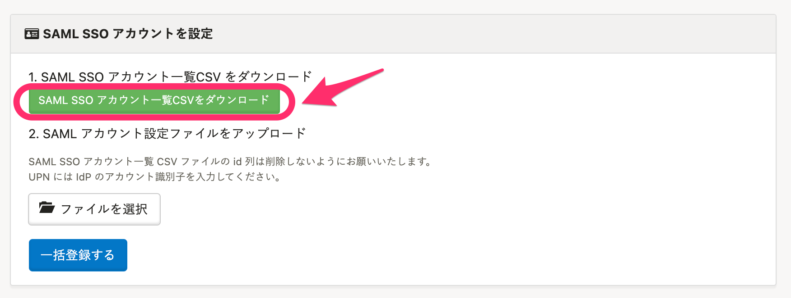
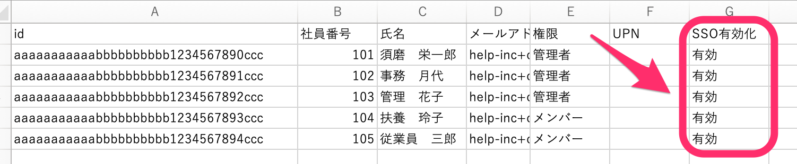
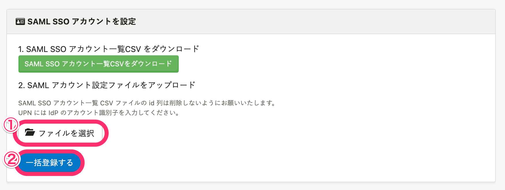
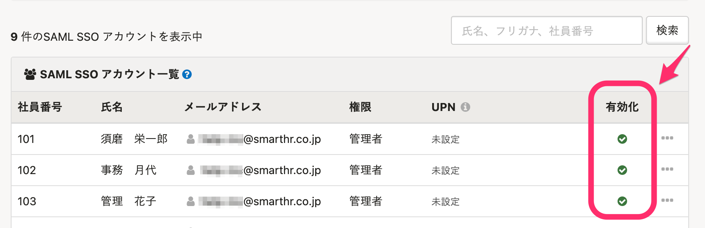
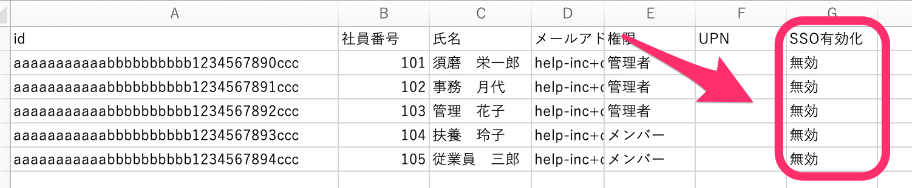

CSVファイルを使い、SAML SSO アカウントを一括有効化・無効化する方法をご案内します。

# SAML SSO アカウントを一括有効化する

## 1\. 画面右上のアカウント名 >［共通設定］>［SAML SSO アカウント］をクリック

画面右上のアカウント名 > **［共通設定］** \> **［SAML SSO アカウント］** をクリックすると、SAML SSO アカウントを設定する画面がひらきます。

## 2\. 「SAML SSO アカウント一覧CSVファイル」をダウンロード

 **［SAML SSO アカウントを設定］** にある **［SAML SSO アカウント一覧CSVをダウンロード］** をクリックすると、SAML SSO アカウント一覧のCSVファイルのダウンロードが始まります。

バックグラウンド処理完了後、 **［バックグラウンド処理一覧］** からファイルをダウンロードしてください。

## 3\. ファイルの［SSO有効化］項目に［有効］と入力し、保存

ダウンロードしたファイルをひらき、SAML SSOアカウントを有効にしたい従業員の **［SSO有効化］** の列に **［有効］** と入力し、保存します。

## 4\. CSVファイルを取り込む

 **［SAML SSO アカウントを設定］** \> **［ファイルを選択］** より、作成したCSVファイルを選択し、 **［一括登録する］** をクリックして選択したCSVファイルを取り込みます。

CSVファイルを取り込むと、バックグラウンド処理で一括更新が開始します。

しばらく経ってから画面をリロード（更新）すると、 **［SAML SSOアカウント一覧］** の **［有効化］** の列に緑のチェックマークが表示され、有効化されていることが確認できます。

# SAML SSO アカウントを一括無効化する

## 1\. 画面右上のアカウント名 >［共通設定］>［SAML SSO アカウント］をクリック

画面右上のアカウント名 > **［共通設定］** \> **［SAML SSO アカウント］** をクリックすると、SAML SSO アカウントを設定する画面がひらきます。

## 2\. 「SAML SSO アカウント一覧CSVファイル」をダウンロード

 **［SAML SSO アカウントを設定］** にある **［SAML SSO アカウント一覧CSVをダウンロード］** をクリックすると、SAML SSO アカウント一覧のCSVファイルのダウンロードが始まります。

バックグラウンド処理完了後、 **［バックグラウンド処理一覧］** からファイルをダウンロードしてください。

## 3\. ファイルの［SSO有効化］項目に［無効］と入力し、保存

ダウンロードしたファイルをひらき、SAML SSOアカウントを有効にしたい従業員の **［SSO有効化］** の列に **［無効］** と入力し、保存します。

## 4\. CSVファイルを取り込む

 **［SAML SSO アカウントを設定］** \> **［ファイルを選択］** より、作成したCSVファイルを選択し、 **［一括登録する］** をクリックして選択したCSVファイルを取り込みます。

CSVファイルを取り込むと、バックグラウンド処理で一括更新が開始します。

しばらく経ってから画面をリロード（更新）すると、 **［SAML SSOアカウント一覧］** の **［有効化］** の列が **［無効］** になります。

