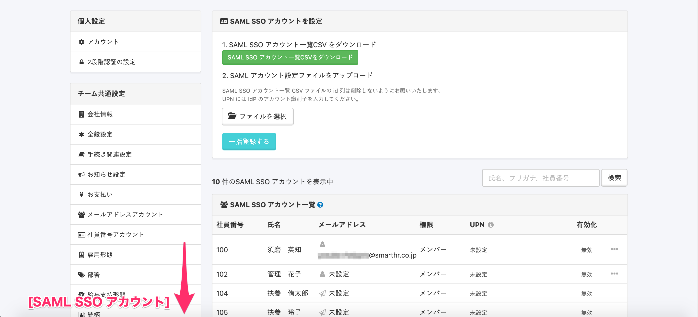
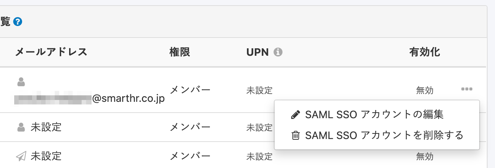
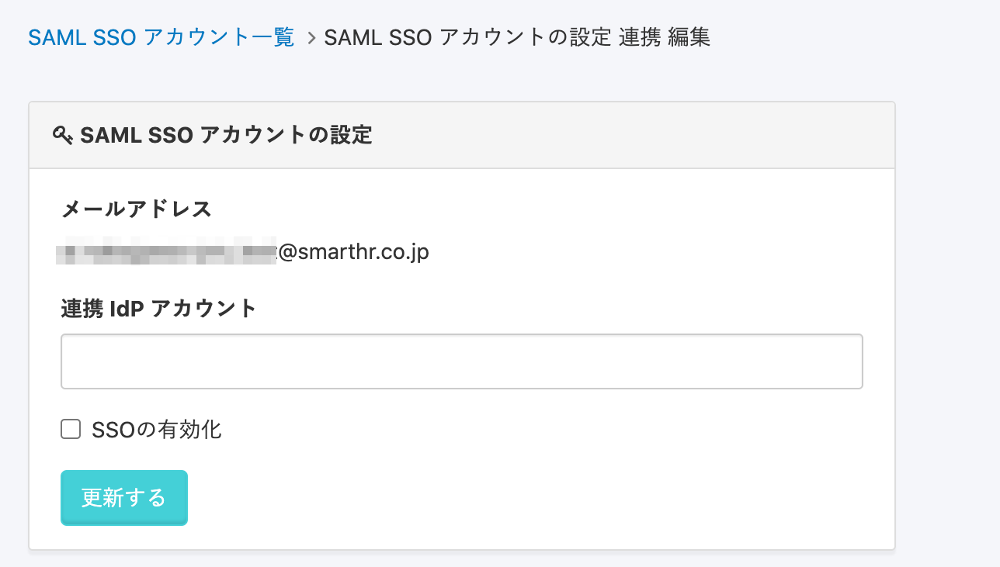
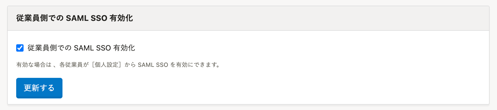
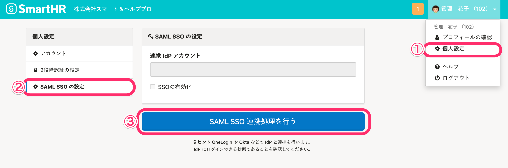

[SAML認証（SSO）を設定する](https://knowledge.smarthr.jp/hc/ja/articles/360037010093) を参考にSAML SSOの設定後、「SAML SSOアカウント」を設定することで、SmartHRへシングルサインオンでログインできます。

一括更新でSAML SSOアカウントを設定する方法は、下記のページを参照してください。

[SAML SSO アカウントを一括更新する](https://knowledge.smarthr.jp/hc/ja/articles/900006193486)

# SAML SSO アカウントの設定を行なう

SmartHRの **［共通設定］** \> **［SAML SSO アカウント］** に移動します。

対象従業員の **［…］メニュー**  \> **［SAML SSO アカウントの編集］** をクリックすると、編集画面へ移動します。

お使いのIDプロバイダ（IdP）に登録されているアカウント（メールアドレス）を **［連携 IdP アカウント］** に入力し、 **［SSOの有効化］** にチェックを入れて **［更新する］** をクリックすると、SSOの有効化が行なわれます。

:::alert
SAML SSOアカウントが有効な場合、ログインIDとパスワードでのログインができなくなります。
:::

## 従業員側でSAML SSOの設定をする場合

管理者は、 **［共通設定］>［SAML SSO 設定］** にある、 **［従業員側での SAML SSO 有効化］** にチェックを入れ **［更新する］** をクリックしてください。

管理者が上記を設定したあと、各従業員はSmartHRにログインし、 **［個人設定］** を開きます。

 **［SAML SSOの設定］** にある **［SAML SSO連携処理を行う］** をクリックすると、SAML SSOの連携処理ができます。

# SAML SSO アカウントの設定を無効にする

SmartHRの **［共通設定］** \> **［SAML SSO アカウント］** に移動します。

対象従業員の **［…］メニュー**  \> **［SAML SSO アカウントを削除する］** をクリックすると、確認のダイアログが表示されるので、 **［OK］** をクリックしてアカウントを削除します。

:::tips
 **［退職者］** 権限になったアカウントは、自動で SAML SSOが無効化されます。
:::
