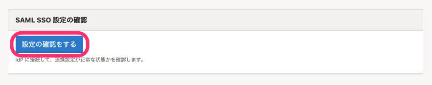

SAML SSOを有効にすると、お使いのIDプロバイダ（IdP）経由でSmartHRにアクセスできます。

2020/05/27現在、下記のIDプロバイダの動作確認を行っております。

- [Microsoft AzureAD](https://azure.microsoft.com/ja-jp/services/active-directory/)
- [Google Cloud Identity](https://cloud.google.com/identity/?hl=ja)
- [OneLogin](https://www.onelogin.com/jp)
- [Okta](https://www.okta.com/)
- [トラスト・ログイン](https://trustlogin.com/)
- [HENNGE One](https://hennge.com/jp/service/one/)
- [CloudGate UNO](https://www.cloudgate.jp/lineup/uno.html)

※ 上記以外にもSAML 2.0に対応しているIDプロバイダ（IdP）であればご利用いただけます

# 1\. IDプロバイダ（IdP）の設定を行う

SmartHRの **［共通設定］** \> **［SAML SSO 設定］** にある [サービスプロバイダ情報](https://app.smarthr.jp/?redirect_path=admin%2Fexternal_saml_service_provider) 画面で、設定に必要な情報を確認できます。

 **［サービスプロバイダ情報］** に記載されている情報をお使いのIDプロバイダ（IdP）に設定します。

設定後、metadata（.xmlファイル）をダウンロードしてください。

# 2\. SmartHR側の設定を行う

SmartHRの **［共通設定］** \> **［SAML SSO 設定］** の **［SAML SSO 設定］** で **［編集］** をクリックすると、 **［SAML SSO の設定の更新］** 画面が表示されます。

IdPからダウンロードしたmetadata（.xml）のファイルをアップロードするか、各入力エリアに必要情報を入力します。

 **［Name identifier format］** では、基本的に **「urn\:oasis\:names\:tc\:SAML\:1.1\:nameid-format\:emailAddress」** を選択してください。

 **［更新する］** をクリックします。

# 3\. ログインボタンのラベルを設定する

 **［SAML SSO ログイン］** の **［ログインボタンのラベル］** で、SSOログインを利用する場合のログインボタンのラベルテキストを入力し、 **［更新する］** をクリックします。

未設定の場合は、 **［SAML SSO でログイン］** と表示されます。

【ログイン画面】

# 4\. IDプロバイダ（IdP）との接続を確認する

画面下部の **［SAML SSO 設定の確認］** で、 **［設定の確認をする］** をクリックします。

正常に設定ができていると、メッセージが表示されます。

# 5\. SAML SSOを有効化する

画面上部の **［SAML SSO 有効化］** で **［SAML SSO 有効化］** にチェックを入れ、 **［更新する］** をクリックすると、SAML認証が利用できます。

# 6\. SAML SSOアカウントを設定する

SAML SSOのアカウントの設定は、[SAML認証（SSO）を使ってログインする](https://knowledge.smarthr.jp/hc/ja/articles/360037085933)をご覧ください。

:::tips
SAML SSOの設定やSAML SSOアカウントの編集は、管理者権限以外のアカウントでも可能です。
**カスタム権限** を作成し、 **［SAML SSOの設定］［SAML SSOアカウント］** の権限を付与してください。

**カスタム権限** の作成方法については、下記のページをご覧ください。
[カスタム権限を追加する](https://knowledge.smarthr.jp/hc/ja/articles/360026106594)
:::
:::alert
 **［SAML SSOアカウント］** の操作を行うには、 **［SAML SSOアカウント］** の権限だけでなく、 **［従業員関連］** の **［操作できる範囲］** の設定が必要です。
操作できる範囲に含まれている従業員のSAML SSOアカウントのみ操作できます。
:::
