Azure AD SAMLの設定手順を説明します。

:::related
[チュートリアル\:Azure Active Directory シングル サインオン (SSO) と SmartHR の統合｜Microsoft](https://docs.microsoft.com/ja-jp/azure/active-directory/saas-apps/smarthr-tutorial)
:::

# 1\. \[Azure Active Directory\] > \[Enterprise applications\] をクリック

画面左にある **\[Azure Active Directory\]** のメニューにある **\[Enterprise applications\]** をクリックします。

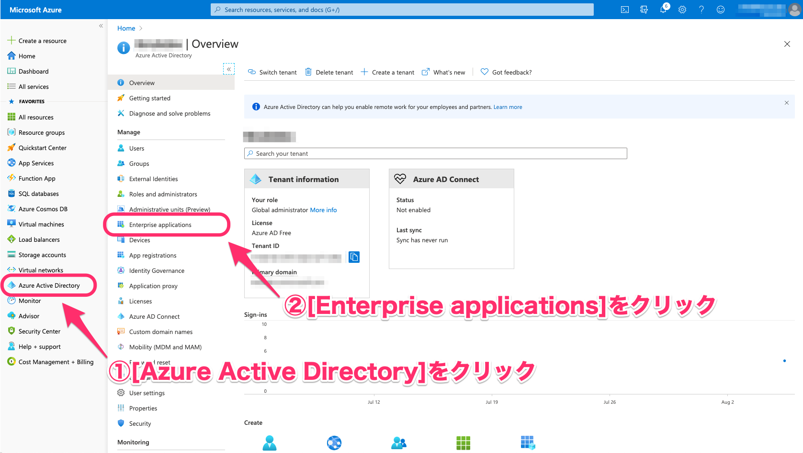

# 2\. \[New application\] をクリック

画面上部にある **\[ + New application\]** をクリックします。

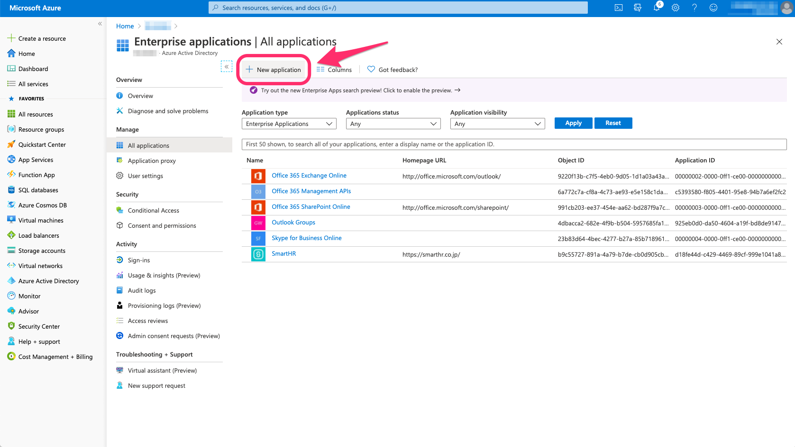

# 3\. \[Add from the gallery\] から \[SmartHR\] を選択し、アプリケーションを追加

画面中央にある **\[Add from the gallery\]** 欄の検索フォームに**\[****smarthr\]** と入力すると、フォーム下のスペースに **\[SmartHR\]** が表示されるのでクリックしてください。

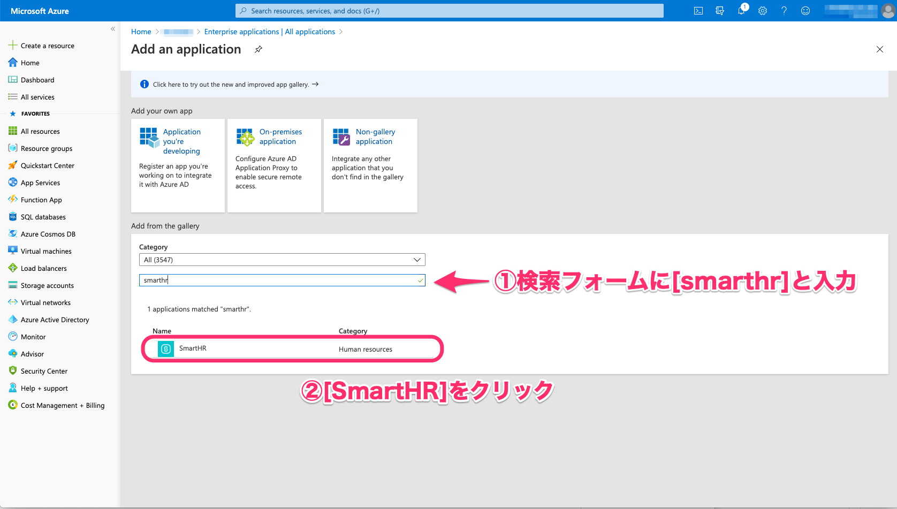

画面右にSmartHRの概要が表示されたら、**\[Add\]** をクリックします。

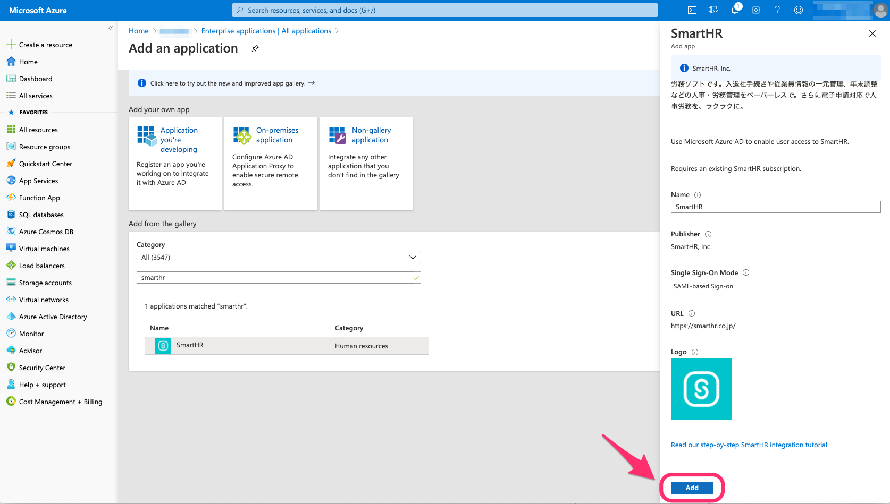

# 4\. \[Set up Single sign on\]をクリック

画面中央にある **\[Set up single sign on\]** をクリックします。

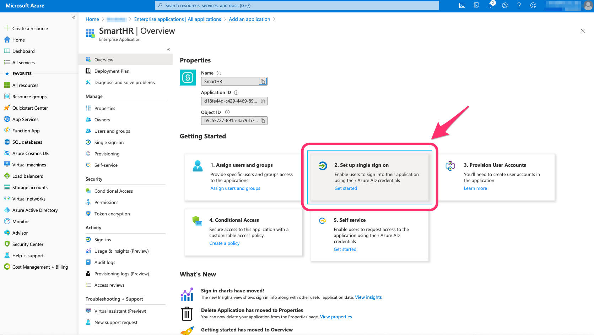

# 5\. \[SAML\] をクリック

画面中央にある **\[SAML\]** をクリックします。

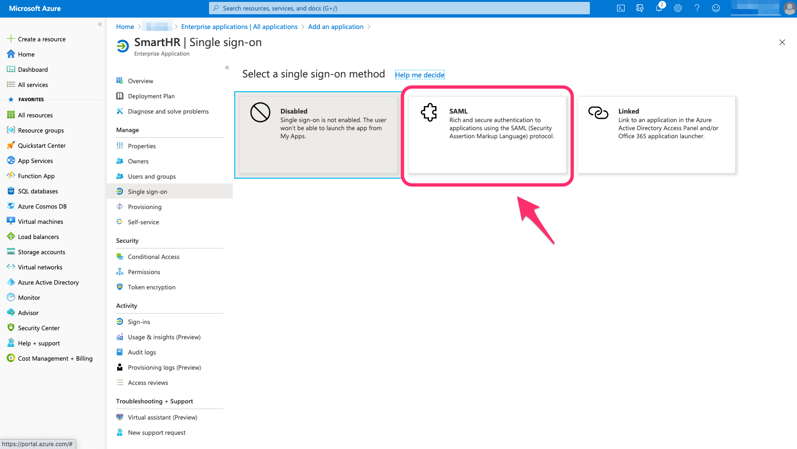

**\[SAML\]** をクリックすると、 **\[Set up Single Sign-On with SAML\]** のページが表示されます。

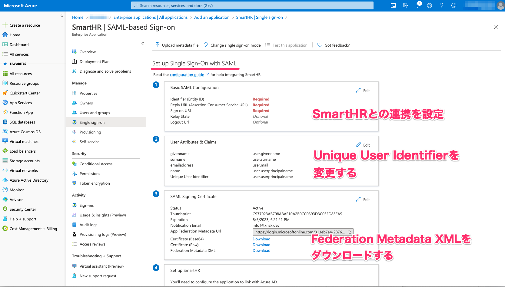

ここでは、**\[Basic SAML Configuration\]**、**\[User Attributions ＆ Claims\]**、**\[SAML Signing Certificate\]** の項目で操作を行います。

まずは **\[Basic SAML Configuration\]** の **\[Edit\]** をクリックしてください。

# 6\. \[Basic SAML Configuration\] を設定する

**\[Basic SAML Configuration\]** 画面では、**\[Identifier (Entity ID)\]** **\[Reply URL (Assertion Consumer Service URL)\]** **\[Sign on URL\]** **\[Logout Url\]** にURLを記入します。

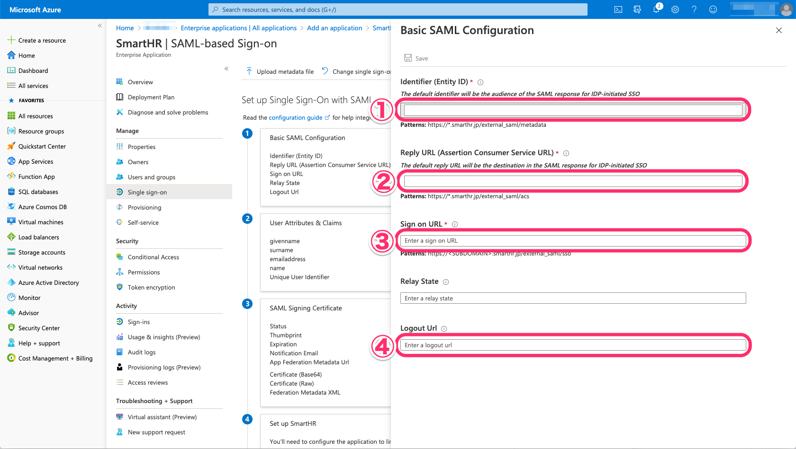

入力内容は以下のとおりです。URLのSUBDOMAIN部分には、管理者さまが設定したサブドメイン（テナントID）をご入力ください。

:::related
[サブドメイン（テナントID）とは](https://knowledge.smarthr.jp/hc/ja/articles/360026264893)
:::

| **入力先** | **入力内容** |
| --- | --- |
| ① Identifier (Entity ID) | https://SUBDOMAIN.smarthr.jp/external\_saml/metadata |
| ② Reply URL (Assertion Consumer Service URL) | https://SUBDOMAIN.smarthr.jp/external\_saml/acs |
| ③ Sign on URL | https://SUBDOMAIN.smarthr.jp/external\_saml/sso |
| ④ Logout Url | https://SUBDOMAIN.smarthr.jp/single\_logout  |

各情報は、SmartHRにある [サービスプロバイダ情報](https://app.smarthr.jp/?redirect_path=admin%2Fexternal_saml_service_provider) でも確認できます。

SmartHR上での項目の表記と、Microsoft Azure上での表記は異なりますので、以下の画像を参考に記入してください。

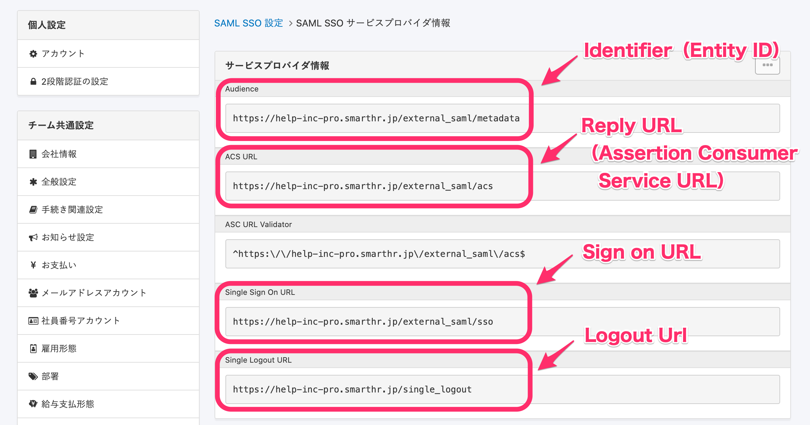

# 7\. User Attributes & Claimsを設定する

**\[User Attributes & Claims\]** の項目では、**\[Source attribute\]** にあるプルダウンリストで **\[user.email\]** を選択してください。

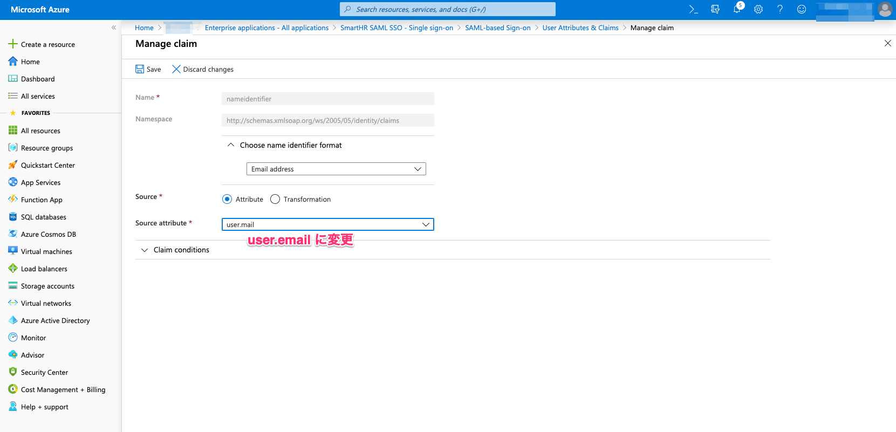

# 8\. metadataをダウンロードする

**\[Set up Single Sign-On with SAML\]** にある **\[SAML Signing Certificate\] > \[Federation Metadata XML\]** の項目で、**\[metadata\]** をダウンロードしてください。

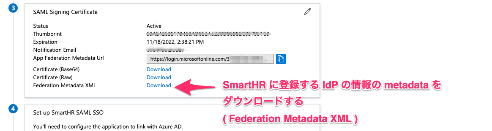

ダウンロードしたmetadataは、SmartHRの **\[SAML SSO 設定\]** 画面でアップロードします。

アップロードの方法について詳しくは、以下のページをご覧ください。

[SAML認証（SSO）を設定する](https://knowledge.smarthr.jp/hc/ja/articles/360037010093)

# 9\. ユーザーもしくはグループをアサインする

 **\[Overview\]** の **\[Getting Started\]** 欄にある、 **\[Assign users and groups\]** をクリックしてください。

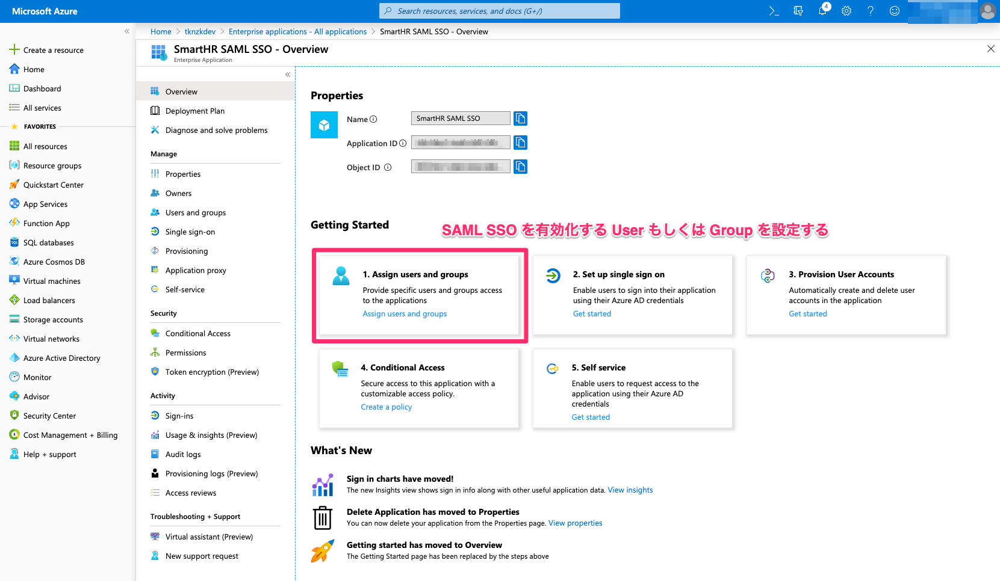

**\[Add Assignment\]** に表示されるリストで、SAML SSOを有効化するUserもしくはGroupを設定します。

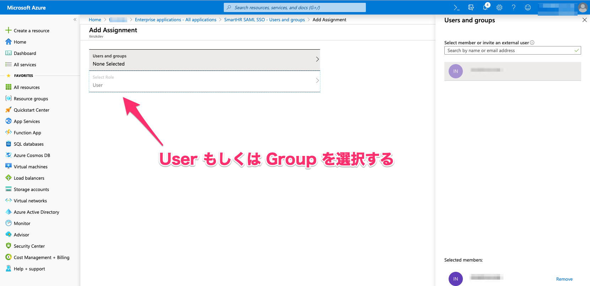

# 10\. Azure AD から SmartHR への連携テストを行う

Azure ADでSmartHRへの連携テストを行います。

:::alert
連携テストを行う前に、以下の準備が完了していることをご確認ください。
- SmartHR側で連携設定がすべて完了しているか
- Azure ADのアカウントとSmartHRのアカウントの紐付け設定が完了しているか
- SmartHR上のSAML SSOが有効化されているか
SmartHRでSAML SSOを有効化する方法について詳しくは、以下の記事をご覧ください。
[SAML認証（SSO）を設定する](https://knowledge.smarthr.jp/hc/ja/articles/360037010093)
:::

画面左にある **\[Single sign-on\]** をクリックし、画面の下部にある **\[Test\]** をクリックして、連携テストを開始してください。

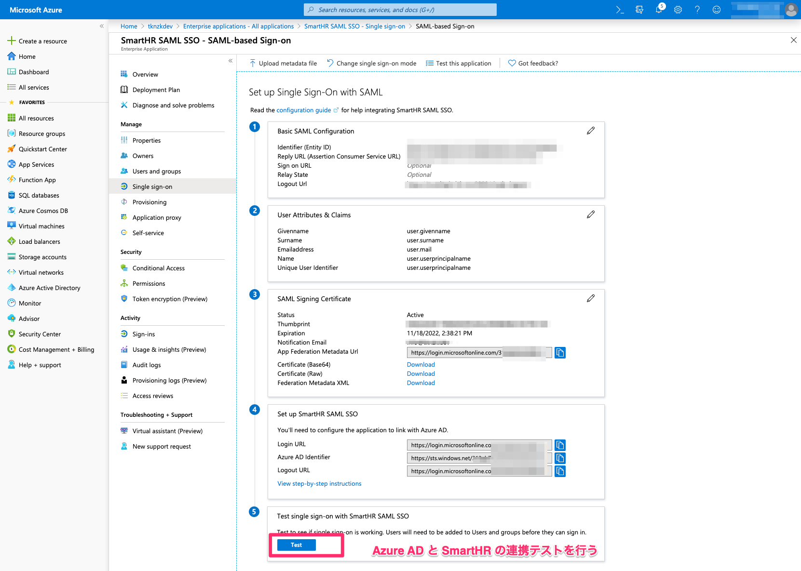
