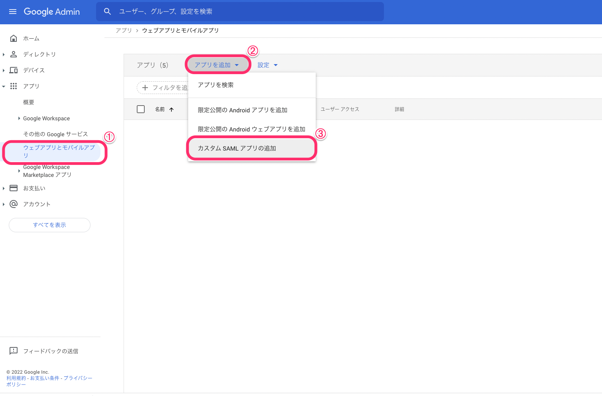
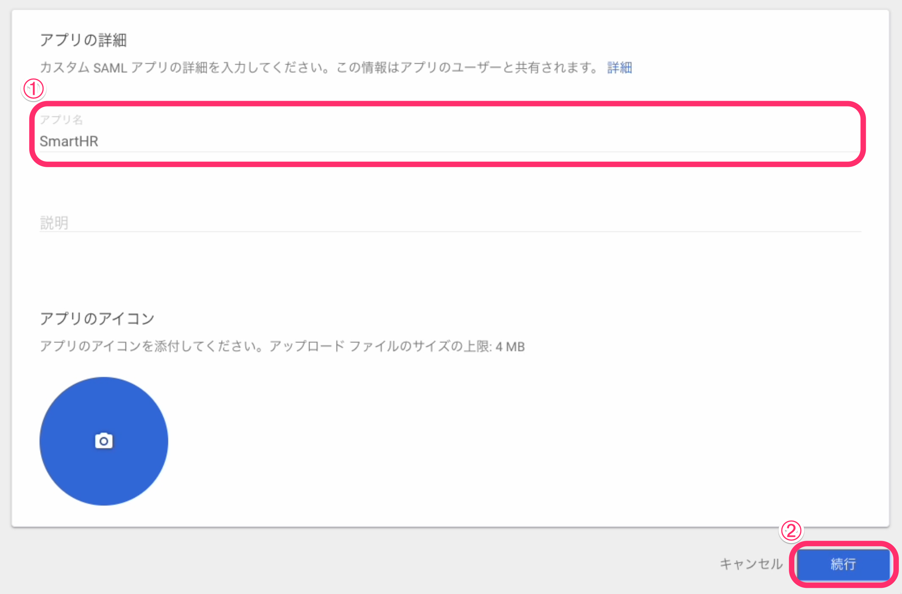
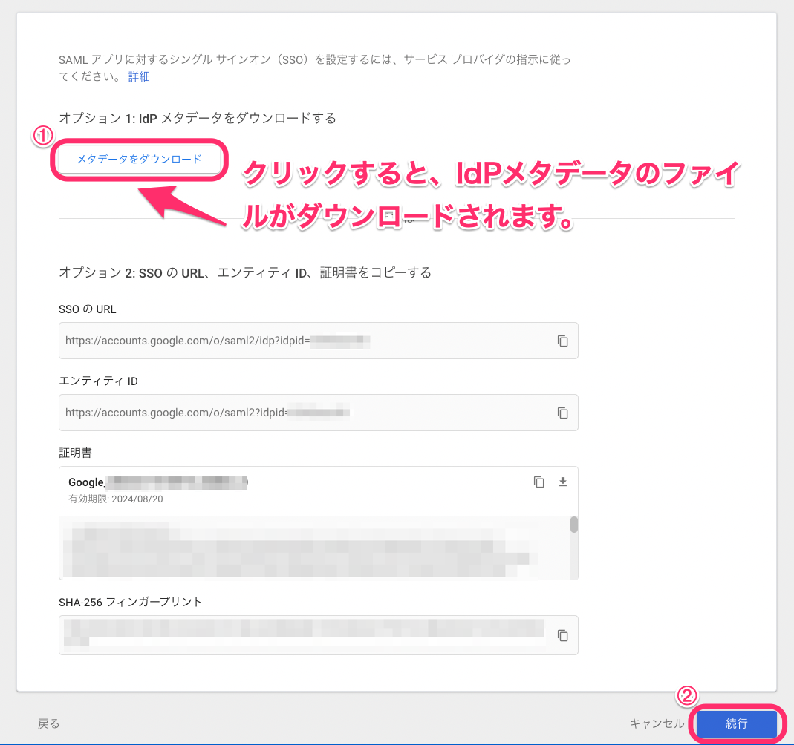
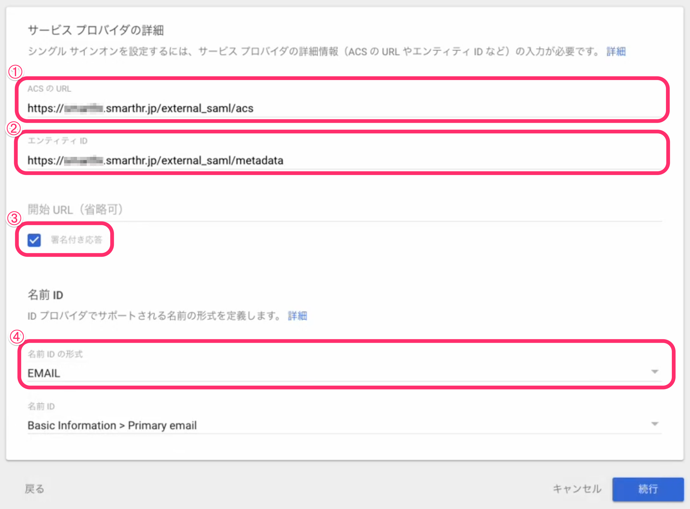
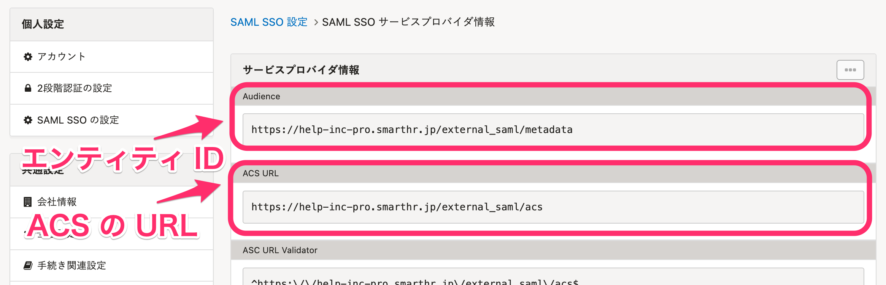
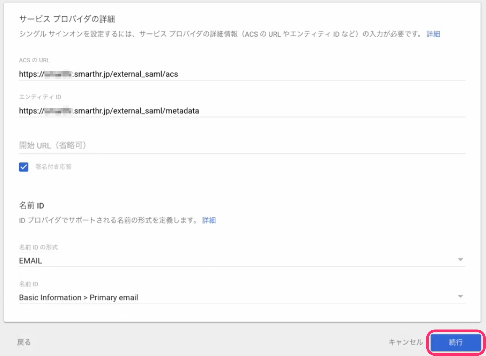
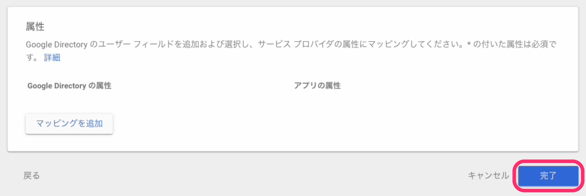
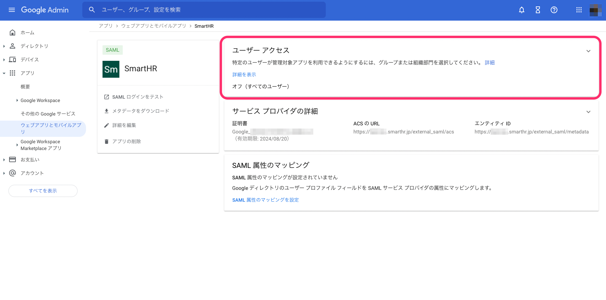
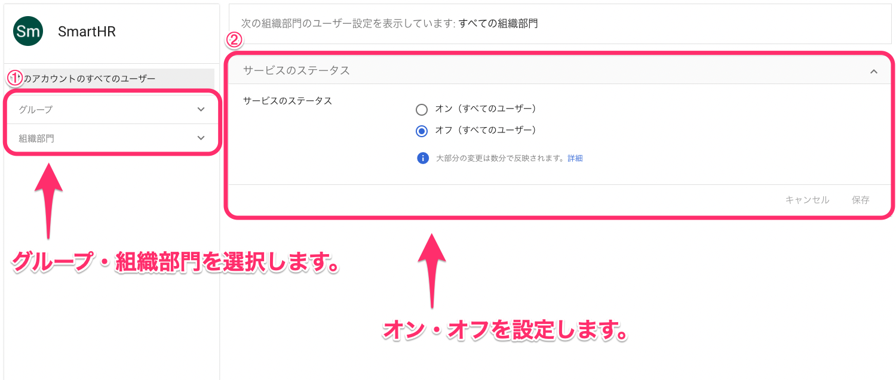

Google Workspace カスタム SAML アプリの設定方法を説明します。

# 1\. 管理コンソールから［カスタム SAML アプリの追加］をクリック

Google 管理コンソールを開き、  **［アプリ］>［ウェブアプリとモバイルアプリ］**  の画面を表示します。 **［アプリを追加］** をクリックし、 **［カスタム SAML アプリの追加］** をクリックします。

# 2\. カスタム SAML アプリの名前を設定する

カスタム SAML アプリに設定したい名前を **［アプリ名］** に入力します。必要に応じて、カスタム SAML アプリの説明やアイコンも設定してください。

設定が完了したら **［続行］** をクリックします。

# 3. IdPメタデータをダウンロードする

 **［メタデータをダウンロード］** をクリックし、IdPメタデータをダウンロードします。ダウンロードしたメタデータは、SmartHRにIdPの情報を登録する際に使用します。

:::related
[SAML認証（SSO）を設定する](https://knowledge.smarthr.jp/hc/ja/articles/360037010093)
:::

ダウンロードが完了したら、 **［続行］** をクリックします。

# 4\. サービスプロバイダを設定する

 **［サービス プロバイダの詳細］** 画面で、SmartHRをサービスプロバイダとして設定します。 **［ACS の URL］**  **［エンティティID］［署名付き応答］［名前 ID の形式］** の項目を設定します。

それぞれの項目に設定する値は、下記の通りです。

|   | 項目名 | 設定値 |
| --- | --- | --- |
| ➀ | ACS の URL | https://サブドメイン.smarthr.jp/external\_saml/acs |
| ➁ | エンティティID | https://サブドメイン.smarthr.jp/external\_saml/metadata |
| ➂ | 署名付き応答 | チェックを入れます。 |
| ➃ | 名前 ID の形式 | EMAIL |

URL内の「サブドメイン」と表記されている部分を、貴社のサブドメインに変更して入力してください。

:::related
[サブドメインとは](https://knowledge.smarthr.jp/hc/ja/articles/360026264893)
:::
:::tips
 **［ACS の URL］** と  **［エンティティ ID］** に入力するURLは、SmartHRの [サービスプロバイダ情報](https://app.smarthr.jp/?redirect_path=admin%2Fexternal_saml_service_provider) でも確認できます。
サービスプロバイダ情報を参照しながら入力を進める場合は、サービスプロバイダ情報の **［Audience］** 項目にあるURLを **［エンティティ ID］** に入力し、 **［ACS URL］** 項目にあるURLを **［ACS の URL］** に入力してください。

:::

設定が完了したら、 **［続行］** をクリックします。

# 5\. ［完了］をクリック

 **［属性］** の画面では何も設定しません。そのまま **［完了］** をクリックします。完了後は、追加したカスタム SAML アプリの設定画面が自動的に表示されます。

# 6\. ［ユーザー アクセス］をクリック

カスタム SAML アプリの設定画面で、 **［ユーザー アクセス］** をクリックします。

# 7\. サービスのステータスをオンにする

デフォルトでは、すべてのユーザーはサービスを利用できません。 **［サービスのステータス］** のオン・オフを切り替えて **［保存］** をクリックし、サービスの有効化・無効化を設定してください。設定はグループ・組織部門単位で可能です。

以上で、Google Workspace カスタム SAML アプリの設定は完了です。

SmartHRでSAML認証（SSO）の設定を行なってください。

[SAML認証（SSO）を設定する](https://knowledge.smarthr.jp/hc/ja/articles/360037010093)
