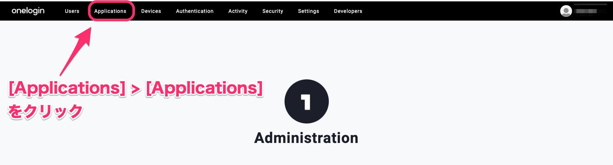
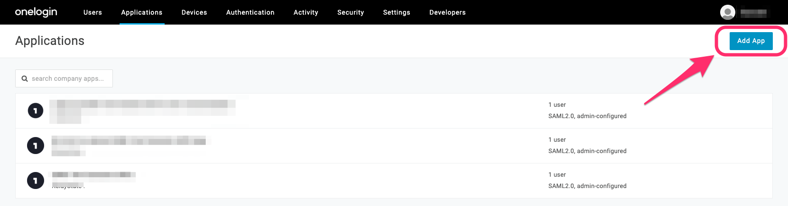
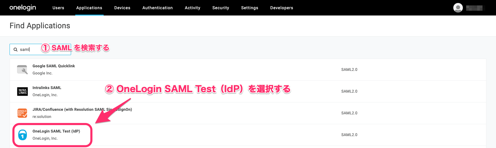
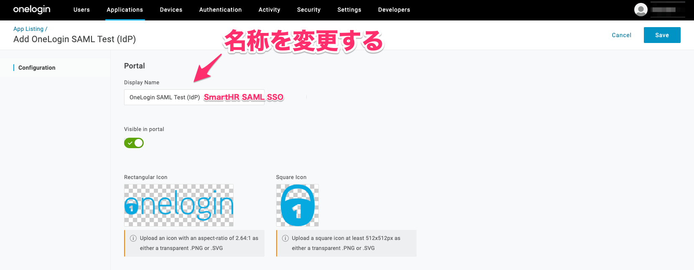
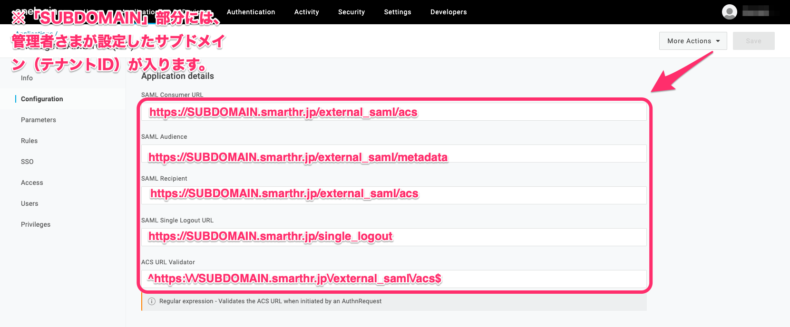
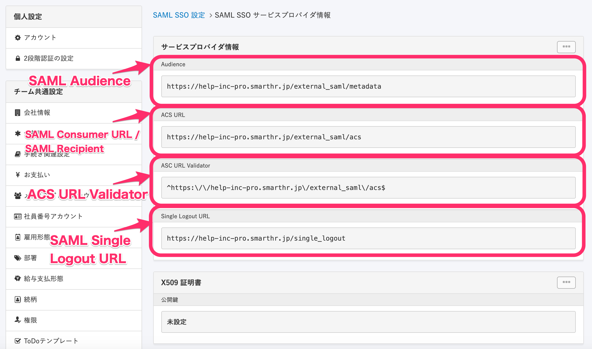
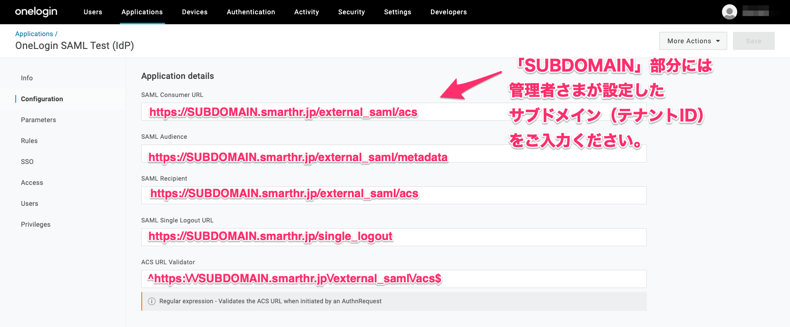
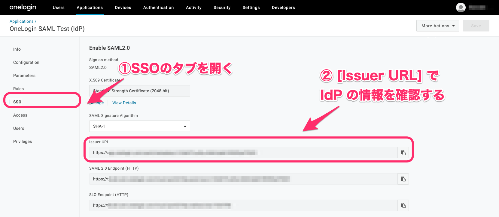
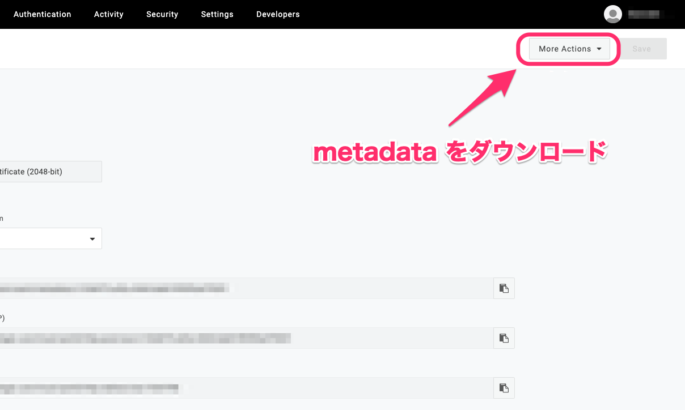

OneLoginでSAMLを設定する際の手順を説明します。

# 1\. \[Applications\] > \[Applications\] をクリック

画面上部にある **\[Applications\] > \[Applications\]** をクリックしてください。

# 2\. \[Add App\] をクリック

**\[Applications\]** をクリックしたら、画面右上にある **\[Add App\]** をクリックしてください。

# 3\. SAMLを検索する

左上にある検索バーで「SAML」と入力し、 **\[OneLogin SAML Test（IdP）\]** をクリックします。

# 4\. アプリケーションの名前を変更する

**\[OneLogin SAML Test（IdP）\]** をクリックすると、名称を変更する画面が表示されます。

「Display Name」に名前を入力して、名称を変更してください。

# 5\. コンフィギュレーションを編集する

OneLoginの「Application details」画面に表示される項目を、SmartHRの[サービスプロバイダ情報](https://app.smarthr.jp/?redirect_path=admin%2Fexternal_saml_service_provider)を参照しながら記入します。

SmartHRのサービスプロバイダ情報と、OneLoginの入力欄では項目の名称が異なるため、以下の画像を参考にOneLoginの項目を入力してください。

:::tips
SmartHRのサービスプロバイダ情報を参照せずに、以下の画像に記載されているURLを入力する方法でも記入が完了します。

画像上の入力例では、　URLが以下のように表記されています。
- **SAML Consumer URL …** https://SUBDOMAIN.smarthr.jp/external\_saml/acs
- **SAML Audience ...** https://SUBDOMAIN.smarthr.jp/external\_saml/metadata
- **SAML Recipient ...** https://SUBDOMAIN.smarthr.jp/external\_saml/acs
- **SAML Single Logout URL ..**. https://SUBDOMAIN.smarthr.jp/single\_logout
- **ACS URL Validator ...** ^https:\\/\\/SUBDOMAIN.smarthr.jp\\/external\_saml\\/acs$
実際にOneLogin上で入力するときは、URLの「SUBDOMAIN」と表記されている部分を「企業のサブドメイン（テナントID）」に変更して入力してください。
:::
:::related
[サブドメイン（テナントID）とは](https://knowledge.smarthr.jp/hc/ja/articles/360026264893)
:::

# 6\. SSOのタブを開き、IdPの情報を確認する

URLの設定が完了したら、画面左にあるメニューで **\[SSO\]** をクリックします。

SSOの設定画面が開けたら、画面中央にある **\[Issuer URL\]** でSmartHRに設定するIdPの情報を確認してください。

# 7\. \[More Actions\] をクリックして metadata をダウンロードする

右上にある **\[More Actions\]** をクリックし、**metadata**をダウンロードしてください。

