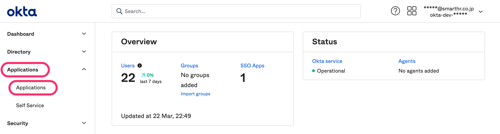
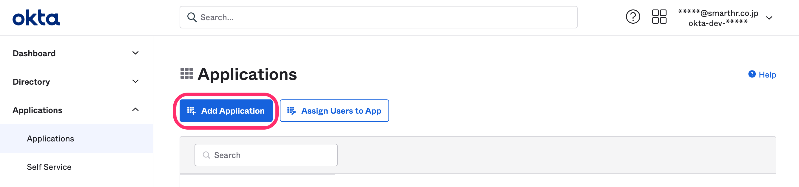
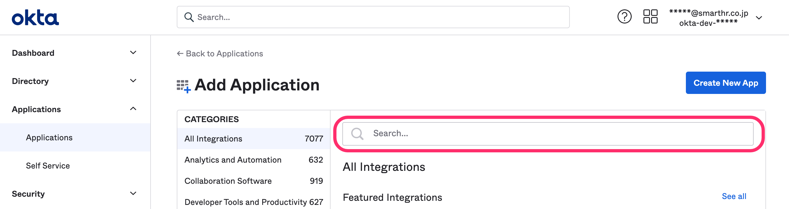
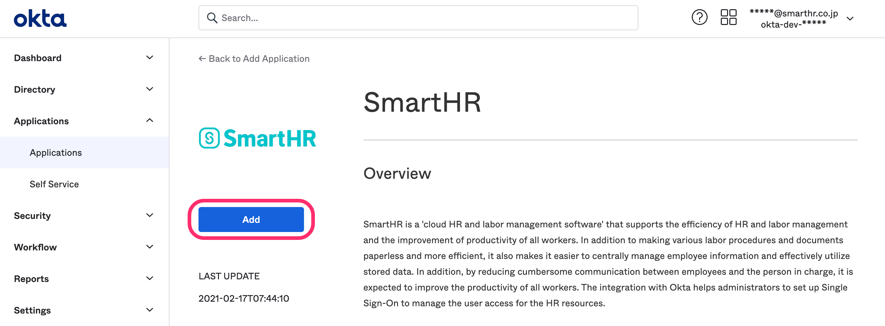
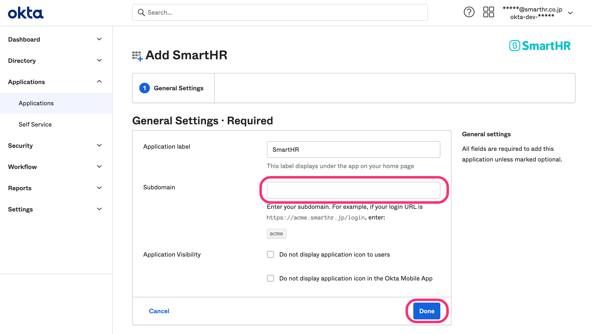
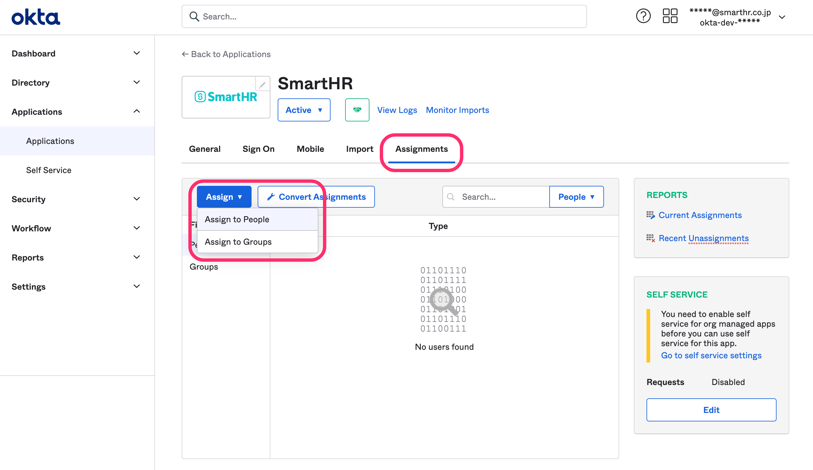
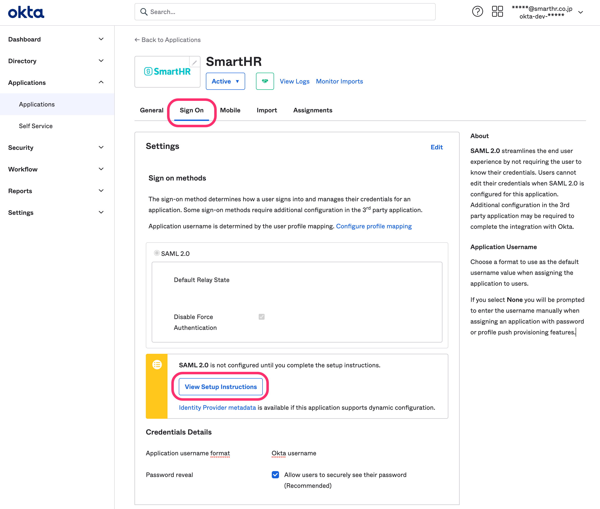
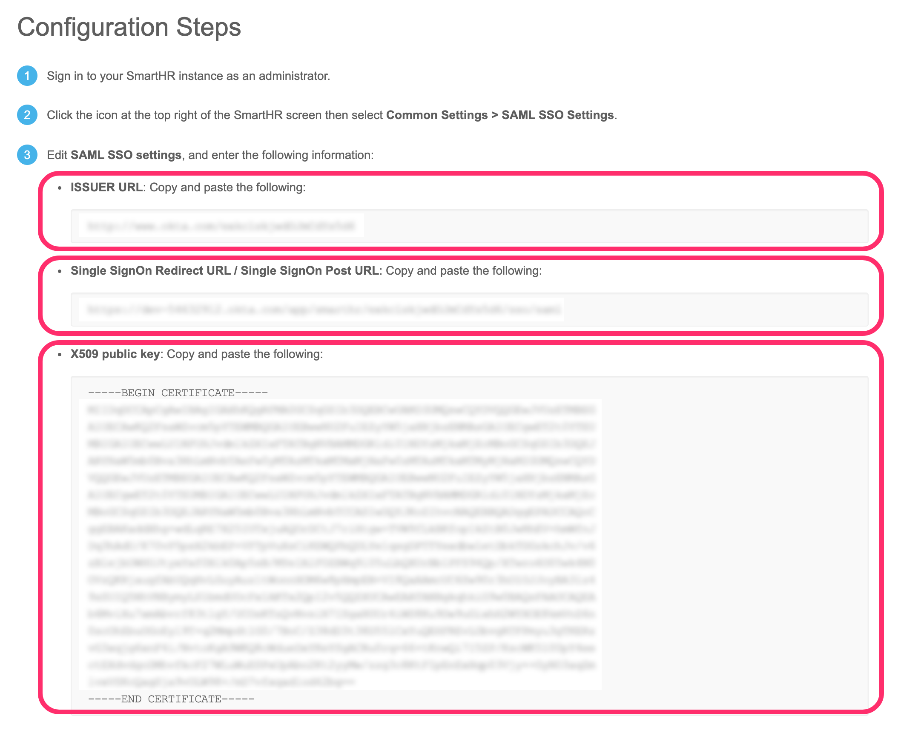

OktaでのSAML SSOの設定手順を説明します。

# SAML SSOの設定

## 1\. ［Applications］>［Applications］をクリック

画面左の **［Applications］>［Applications］** をクリックします。

## 2\. ［Add Application］をクリック

 **［Add Application］** をクリックすると、アプリケーション一覧画面が表示されます。

## 3\. 「SmartHR」を検索

検索フォームで「SmartHR」を検索し、SmartHR のアプリケーション詳細画面に移動します。

## 4\. ［Add］をクリック

 **［Add］** をクリックすると、設定画面が表示されます。

## 5\. ［Subdomain］を入力

SmartHRに設定したサブドメインを **［Subdomain］** に入力し、 **［Done］** をクリックします。

:::related
[サブドメイン（テナントID）とは](https://knowledge.smarthr.jp/hc/ja/articles/360026264893)
:::

## 6\. ［Assign］をクリック

 **［Assignment］** タブにある **［Assign］** をクリックし、SAML SSOの対象メンバーを追加します。

一人ずつ追加する場合は **［Assign to People］** を、グループごとに追加する場合は **［Assign to Groups］** をクリックします。

## 7\. ［View Setup Instructions］をクリック

 **［Sign On］** タブにある **［View Setup Instructions］** をクリックすると、SmartHR のSAML SSOの設定手順が表示されます。

## 8\. 表示された情報を SmartHR に登録 

下記の情報をSmartHRの **［SAML SSO 設定］** 画面に登録します。

[SAML認証（SSO）を設定する > 2. SmartHR側の設定を行う](https://knowledge.smarthr.jp/hc/ja/articles/360037010093#toc--2)を参考に登録してください。

# SCIMの設定

OktaとSmartHRをSCIM連携させると、入社や退社をきっかけにアカウント管理を自動化できます。

SCIM設定については、別途マニュアルを用意しています。

[Okta Provisioning設定ガイド（日本語）](https://smarthr.app.box.com/s/ywbewzqaxocs88l0lk65fhdz9t4zebj2)

[Okta user provisioning integration with SCIM（英語）](https://smarthr.app.box.com/s/f26rol4f0zeln43kv0f2dxaclbus75kx)
