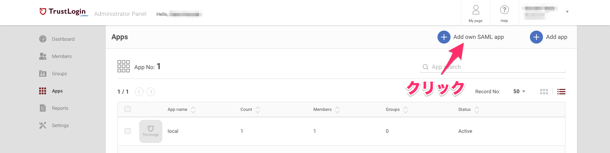
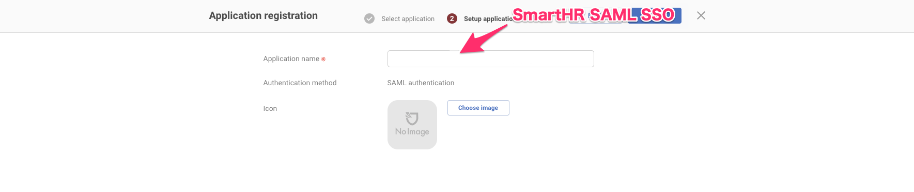
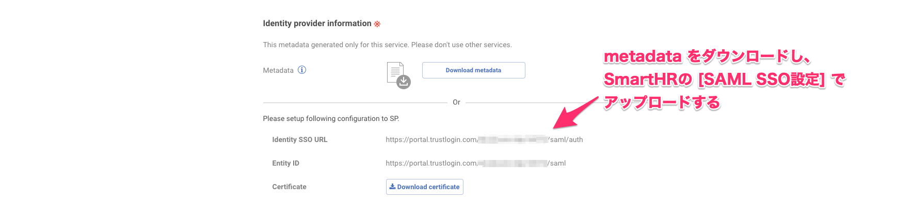
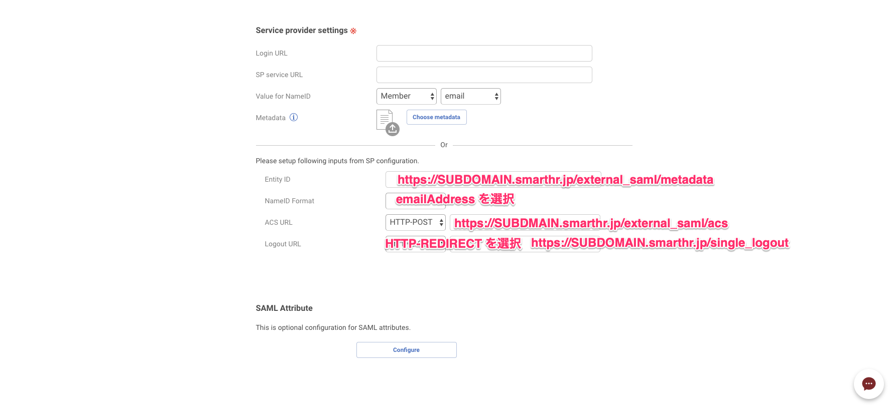
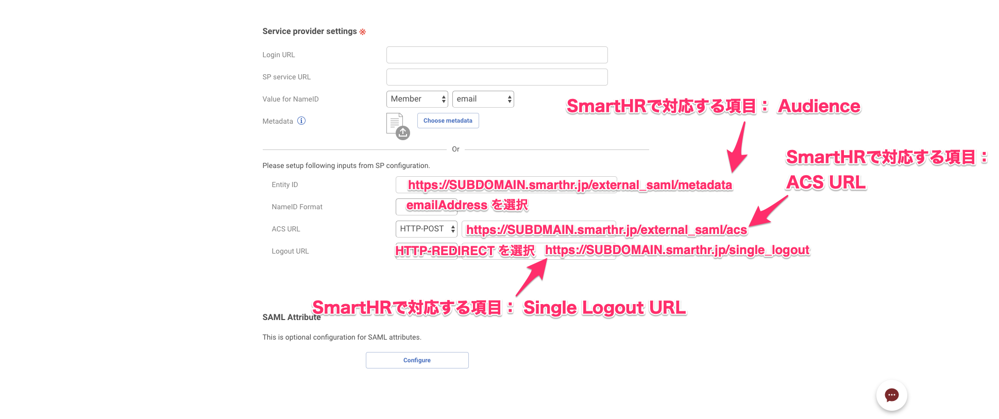
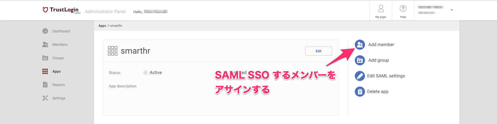
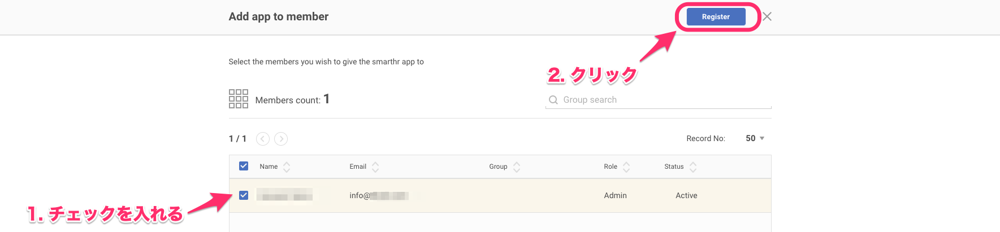

GMO TrustLoginでSAMLの設定を行なう手順を説明します。

# 1\. Admin Portal > SAML appを追加する

Admin Portalを開いて、 **「Add own SAML app」** をクリックします。

# 2\. ［Application name］を入力

 **「Add own SAML app」** をクリックすると、［ **Application registration］** の画面が表示されます。

 **［Application name］** の項目を記入してください。

# 3\. Identity provider informationでmetadataをダウンロードする

次に、同じページの **［Identity provider information］** 項目にある、 **「Download metadata」** をクリックし、metadataをダウンロードしてください。

ダウンロードしたmetadataは、SmartHRのSAML SSO設定でアップロードを行います。

metadataのアップロードを行う手順について詳しくは、以下のページをご覧ください。

[SAML認証（SSO）を設定する](https://knowledge.smarthr.jp/hc/ja/articles/360037010093)

# 4\. Service provider settingsを設定する

次に、 **［Service provider settings］** を設定します。

2番目の項目 **［NameID Format］** では、 **［emailAddress］** を選択してください。

 **［Entity ID］** と **［ACS URL］** 、そして **［Logout URL］** の項目は、SmartHRにある [サービスプロバイダ情報](https://app.smarthr.jp/?redirect_path=admin%2Fexternal_saml_service_provider)を参照しながら入力します。

GMO Trust LoginとSmartHRに記載している項目では表記が異なるので、以下の画像を参考に項目を照らし合わせてください。

また、SmartHRのサービスプロバイダ情報を参照せず、上の画像に例として記載されているURLを入力いただく方法でも記入が完了します。

画像上の入力例では、URLが以下のように表記されています。

- **Entity ID ...** https://SUBDOMAIN.smarthr.jp/external\_saml/metadata
- **ACS URL ...** https://SUBDOMAIN.smarthr.jp/external\_saml/acs
- **Logout URL ...** https://SUBDOMAIN.smarthr.jp/single\_logout

実際にGMO Trust Login上で入力するときは、「SUBDOMAIN」と表記されている部分を、「企業のサブドメイン（テナントID）」に変更して入力してください。

:::related
[サブドメイン（テナントID）とは](https://knowledge.smarthr.jp/hc/ja/articles/360026264893)
:::

# 5\. メンバーを登録する

次に、SAML SSOするメンバーを登録します。画像右上にある **「Add member」** をクリックしてください。

 **［Add app to member］** 画面が表示されたら、登録するメンバー名の横にあるボックスにチェックを入れ、  **「Register」** をクリックして登録します。

