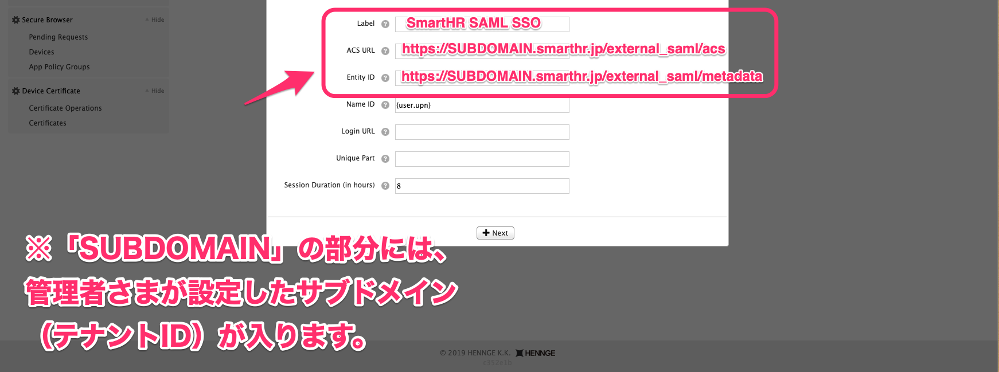
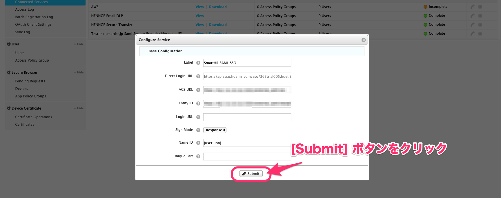

HENNGE oneでSAMLの設定を行う方法を説明します。

# metadata をアップロードして設定する場合

## 1\. SmartHRでmetadataをエクスポートする

後の手順で使用するmetadataをSmartHRでエクスポートしておきます。

SmartHRにログインし、**画面右上のアカウント名 > \[共通設定\]** をクリックしてください。

画面左側に表示される **\[共通設定\]** で **\[SAML SSO 設定\]** をクリックし、表示された画面の **\[サービスプロバイダ情報\]** 項目にある「サービスプロバイダ情報をIdPに設定してください。」と書かれたリンクをクリックします。

画面右上の **\[...\] メニュー > \[metadataのエクスポート\]** をクリックしてください。

ダウンロードしたファイルは、「⒊ \[Upload SSO Metadata\] ボタンをクリックし、metadataを選択する」の手順で使用します。

## 2\. \[Connected Services\] > \[Add new Service\] をクリック

HENNGE oneを開き、画面左にある **\[System\]** 項目の **\[Connected Services\] > \[Add new Service\]** をクリックしてください。

## 3\. \[Upload SSO Metadata\] ボタンをクリックし、metadata を選択する

モーダル上部に表記されている **\[Upload SSO Metadata\]** ボタンをクリックしてください。

**\[Choose File\]** をクリックして、SmartHRでエクスポートしたmetadataを選択します。

metadataを選択し画面下部にある **\[Next\]** をクリックすると、 **\[Configure Service\]** のモーダルが表示されます。

## 4\. \[Label\] 項目を変更して \[Submit\] ボタンをクリック

**\[Label\]** 項目で任意の名称を登録し、画面下にある **\[Submit\]** ボタンをクリックしてください。

## 5\. IdP metadata をダウンロードする

**\[Connected Services\]** の一覧で、追加した項目の **\[Metadata\]** 欄にある、 **\[Download\]** をクリックします。

ダウンロードしたmetadataは、SmartHRの **\[SAML SSO 設定\]** 画面でアップロードしてください。

**\[SAML SSO 設定\]** でmetadataをアップロードする手順については、以下のページをご覧ください。

[SAML認証（SSO）を設定する](https://knowledge.smarthr.jp/hc/ja/articles/360037010093)

## 6\. メンバーを登録する

次に、SAML SSOするメンバーを登録します。Userの個別の編集画面にある **\[Allowed Services\]** 項目で、設定したServiceにチェックを入れてください。

最後に、 画面下にある **\[Submit\]** ボタンをクリックします。

# Custom SSO Serviceを編集して設定する場合

## 1\. \[Connected Services\] > \[Add new Service\] をクリック

画面左にある **\[System\]** 項目で **\[Connected Services\]** をクリックし、画面上部に表示される **\[Add new Service\]** をクリックしてください。

 **\[Add new Service\]** をクリックすると、画面中央にモーダルが表示されます。

## 2\. \[Custom SSO Service\] ボタンをクリック

モーダル上部に表記されている、 **\[Custom SSO Service\]** ボタンをクリックしてください。

## 3\. \[Label\] と \[ACS URL\] 、\[Entity ID\] の項目に記入する

次に **\[Label\]** と **\[ACS URL\]** 、 **\[Entity ID\]** の項目に記入します。

**\[Label\]** には、任意の名称を入力してください。

**\[ACS URL\]** と **\[Entity ID\]** 項目は、SmartHRにある [サービスプロバイダ情報](https://app.smarthr.jp/?redirect_path=admin%2Fexternal_saml_service_provider) を参照しながら入力します。

**HENNGE one**と**SmartHR**の画面では項目の表記が一部異なるので、以下の画像を参考に項目を照らし合わせてください。

:::tips
なお、SmartHRのサービスプロバイダ情報を参照せずに、以下の画像に記載されているURLを入力する方法でも記入が完了します。

画像上の入力例では、 URLが以下のように表記されています。
- **ACS URL …** https://SUBDOMAIN.smarthr.jp/external\_saml/acs
- **Entity ID ...** https://SUBDOMAIN.smarthr.jp/external\_saml/metadata
実際にHENNGE one上で入力するときは、URLの「SUBDOMAIN」と表記されている部分を「企業のサブドメイン（テナントID）」に変更して入力してください。
サブドメイン（テナントID）の確認方法について詳しくは、以下のページをご覧ください。
[サブドメイン（テナントID）とは](https://knowledge.smarthr.jp/hc/ja/articles/360026264893)
:::

## 4\. \[Submit\] をクリック

入力が完了したら、そのまま **\[Submit\]** をクリックしてください。

## 5\. IdP metadata をダウンロードする

**\[Connected Services\]** の一覧で、追加した項目の **\[Metadata\]** 欄にある、 **\[Download\]** をクリックします。

ダウンロードしたmetadataは、SmartHRの **\[SAML SSO 設定\]** 画面でアップロードしてください。

**\[SAML SSO 設定\]** でmetadataをアップロードする手順については、以下のページをご覧ください。

[SAML認証（SSO）を設定する](https://knowledge.smarthr.jp/hc/ja/articles/360037010093)

## 6\. メンバーを登録する

次に、SAML SSOするメンバーを登録します。Userの個別の編集画面にある **\[Allowed Services\]** 項目で、設定したServiceにチェックを入れてください。

最後に、 画面下にある **\[Submit\]** ボタンをクリックします。
