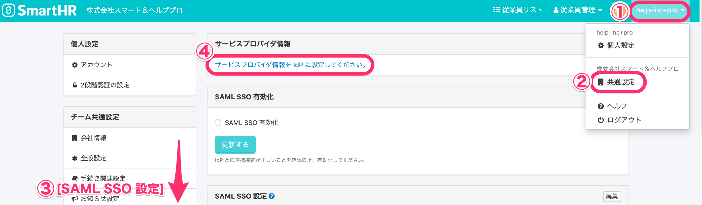
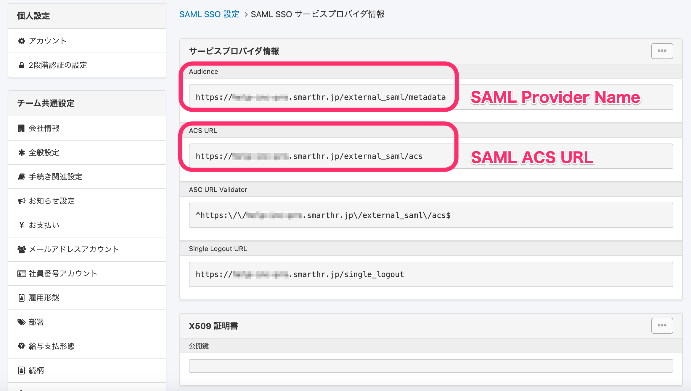
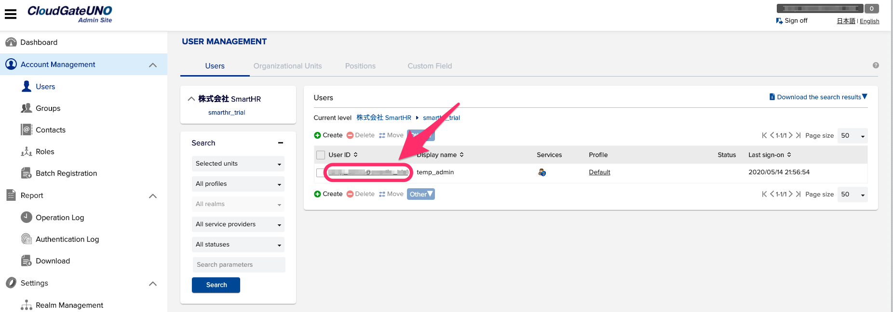
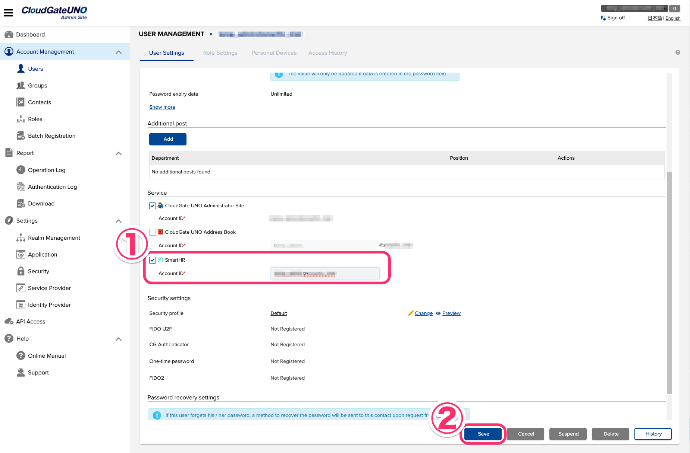
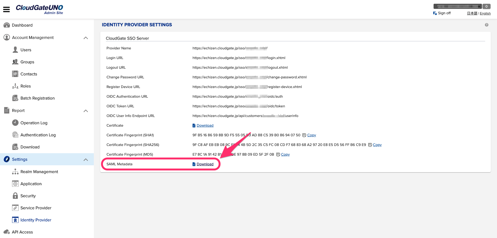

CloudGate UNOでSAMLの設定を行う方法を説明します。

# IdP側の設定に必要な情報の確認方法

IdP側の設定は、下記の情報をCloudGate側に渡して設定してもらいます。

## 1\. \[サービスプロバイダ情報\] 画面へ移動

**\[共通設定\]** にある **\[SAML SSO 設定\]** 画面に移動し、**\[サービスプロバイダ情報\]** 項目にあるリンクをクリックすると、**\[SAML SSO サービスプロバイダ情報\]** を確認できます。

## 2\. 各項目に対応する情報を確認

下記を参考に、CloudGate側へ情報を伝えてください。

| CloudGate UNO 側の項目 | SmartHR上の項目 | サンプルURL |
| --- | --- | --- |
| SAML Site URL | (テナント専用のログイン画面のURL) | https://\_\_\_\_\_\_.smarthr.jp |
| SAML Provider Name | Audience | https://\_\_\_\_\_\_.smarthr.jp/external\_saml/metadata |
| SAML ACS URL | ACS URL | https://\_\_\_\_\_\_.smarthr.jp/external\_saml/acs |

# アカウントの関連付け

## 1\. 対象のユーザーをクリック

CloudGate UNOの管理者サイトにアクセスし、**\[Account Management\] > \[Users\]** 画面にあるユーザー一覧から対象のユーザーを選択すると、**\[User Settings\]** 画面に移動します。

## 2\. Account ID の設定

**\[Service\]** にある **\[SmartHR\]** にチェックを入れて**Account ID**を入力し、**\[Save\]** をクリックすると情報が保存されます。

:::tips
Account IDは、SmartHRのSAML SSOアカウントのUPNと同じものを設定します。
:::

# SmartHRのSSO設定

## 1. Identity Providerからmetadataをダウンロード

CloudGate UNOの管理者サイトにアクセスし、**\[Settings\]** > **\[Identity Provider\]** 画面に移動すると、SAML metadataをダウンロードできます。

## 2. SmartHRの \[SAML SSO 設定\] にてアップロード

ダウンロードしたmetadataファイルを、SmartHRの **\[SAML SSO 設定\]** 画面にてアップロードします。

metadataのアップロードを行う手順について詳しくは、下記のページをご覧ください。 

[SAML認証（SSO）を設定する > 2. SmartHR側の設定を行う](https://knowledge.smarthr.jp/hc/ja/articles/360037010093)
