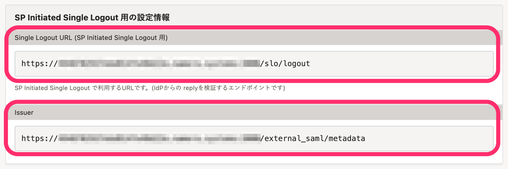
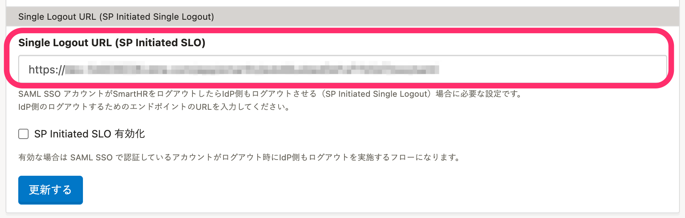
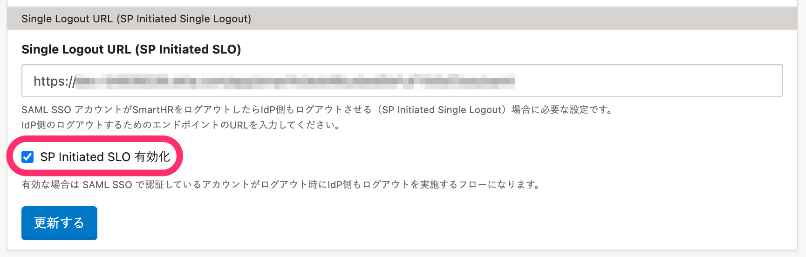
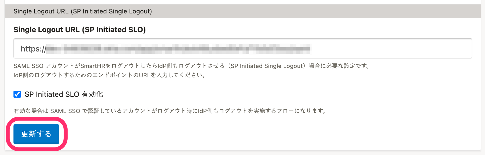

SP Initiated Single Log Out（SP Initiated SLO）を設定する手順を説明します。

SP Initiated SLOを設定すると、SmartHRのログアウトと同時にIdP側でもログアウトできます。

SmartHRでSAML認証（SSO）のみ設定した場合、従業員がSmartHRからログアウトしても、IdP側ではログインしたままとなります。

# 事前に完了しておく設定

SP Initiated SLOを利用するには、下記の設定が完了している必要があります。また、利用しているIdPがSP Initiated SLOに対応している必要があります。

- [SAML認証（SSO）を設定する](https://knowledge.smarthr.jp/hc/ja/articles/360037010093)
- [SAML認証（SSO）を使ってログインする](https://knowledge.smarthr.jp/hc/ja/articles/360037085933)（SAML SSOアカウントの有効化）

# 1\. IdP側でSP Initiated SLOを設定する

利用中のIdPで、SP Initiated SLOを設定します。設定方法は利用しているIdPによって異なります。

SmartHRの **［共通設定］** \> **［SAML SSO 設定］** にある [サービスプロバイダ情報](https://app.smarthr.jp/?redirect_path=admin%2Fexternal_saml_service_provider) で、設定に必要な情報を確認できます。

 **［Single Logout URL (SP Initiated Single Logout 用)］** は、IdP側でログアウトの応答先として設定するURLです。 **［Issuer］** は、IdP側で認証要求の発行者情報として設定するURLです。どちらの項目も、IdPに設定する必要があります。

# 2\. SmartHR側でSP Initiated SLOを設定する

 **［共通設定］** \> **［SAML SSO 設定］** の画面を開きます。 **［Single Logout URL (SP Initiated SLO)］** に、IdP側でログアウトするためのIdPのURLを設定します。

 **［SP Initiated SLO 有効化］** にチェックを入れ、SP Initiated SLOを有効化します。

 **［更新する］** をクリックし、設定を更新します。

# 3\. 動作を確認する

SmartHRからログアウトすると、IdPからも自動でログアウトが完了することを確認します。
