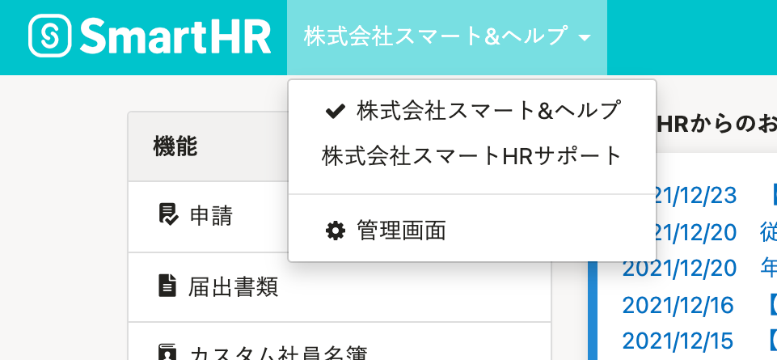
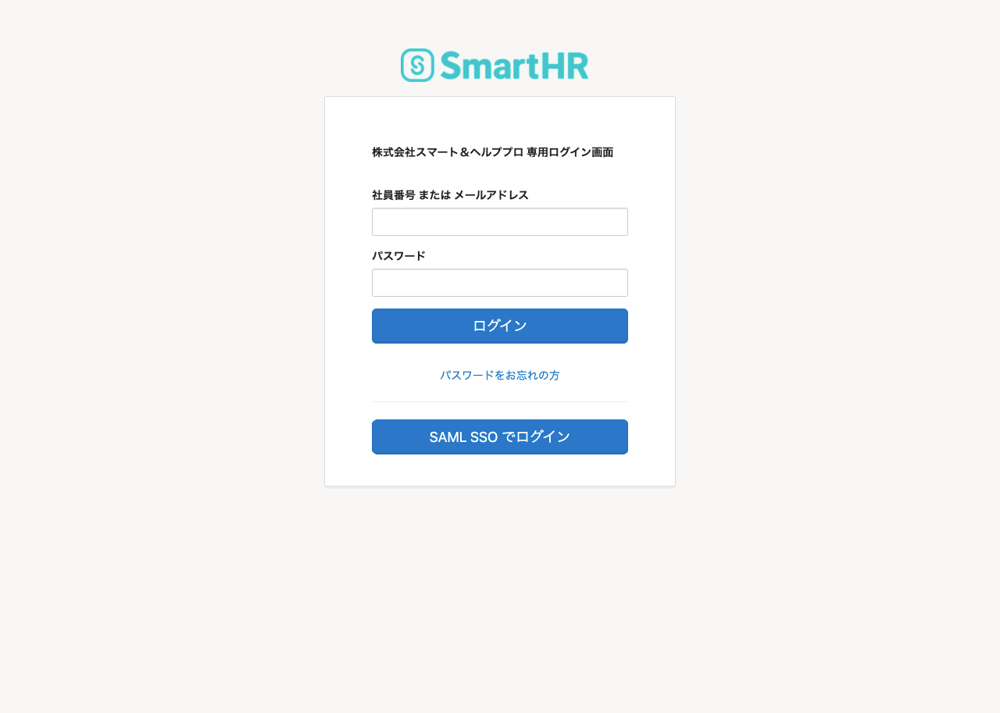

# Q. 他の企業アカウント画面から、SSOが有効な企業アカウントへの切り替えができません。

## A. マルチログインアカウントで他の企業アカウントにログインした状態では、SAML認証（SSO）が有効な企業アカウントへ切り替えができません。企業専用のログイン画面からログインし直してください。

マルチログインアカウントで利用できる複数の企業アカウントの中に、SAML認証（SSO）が有効な企業アカウントが含まれている場合、他の企業アカウントの画面から切り替えができません。

SAML認証（SSO）が有効な企業アカウントへ切り替える場合は、ログイン中の企業アカウントをログアウトし、企業専用のログインURL（サブドメイン.smarthr.jp）の画面からログインし直してください。

:::related
[マルチログインアカウントとは](https://knowledge.smarthr.jp/hc/ja/articles/360026262853)
[サブドメインとは](https://knowledge.smarthr.jp/hc/ja/articles/360026264893)
:::

# Q. SSOが有効なとき、ログイン画面のメールアドレスとパスワードの入力欄を非表示にするにはどうしたらいいですか？

## A. 入力欄は非表示にできません。

SSOが有効化されているかどうかは **［SAML SSOでログイン］** をクリックした時点で判定します。

メールアドレスとパスワードの入力欄を非表示にできない理由は、SmartHRのログイン画面を表示した時点ではメールアドレスとパスワードの入力によるログインか、SAML認証（SSO）によるログインかの判別ができないことにあります。

