文書配付機能は、従業員宛に合意書類や確認書類を送信し、合意・確認をしてもらう機能です。

従業員に対してさまざまな書類を送信することを、**文書配付**と呼んでいます。

このページでは、管理者が従業員宛に文書を送付する一連の流れについて、説明します。

# 依頼グループを作成する

文書配付をするには、まず**依頼グループ**を作成します。

依頼グループとは、任意の**書類セット**もしくは**PDF書類**と、**依頼対象従業員**を関連づけるためのグループです。

依頼グループ作成後は、**書類セットおよびPDF書類の変更はできません。**

**依頼対象従業員はあとから追加可能**です。ただし、同じ従業員に対する送信は、**1回限り**です。

## 1\. ［+ 従業員への文書配付をはじめる］をクリック

文書配付メニューの **［ダッシュボード］** \>［ **\+ 従業員への文書配付をはじめる］** をクリックすると、 **［依頼グループの作成］** 画面が表示されます。

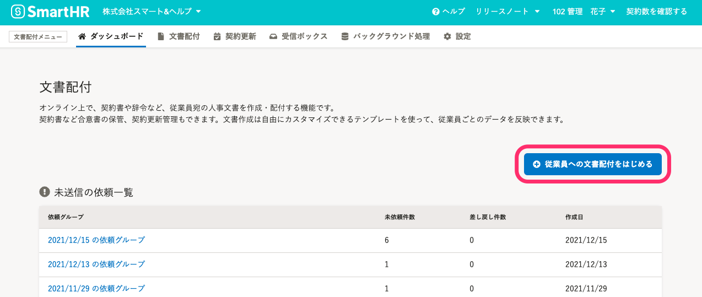

## 2\. ［配付する書類］を選択する

最初に、従業員に配付する書類を選択します。

**書類テンプレートから作成する場合**は、 **［書類セット］** にチェックを入れ、**作成済みのPDFファイルを送信する場合**は、 **［PDF書類］** にチェックを入れます。

片方のみ、両方、いずれも選択できます。

チェックを入れ、［ **次へ］** をクリックすると、依頼に使用する書類を選択する画面が表示されます。

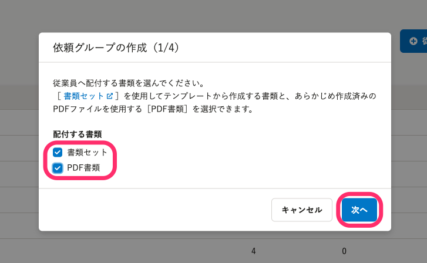

## 3\. 書類を選択し、［次へ］をクリック

次に、依頼に使用する書類を選択します。

前の画面で［書類セット］［PDF書類］の**いずれかを選んだ**場合、画面には選択した書類のみ表示されます。

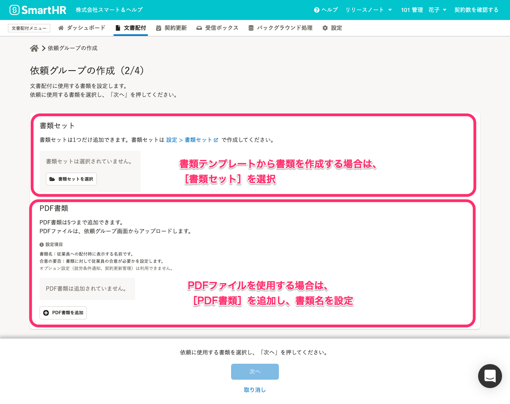

### 書類セットを選択する場合

あらかじめ**書類テンプレート**を作成し、 **書類セット**の作成を済ませておく必要があります。

:::related
[書類テンプレートを作成・編集する](https://knowledge.smarthr.jp/hc/ja/articles/360026263953)
[書類セットを作成する](https://knowledge.smarthr.jp/hc/ja/articles/360026263933)
:::

 **［書類セットを選択］** をクリックすると、使用できる書類セット一覧が表示されます。

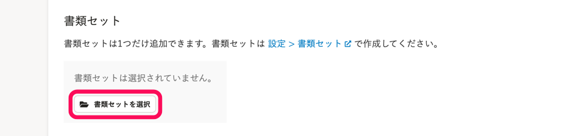

**書類セット**を選択し、 **［選択］** をクリックします。

 **［書類テンプレート］** 欄には、書類セットに含まれる書類テンプレート名が表示されます。

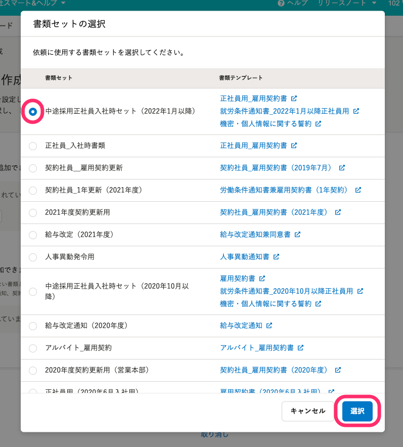

選択した書類セットと、書類セットに含まれる書類テンプレートが **［依頼グループの作成］** 画面に表示されます。

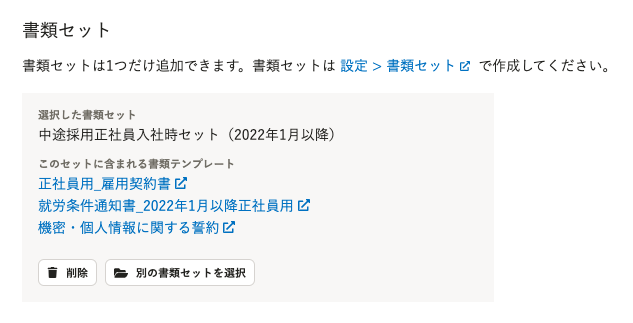

### PDF書類を追加する場合

PDF書類として送る、PDFファイルの書類名を設定します。

実際に送信するPDFファイルのアップロードは、依頼グループ作成時には行いません。

 **「＋PDF書類を追加」** をクリックし、 **［書類名］** の入力と **［合意の要否］** を設定します。

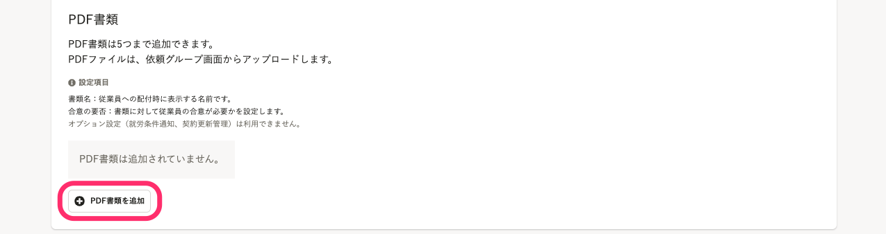

ここで入力した書類名は、従業員に配付時に表示されます。（書類テンプレートに設定する「従業員向けテンプレート名」と同様に表示されます）

**PDF書類の書類名は、あとから変更できません。**

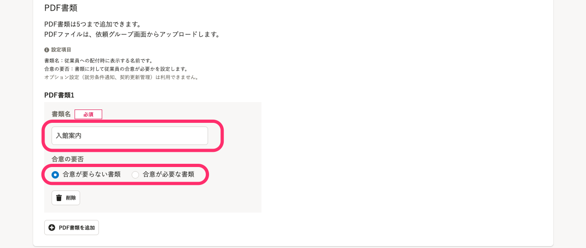

:::alert
PDF書類を合意が必要な書類として設定できるのは、**管理者権限のアカウントのみです。**
管理者権限以外のアカウントが配付できるのは、合意が要らないPDF書類と権限を付与されている書類セットです。
:::

依頼に使用する書類の選択を終えたら、 **［次へ］** をクリックします。

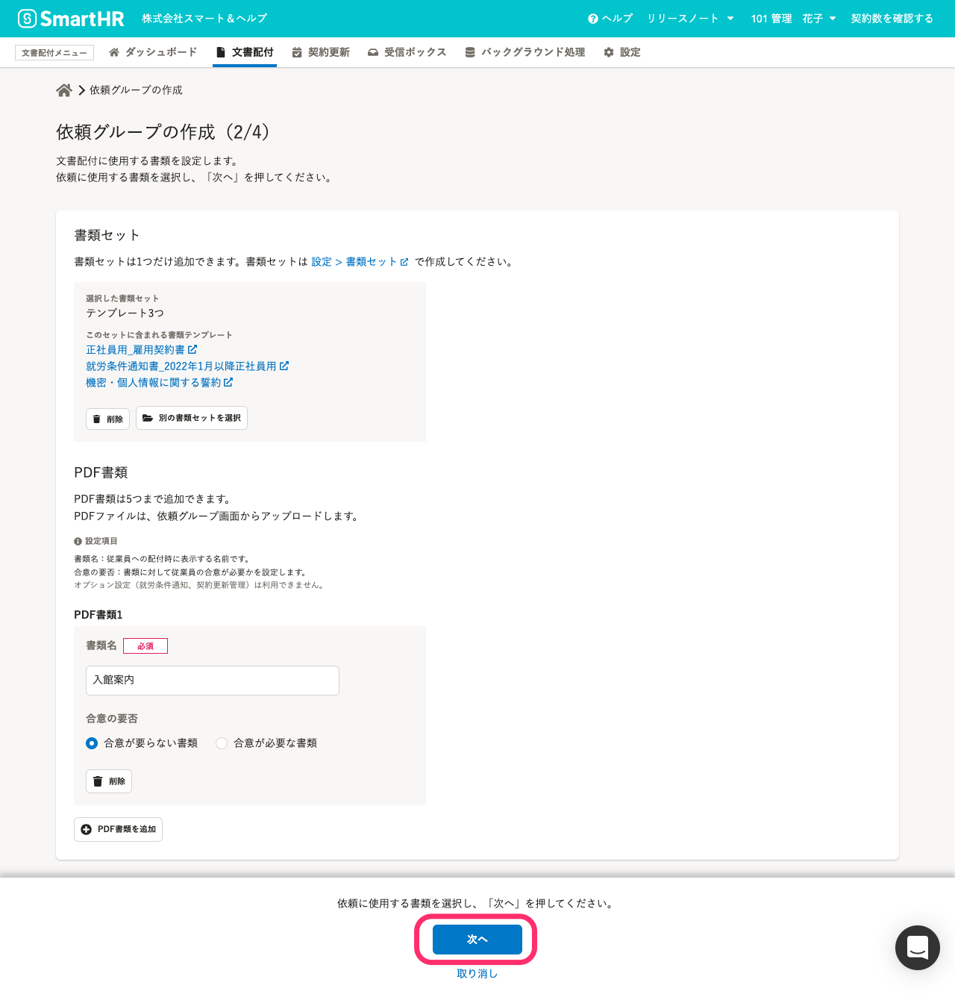

:::related
[既存のPDFファイルを書類として配付する](https://knowledge.smarthr.jp/hc/ja/articles/900005440846)
:::

## 4\. メールフォーマットを選択し、「作成」をクリック

次に、メールフォーマットの設定内容を確認し、 **［次へ］** をクリックします。メールフォーマットは、依頼グループ作成後も変更できます。

**書類セット**を使用する場合は、書類セットに設定されているフォーマットが自動適用されます。

**PDF書類のみ**を使用する場合は、標準メールフォーマットが自動適用されます。

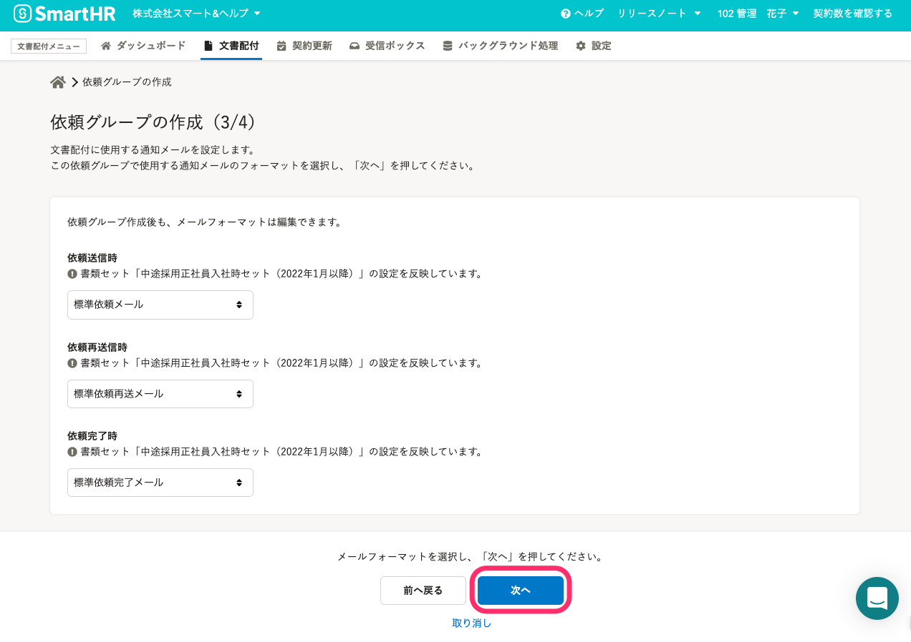

## 5\. ［依頼グループ名］ を入力し、［作成］ をクリック

次に、作成した依頼グループに対して、依頼グループ名をつけます。

 **［依頼グループ名］** を入力して **［作成］** をクリックすると、依頼グループの新規作成が完了し、 **［依頼対象従業員の選択］** 画面に切り替わります。

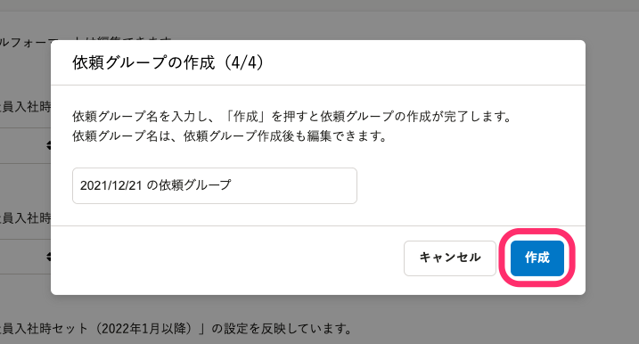

# 依頼グループに依頼対象従業員を追加する

## 6\. 依頼を送りたい従業員を選択し、［追加］をクリック

依頼を送りたい従業員のチェックボックスを選択し、 **［追加］** をクリックすると、従業員が依頼グループに追加されます。

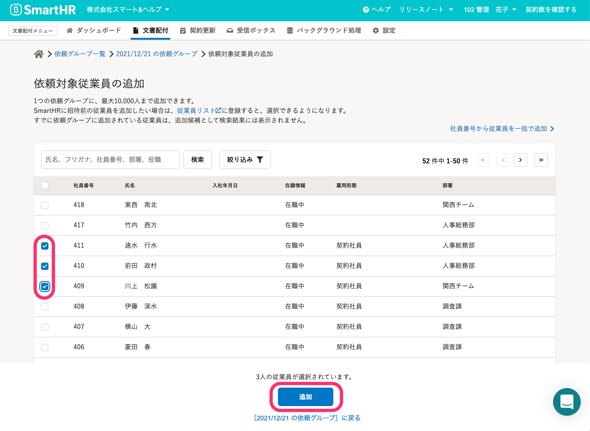

大量の依頼対象従業員を一度に追加する場合は、 **［社員番号から従業員を一括で追加］** を利用すると作業が軽減されます。

:::related
[依頼グループに従業員をまとめて追加する](https://knowledge.smarthr.jp/hc/ja/articles/360043494373)
:::

# 依頼グループ詳細画面から、依頼を送信

## 7\. 依頼する従業員を選択し、［依頼を一括送信］をクリック

配付する書類の内容を確認後、依頼したい従業員にチェックを入れ ［ **依頼を一括送信］** をクリックすると、従業員に依頼を送信します。

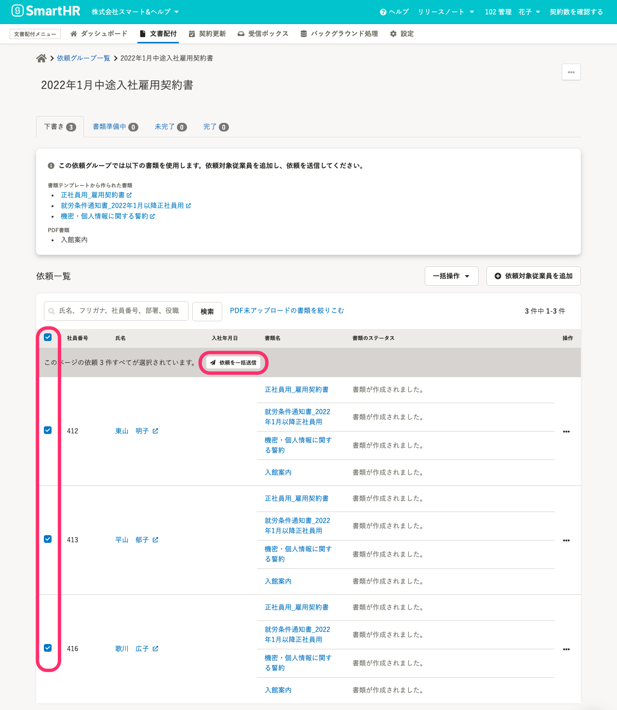

書類の作成の準備を終えていないと、依頼を送信できません。

- 書類テンプレートで設定されている **［入力必須項目］** のデータが、SmartHRの従業員情報に登録されていない
-  **［CSV挿入用テンプレート変数］** の挿入が終わっていない
-  **［PDF書類］** にPDFファイルのアップロードが終わっていない

:::related
**書類テンプレートの必須項目について**
[「書類の作成に失敗しました。必須項目の内容を確認してください。」と表示される場合は？](https://knowledge.smarthr.jp/hc/ja/articles/360047119273)
[SmartHRの従業員項目を書類テンプレートに挿入する](https://knowledge.smarthr.jp/hc/ja/articles/360036818773)
**CSV挿入用テンプレート変数について**
[SmartHRの従業員項目以外のデータを書類テンプレートに挿入する](https://knowledge.smarthr.jp/hc/ja/articles/360054592174)
**PDF書類について**
[既存のPDFファイルを書類として配付する](https://knowledge.smarthr.jp/hc/ja/articles/900005440846)
:::

## 8\. ［未完了］をクリックし、依頼が送られたことを確認する

依頼が送信された従業員は、［ **未完了］** タブの一覧に表示されます。

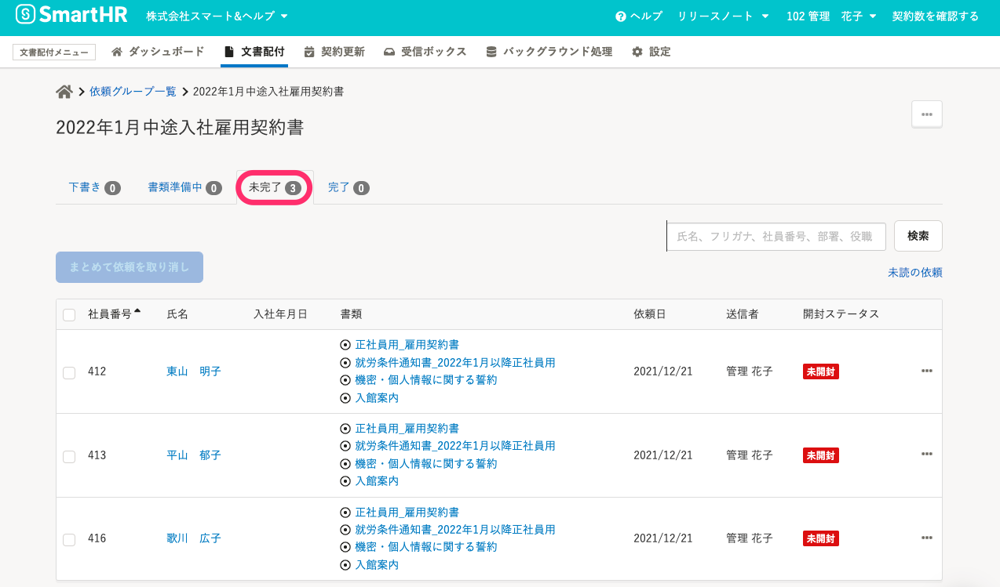

# 依頼ステータスの意味

| 下書き |   書類テンプレートから、従業員ごとの書類を作成する準備が整っていない状態。  もしくは、従業員から依頼が差し戻された状態。   |
| --- | --- |
| 書類準備中 | 依頼対象の従業員が SmartHR にログインできる状態になっていない状態。 このあと、SmartHR への招待を行なうことで、依頼が送信されます。 |
| 未完了 | 従業員に依頼を送信し、従業員による書類の確認・合意を待っている状態。 |
| 完了 | 従業員が、依頼に含まれるすべての書類の確認・合意をした状態。 |

# 従業員に依頼を通知する

依頼送信時には、SmartHR から従業員宛に通知メールが自動的に送信されます。

依頼後に、リマインドメールを送ったり、従業員ごとに再通知もできます。

:::related
[【一覧】文書配付機能の通知メールの内容](https://knowledge.smarthr.jp/hc/ja/articles/360035821993)
[通知メールを書類セットや依頼グループに紐づける](https://knowledge.smarthr.jp/hc/ja/articles/360042985914)
[依頼の再通知（リマインド）を設定する](https://knowledge.smarthr.jp/hc/ja/articles/360035822013)
:::
