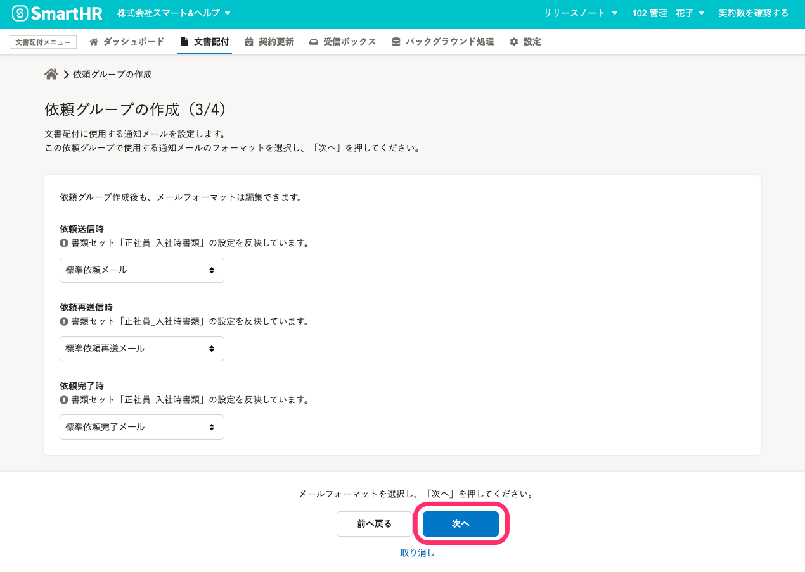

SmartHRにアカウントがない従業員に対して、事前に社員番号アカウントを作成しておくことで、雇用契約書への合意依頼と同時にSmartHRへ招待できます。

# 1\. 従業員の社員番号アカウントを作成

文書配付機能を利用する前に、SmartHRに従業員の社員番号アカウントを作成しておいてください。

社員番号アカウントを作成する手順は、 [社員番号アカウントを作成する](https://knowledge.smarthr.jp/hc/ja/articles/360026263373) を参照してください。

:::alert
必ず従業員招待フォームを設定して、社員番号アカウントを作成してください。従業員招待フォームが設定されていないと、文書配付機能を利用できません。

:::

また、配付書類の作成に使用する**書類テンプレート**に従業員項目を挿入する **テンプレート変数**を使っている場合は、従業員情報の登録も完了しておく必要があります。

なお、住所に限り、従業員本人に入力を依頼する機能があります。

:::related
[書類に記載する従業員の住所を本人に入力してもらう](https://knowledge.smarthr.jp/hc/ja/articles/360033699433)
:::

# 2\. 依頼グループに従業員を追加

## 2-1. ダッシュボード画面の **［+ 従業員への文書配付をはじめる］** から依頼グループ作成をします。

依頼グループは書類と依頼先従業員を紐づけるためのグループで、依頼に使用する書類が変わらない限り、従業員を追加して使えます。

依頼グループ作成後も**書類テンプレート**を編集し、書面の改訂ができます。（ただし、 合意の有無の設定と就労条件通知設定の変更はできません。）

詳しい手順は、 [従業員へ文書配付をする](https://knowledge.smarthr.jp/hc/ja/articles/360026105334) を参照してください。

## 2-2. 従業員へ配付する書類の種類を選択します。

## 2-3. 従業員へ配付したい書類セットを選択します。

 **［書類セットを選択］** をクリックし、従業員へ配付したい書類セットを選択した後で **［次へ］** をクリックします。

## 2-4. この依頼グループで使用するメールフォーマットを選択します。

この依頼グループで使用するメールフォーマットを選択し、 **［次へ］** をクリックします。

社員番号アカウントでは、メールアドレスを設定している場合のみメールで通知が配信されます。

メールフォーマットの作成手順については、 [通知メールのフォーマットを作成・編集する](https://knowledge.smarthr.jp/hc/ja/articles/360043502353) を参照してください。

## 2-5. 依頼グループ名を記入し依頼グループを作成します。

依頼グループ名を記入し、 **［作成］** をクリックし依頼グループを作成します。

ここで入力した依頼グループ名については依頼グループ作成後も編集できます。

## 2-6. 依頼対象従業員の追加画面で、従業員を選択し追加します。

依頼対象となる従業員にチェックを入れ、 **［追加］**  をクリックします。

# 3\. 依頼グループ詳細画面から依頼を送信

書類作成の準備が整うと、 **書類のステータス**が**書類が作成されました。**になります。

書類テンプレートに挿入した**テンプレート変数**のうち入力必須項目に設定した項目の従業員情報が登録されていないと書類の作成に失敗し、依頼の送信ができません。

書類のステータスが**書類が作成されました。**の書類は、**書類**の欄の書類名をクリックすると従業員ごとに配付される書類の内容を確認できます。

書類の準備が済んだら、社員番号の左側にあるボックスにチェックを入れて **［依頼を一括送信］** をクリックすると、 **［未完了］** タブに移行します。

# 4\. 対象の従業員へSmartHRへのログインを案内

別途、メールなどSmartHR以外のツールで、下記の情報を従業員へ連絡してください。

- 貴社専用ログインURL（例：https://\*\*\*\*\*\*.smarthr.jp/login）
- 社員番号
- 初期パスワード

社員番号アカウントでログインする手順については、以下のページをご覧ください。

:::related
[社員番号アカウントでログインする](https://knowledge.smarthr.jp/hc/ja/articles/360026263133)
:::
:::tips
ログインURLの例にある（\*\*\*\*\*\*）には、貴社専用のサブドメインが入ります。
現在ログインしているSmartHRのURLを確認してください。
サブドメインについて詳しくは、以下のページをご覧ください。
[サブドメインとは](https://knowledge.smarthr.jp/hc/ja/articles/360026264893)
:::
:::alert
**https://app.smarthr.jp/login**というURLのログイン画面からは、社員番号を使ってのログインはできませんので、ご注意ください。
:::

従業員が初回ログインを完了したあと、雇用契約書が開封され、その後、SmartHRの登録手続きが始まります。

## 文書配付機能の進捗確認は［依頼グループ］から

文書配付機能で依頼した内容の進捗は **［文書配付］** \> **［依頼グループ］** から確認します。

一覧の中から該当の依頼グループをさがし、グループ名のリンクをクリックすると、進捗を確認できます。

従業員が依頼グループに含まれるすべての書類の確認・合意を完了するまでは、  **［未完了］**  タブに表示されます。

開封ステータス、書類ごとの進捗も確認できます。

すべての書類の確認・合意を終えた従業員は **［完了］**  タブに表示されます。

