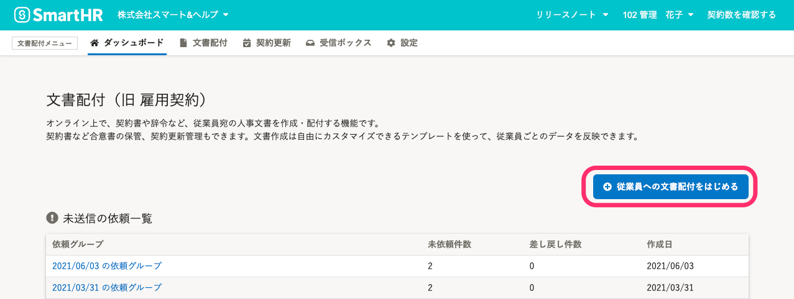

SmartHRでの入社の手続きと一緒に、雇用契約書への合意依頼ができます。

ここでは、メールアドレスアカウントの従業員に依頼する場合の手順を説明します。

社員番号アカウントの従業員に依頼する場合の手順は、[社員番号アカウントに招待と雇用契約書への合意を同時に依頼する](https://knowledge.smarthr.jp/hc/ja/articles/4404302233369)を参照してください。

# 1\. SmartHRに従業員情報を登録

文書配付機能を利用する前に、SmartHRに従業員を追加しておいてください。

SmartHRに従業員を追加する手順は、 [従業員情報を追加・登録する](https://knowledge.smarthr.jp/hc/ja/articles/360026266493) を参照してください。

:::alert
SmartHRには氏名なしでも従業員を登録できますが、文書配付機能で依頼グループに追加するには氏名が必要です。

:::

また、配付書類の作成に使用する **書類テンプレート** に従業員項目を挿入する **テンプレート変数** を使っている場合は、従業員情報の登録も完了しておく必要があります。

なお、住所に限り、従業員本人に入力を依頼する機能があります。

:::related
[書類に記載する従業員の住所を本人に入力してもらう](https://knowledge.smarthr.jp/hc/ja/articles/360033699433)
:::

# 2\. 依頼グループに従業員を追加

## 2-1. ダッシュボード画面の  **［+ 従業員への文書配付をはじめる］** から依頼グループを作成する

依頼グループは書類と依頼先従業員を紐づけるためのグループで、依頼に使用する書類が変わらない限り、従業員を追加して使えます。

依頼グループ作成後も **書類テンプレート** を編集し、書面の改訂ができます。（ただし、 合意の有無の設定と就労条件通知設定の変更はできません。）

詳しい手順は、 [従業員へ文書配付をする](https://knowledge.smarthr.jp/hc/ja/articles/360026105334) を参照してください。

## 2-2. 従業員へ配付する書類の種類を選択する

## 2-3. 従業員へ配付したい書類セットを選択する

 **［書類セットを選択］** をクリックし、従業員へ配付したい書類セットを選択した後で **［次へ］** をクリックします。

## 2-4. ［次へ］をクリック

従業員の招待を同時にする場合、SmartHR本体で設定するメールが送られます。

こちらの画面で設定するメールフォーマットは使用されないため、設定はせず **［次へ］** をクリックしてください。

従業員には、「4-2. 従業員を選択し、［依頼を作成する］をクリック」で説明する **［従業員招待フォーム］** で選択したメールフォーマットの内容がメールで送信されます。

## 2-5. 依頼グループ名を記入し、依頼グループを作成する

依頼グループ名を記入し、 **［作成］**  をクリックし依頼グループを作成します。

ここで入力した依頼グループ名については依頼グループ作成後も編集できます。

## 2-6. 依頼対象従業員の追加画面で、従業員を選択し追加する

依頼対象となる従業員にチェックを入れ、 **［追加］**  をクリックします。

# 3\. 依頼グループ詳細画面から依頼を送信

書類作成の準備が整うと、 **書類のステータス** が **書類が作成されました。** になります。

書類テンプレートに挿入した **テンプレート変数** のうち入力必須項目に設定した項目の従業員情報が登録されていないと書類の作成に失敗し、依頼の送信ができません。

書類のステータスが **書類が作成されました。** の書類は、**書類** の欄の書類名をクリックすると従業員ごとに配付される書類の内容を確認できます。

書類の準備が済んだら、社員番号の左側にあるボックスにチェックを入れて **［依頼を一括送信］**  をクリックすると、順次、書類テンプレートから従業員ごとの書類を作成し、送信する処理が開始されます。

:::related
[従業員に依頼を送信する](https://knowledge.smarthr.jp/hc/ja/articles/360026105334)
:::

# 4\. SmartHRへの招待を送信

## 4-1. ［書類準備中］のタブから、招待ページに移動

文書配付機能の依頼送信を終えたら、SmartHRへの招待の送信をします。

 **［書類準備中］**  タブの  **［入社手続きと併せて招待する場合はこちら］**  をクリックして、 **［入社手続き依頼一覧］**  画面を表示します。

手続きを作成せず、SmartHRへの招待をするには、 **［従業員として招待する場合はこちら］**  をクリックしてください。

## 4-2. 従業員を選択し、［依頼を作成する］をクリック

入社手続きの入力依頼をする従業員を選択し、  **［依頼を作成する］**  をクリックします。

一覧の  **［雇用契約同時依頼］** 欄には、**依頼グループ名** が表示されます。

:::tips
 **［従業員招待フォーム］** で選択したメールフォーマットの内容が従業員へメールで送信されます。

:::

操作は以上で終了です。

## 依頼の進捗確認

文書配付機能で依頼した内容の進捗は  **［文書配付］** \> **［依頼グループ］** から確認します。

一覧の中から該当の依頼グループを探し、グループ名のリンクをクリックすると、進捗を確認できます。

従業員が依頼グループに含まれるすべての書類の確認・合意を完了するまでは、  **［未完了］**  タブに表示されます。

開封ステータス、書類ごとの進捗も確認できます。

すべての書類の確認・合意を終えた従業員は  **［完了］**  タブに表示されます。

:::alert
招待と同時に送信した依頼を取り消すと、従業員の SmartHRへの招待ができなくなります。
もし、依頼を差し戻しされても、依頼を取り消さずに書類の内容を修正の上、再作成して合意依頼をするようにしてください。
:::
