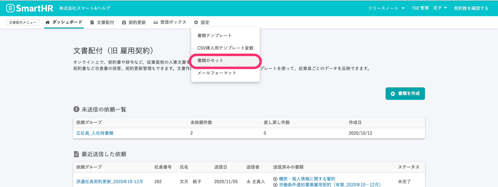

文書配付機能で、SmartHRの管理者権限以外のアカウントに従業員に依頼を送信する権限を付与するには、 **書類セット** ごとに**権限を追加**します。

なお、書類テンプレートの作成ができるのは、SmartHRの管理者権限のみです。

書類セットで従業員に依頼を送信できるようになるSmartHRの権限の条件は以下になります。

- **事務担当者**
-  **［従業員関連］>［操作できる範囲］** が **［本人］以外**  に設定されている**カスタム権限**

利用可能権限が付与されたアカウントは、依頼グループを作成して、操作可能範囲に含まれる従業員に対して書類の合意・確認依頼を送信し、完了済みの書類の閲覧ができるようになります。

:::alert
書類テンプレートに、SmartHR 上で閲覧権限を持っていない従業員項目が **テンプレート変数** として挿入されている場合、依頼時に生成する書類上で従業員項目の内容を閲覧できるようになるので、権限を付与する際は注意してください。
:::
:::related
[アカウントの権限を確認・変更する](https://knowledge.smarthr.jp/hc/ja/articles/360026106574)
[カスタム権限を追加する](https://knowledge.smarthr.jp/hc/ja/articles/360026106594)
[テンプレート変数を使って書類テンプレートを作成する](https://knowledge.smarthr.jp/hc/ja/articles/360036818773)
:::

# 1\. 文書配付メニューから［書類のセット一覧］を表示

文書配付メニューの **［設定］** から **［書類セット］** をクリックして、 **［書類セット一覧］画面**  へ移動します。

# 2\. ［書類のセット一覧］画面で、書類のセット名をクリック

 **［書類セット一覧］** 画面で、権限を付与したい **［書類セット名］** をクリックし、 **［書類セット詳細］** 画面を表示します。

書類セットの作成が済んでいない場合、作成から行なってください。

:::related
[書類セットを作成する](https://knowledge.smarthr.jp/hc/ja/articles/360026263933)
:::

# 3\. ［権限］の項目を設定し、「更新」をクリック

 **［書類セット詳細］** 画面を下部の **［権限］** の **［依頼可能な権限］** にて **［管理者以外も依頼可能］** をクリックすると、書類のセットを利用権限を付与できるSmartHRの権限名が表示されます。

書類セットを利用できるようにしたい権限名のチェックボックスにチェックを入れ、 **「更新」** をクリックして設定を保存します。

