# PDF書類の配付機能について

作成済みの**PDFファイルを文書配付機能にアップロードして従業員に配付**できます。

PDF書類でも合意の要否を設定できますが、**就労条件通知、契約更新管理のオプション設定はできません。**

:::alert
ただし、**PDF書類を合意が必要な書類として設定できるのは、管理者権限のアカウントのみ**です。
管理者権限以外のアカウントが配付できるのは、合意が要らないPDF書類と権限を付与されている書類セットです。
:::

# PDF書類として配付できないPDFファイル

- ファイルサイズが5MBを超えるPDFファイル
    
- 暗号化されたPDFファイル
    
- 電子署名が付与されたPDFファイル
    
- テキスト・画像以外の情報(音声・動画・フォーム・注釈等)を含むPDFファイル

# PDF書類の配付手順

## 1\. ［ダッシュボード］ 画面の 「+ 従業員への文書配付をはじめる」をクリック

 **［ダッシュボード］**  画面の  **「+ 従業員への文書配付をはじめる」** をクリックし、依頼グループの新規作成をはじめます。

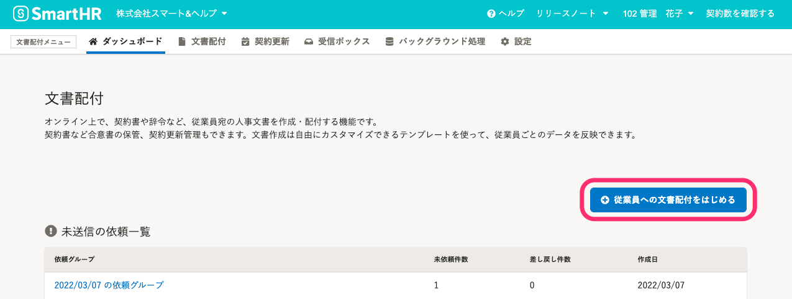

## 2\. ［依頼グループの作成］画面で、［配付する書類］の［PDF書類］にチェック

最初に、 **［配付する書類** ］から **［PDF書類］** にチェックを入れ、 **「次へ」** をクリックします。

なお、配付する書類は「PDF書類のみ」「書類セットとPDF書類の両方」のいずれも選択できます。

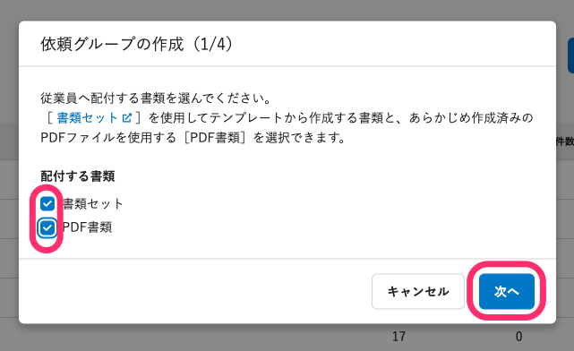

## 3\. ［＋PDF書類を追加］をクリックし、［書類名］を入力

次に、PDF書類の書類名を設定します。

実際に配付するPDFファイルのアップロードは、**ここでは操作しません。**

 **［＋PDF書類を追加］** をクリックすると、 **［書類名］** の入力フォームが表示されます。

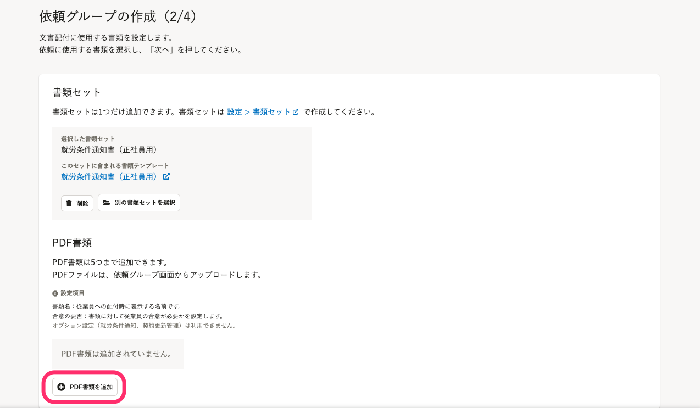

 **［書類名］を入力し、［合意の要否］** を選択します。**設定した内容は、あとから変更ができません。**

PDF書類の書類名は、従業員への配付時に表示されます。（書類テンプレートに設定する「従業員向けテンプレート名」と同様に表示されます）

さらにPDF書類を追加したい場合は、［ **＋PDF書類を追加］** をクリックします。

1つの依頼グループにつきPDF書類は5つまで追加できます。つまり、1人の従業員宛に5つのPDFファイルを配付できます。

依頼に使用する書類の設定を終えたら、［ **次へ］** をクリックします。

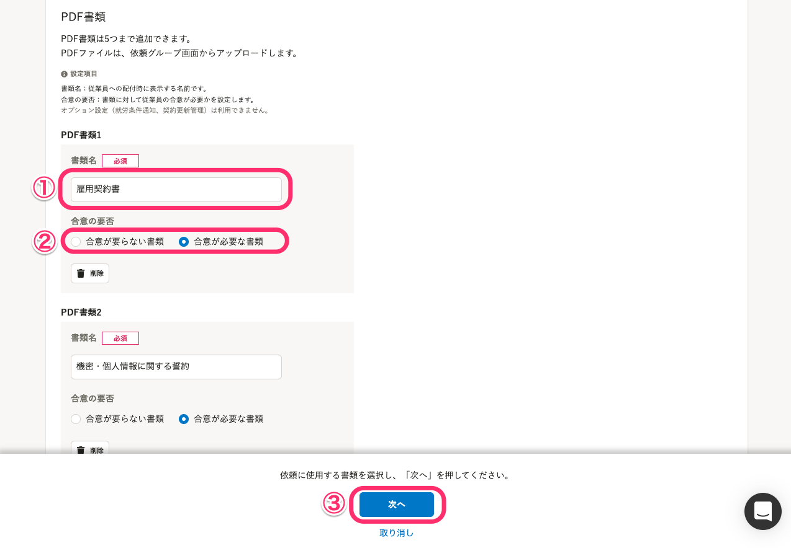

## 4\. メールフォーマットの選択

次に、依頼グループで使用する通知メールのフォーマットを選択し、 **［次へ］** をクリックします。

詳しくは、[【一覧】文書配付機能の通知メールの内容](https://knowledge.smarthr.jp/hc/ja/articles/360035821993) を参照してください。

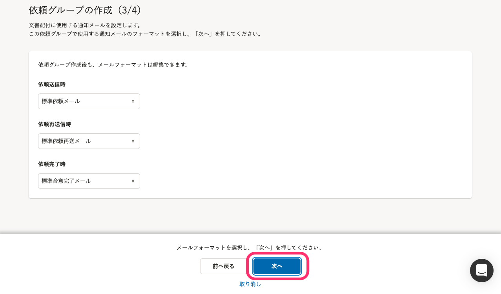

## 5\. 依頼グループ名の設定

次に、 **［依頼グループ名］** を入力して **［作成］** をクリックすると、依頼グループの新規作成を完了します。

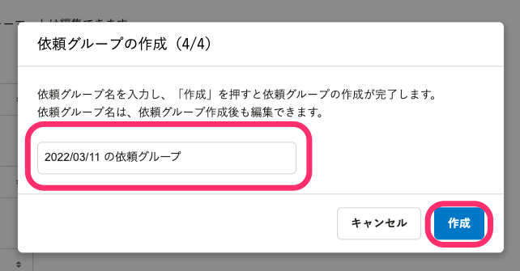

## 6\. 依頼を送りたい従業員を選択し、［追加］をクリック

依頼を送りたい従業員のチェックボックスを選択し、 **［追加］** をクリックすると、従業員が依頼グループに追加されます。

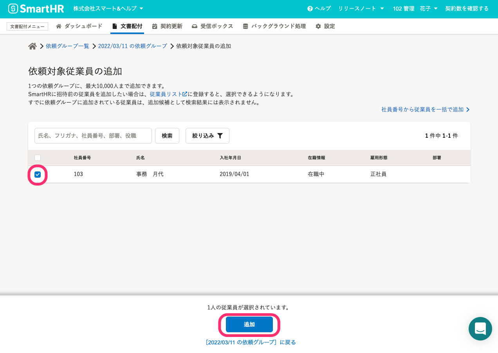

大量の依頼対象従業員を一度に追加する場合は、 **［社員番号から従業員を一括で追加］** を利用すると作業が軽減されます。

:::related
[依頼グループに従業員をまとめて追加する](https://knowledge.smarthr.jp/hc/ja/articles/360043494373)
:::

# 依頼グループ詳細画面からPDFファイルをアップロード

## 7\. ［書類のステータス］欄の［アップロード］をクリック

依頼グループに依頼対象従業員を追加したら、依頼グループ詳細画面で、**配付するPDFファイルをアップロード**します。

 **［アップロード］** をクリックすると、従業員ごとの依頼詳細画面に移動します。

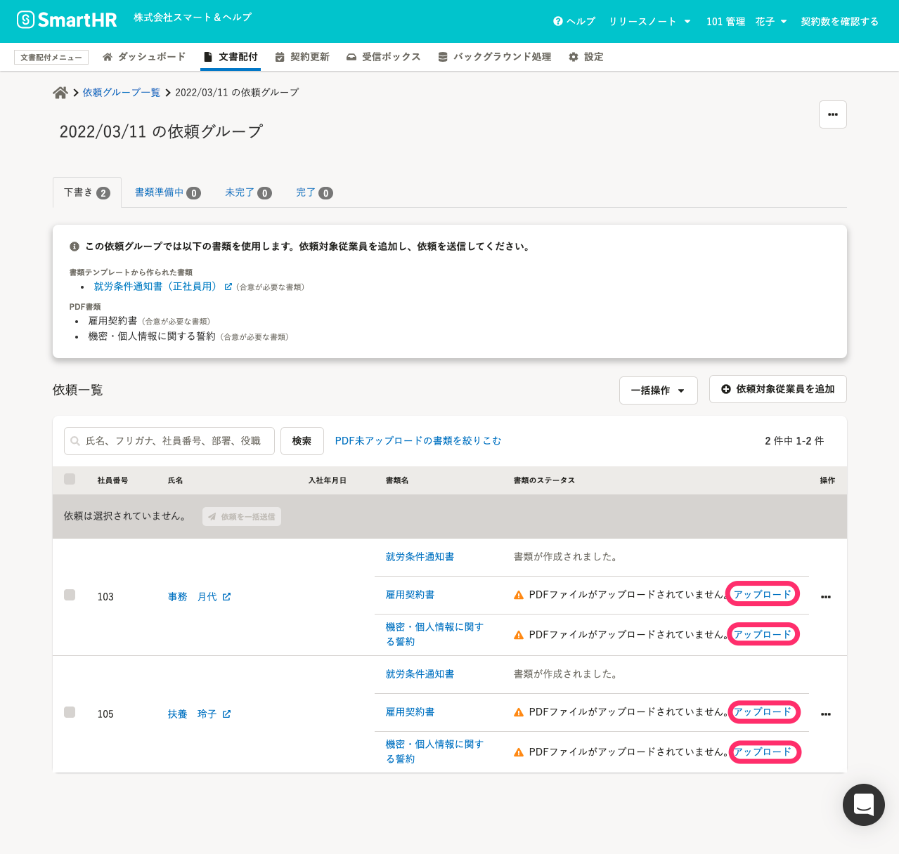

なお、 **［一括操作▼］** をクリックすると、PDFファイルをまとめてアップロード・ダウンロードができます。

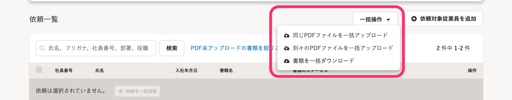

詳しくは、下記のヘルプページを参照してください。

:::related
[PDF書類にPDFファイルをまとめてアップロードする](https://knowledge.smarthr.jp/hc/ja/articles/4402741674393)
:::

## 8.［PDFファイルをアップロード］をクリック

従業員ごとの依頼詳細画面で、［ **PDFファイルをアップロード］** をクリックすると、PDFファイルのアップロード画面が表示されます。

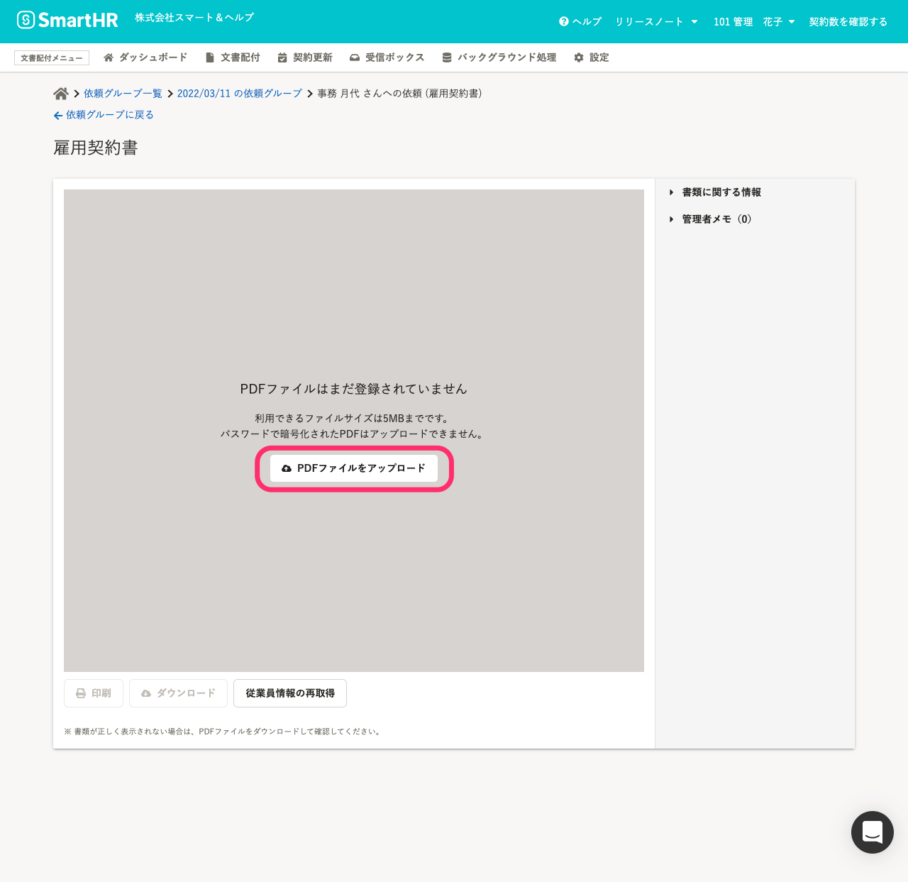

 **［PDFファイルのアップロード］** 画面で、 **「ファイルを選択」** をクリック、もしくは**PDFファイルをドラッグアンドドロップ**して、PDFファイルをアップロードします。

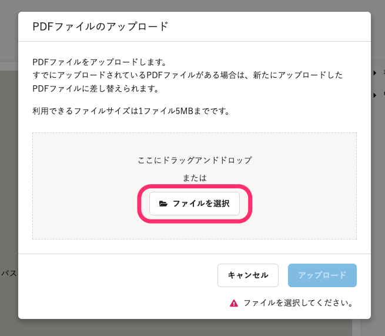

PDFファイルのアップロードが完了すると、アップロードしたファイル名が表示されます。

間違いがなければ、［ **アップロード］** をクリックします。

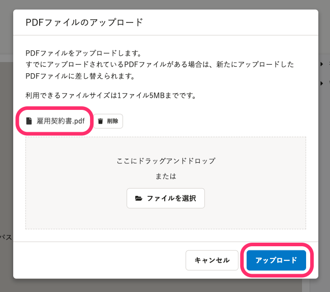

:::related
[Q. PDF書類にPDFファイルがアップロードできません](https://knowledge.smarthr.jp/hc/ja/articles/900006399563)
:::

## 9\. アップロードしたPDFファイルを確認

依頼詳細画面で、アップロードしたPDFファイルの内容を確認します。

依頼グループ詳細画面に戻るには、画面上部のメニューから **［依頼グループに戻る］** をクリックしてください。

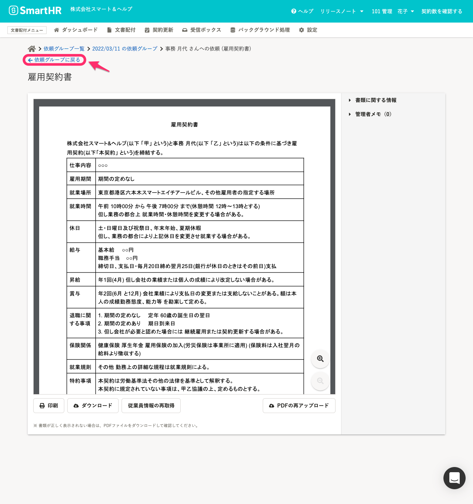

## 10\. 依頼グループ詳細画面から依頼を送信

PDFファイルのアップロードが完了したら、依頼グループ詳細画面からを依頼をします。

依頼手順は、[従業員へ文書配付をする](https://knowledge.smarthr.jp/hc/ja/articles/360026105334)の「7. 依頼する従業員を選択し、［依頼を一括送信］をクリック」以降を参照してください。
