文書配付機能の合意済み書類を破棄する場合、管理者はまず破棄依頼をし、従業員の同意を取った上で、書類の破棄を実行できます。

:::alert
- 合意済み書類の破棄依頼の送信および書類破棄を実行できるのは、**管理者のみ**です。
- 合意書類は当該合意をした双方当事者の意思表示を示したものであり、一方当事者が相手方の同意なく一方的に破棄することは後々問題となる可能性が考えられるため、合意を伴わない書類の破棄を制限しています。
:::

# 書類の破棄を依頼する

## 1\. 破棄したい書類を選んで［書類の破棄］をクリック

合意済みの書類から破棄したい書類を選んで、画面右下にある **［書類の破棄］** をクリックすると、破棄を依頼するモーダルが表示されます。

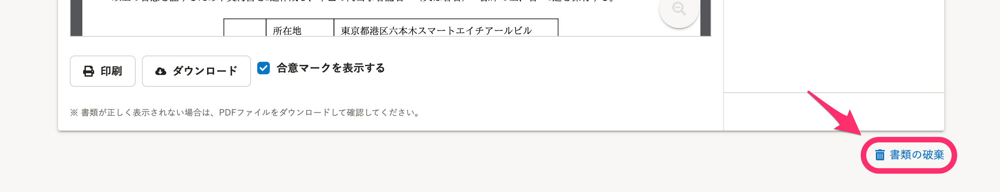

:::tips
 **［合意済み］** の書類は、 **［依頼グループ］** 画面にある **［完了］** タブで確認、または **［依頼一覧］** 画面で検索できます。
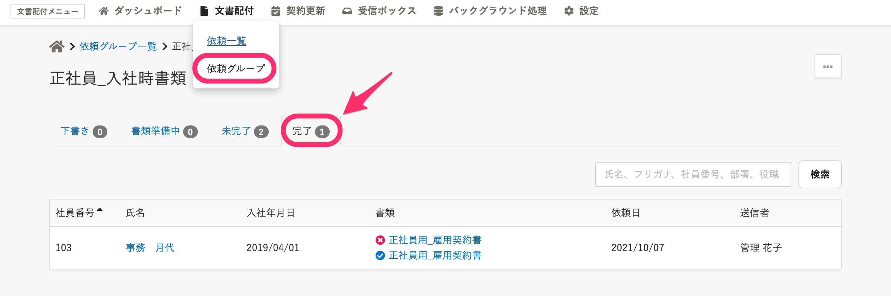
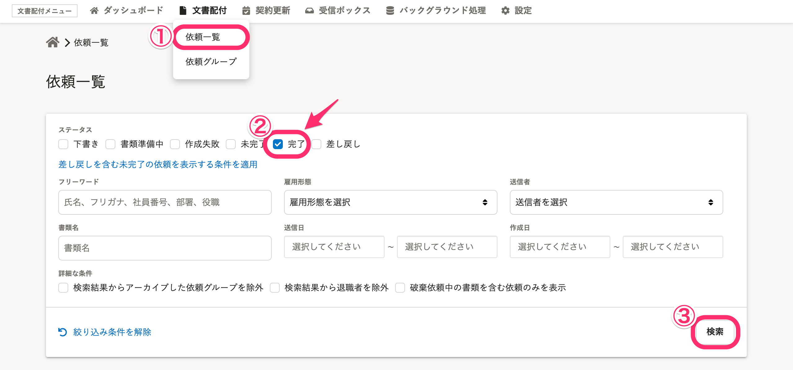
:::

## 2\. コメントを入力して［依頼］をクリック

従業員へ向けたコメントを入力し、 **［依頼］** をクリックすると、破棄依頼が送信されます。

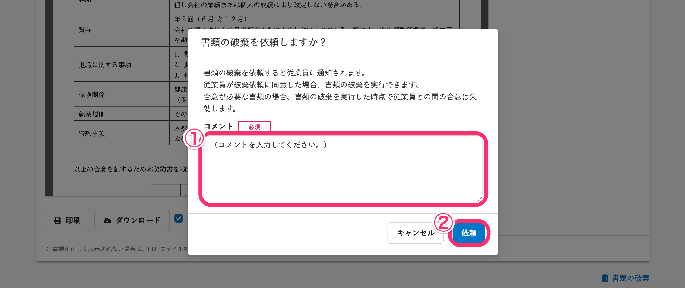

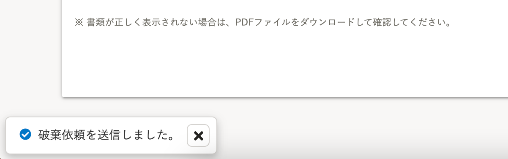

書類画面の上部に **［書類の破棄を依頼中です］** の注意書きが表示されます。

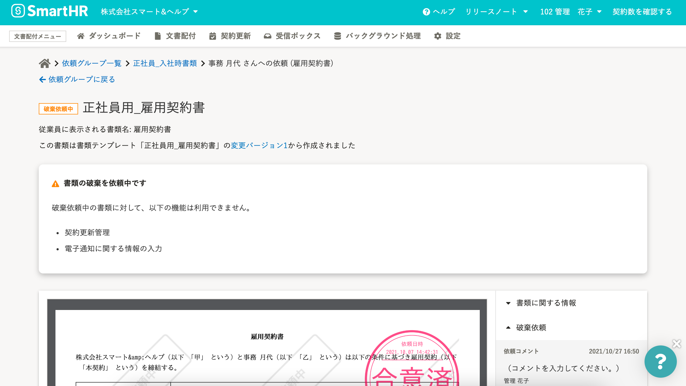

# 従業員が破棄依頼に合意した場合

## 1\. ［破棄の実行待ちの書類］をクリック

従業員が破棄依頼に合意すると、 **［ダッシュボード］** にある **［確認が必要な書類があります。下記より詳細を確認してください。］** のパネルに、 **［破棄の実行待ちの書類］** のリンクが表示されます。

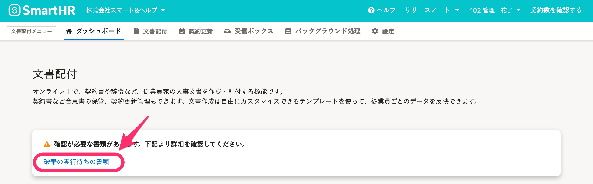

 **［破棄の実行待ちの書類］** をクリックすると、 **［確認が必要な書類］** 画面へ移動します。

## 2\. 書類名をクリック

 **［破棄実行待ち］** タブに、破棄依頼が承諾された書類が表示され、 **［書類］** 欄にある書類名をクリックすると、詳細画面へ移動できます。

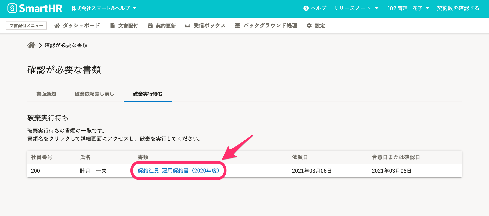

## 3\. ［破棄を実行］をクリック

書類の画面右下にある **［破棄を実行］** をクリックすると、確認のモーダルが表示されます。

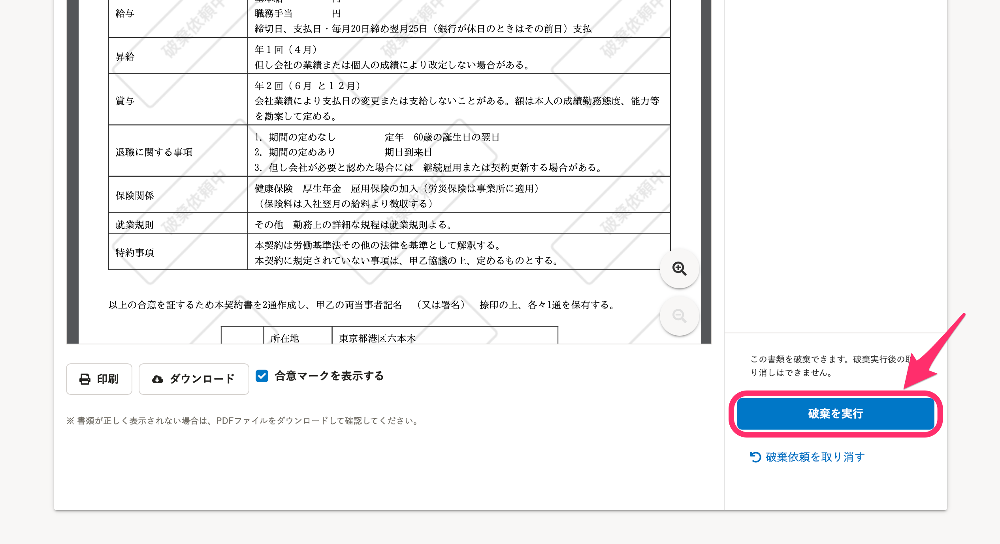

## 4\. ［破棄］をクリック

モーダルに表示された **［破棄］** をクリックすると、書類が破棄されます。

:::alert
破棄を実行すると、合意済みには戻せません。
再度合意が必要な場合は、書類への合意依頼を作成しなおしてください。
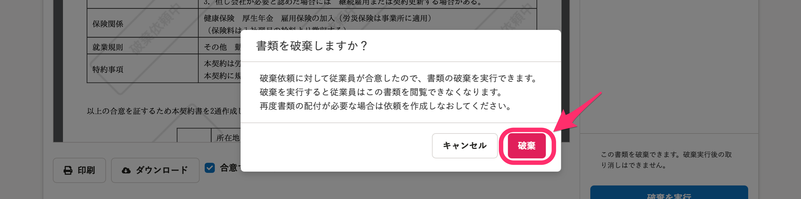
:::

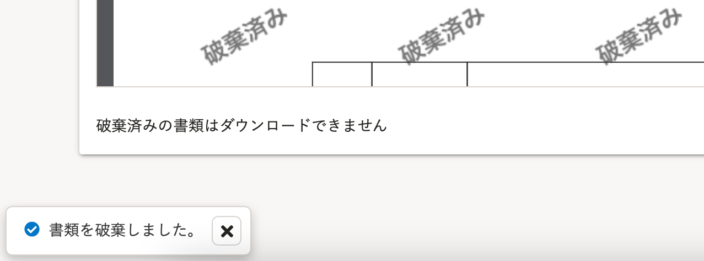

書類には **［破棄済］** のマークが表示されます。また、破棄済みの書類はダウンロードできません。

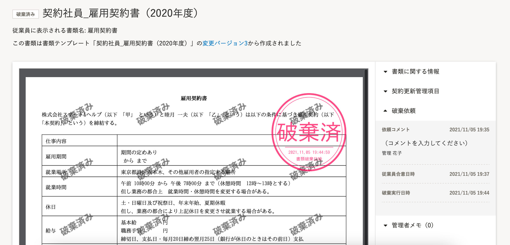

# 従業員が依頼を差し戻した場合

## 1\. ［破棄依頼が差し戻しされた書類］をクリック

従業員が破棄依頼を差し戻した場合、 **［ダッシュボード］** にある **［確認が必要な書類があります。下記より詳細を確認してください。］** のパネルに、 **［破棄依頼が差し戻しされた書類］** のリンクが表示されます。

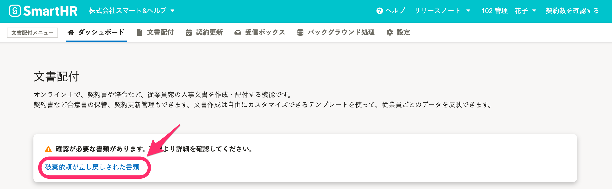

 **［破棄依頼が差し戻しされた書類］** をクリックすると、 **［確認が必要な書類］** 画面へ移動します。

## 2\. 書類名をクリック

 **［破棄依頼差し戻し］** タブに、破棄依頼が拒否された書類が表示され、 **［書類］** 欄にある書類名をクリックすると、詳細画面へ移動して従業員からのコメントを確認できます。

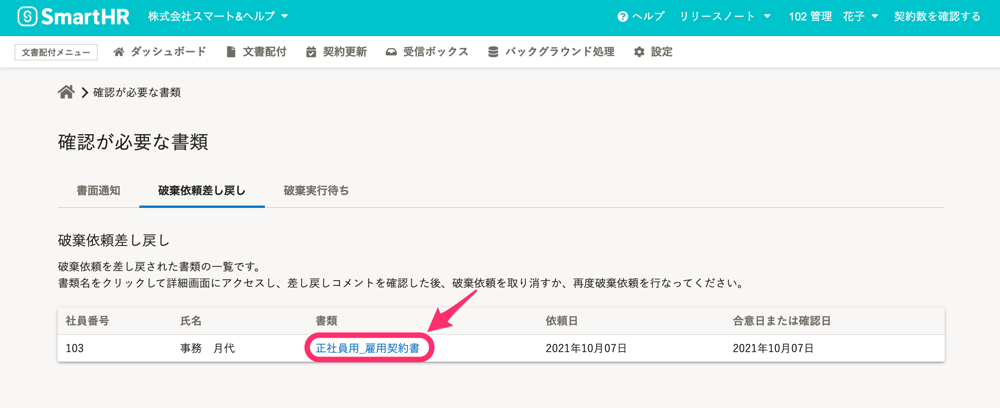

## 3\. 差し戻し理由を確認し、破棄依頼の再送または破棄依頼を取り消します

画面右側の **［差し戻しコメント］** にある従業員からのコメントを確認し、画面右下にある **［破棄依頼の再送］** をクリックして依頼を再送、または **［破棄依頼を取り消す］** をクリックして依頼を取り消してください。

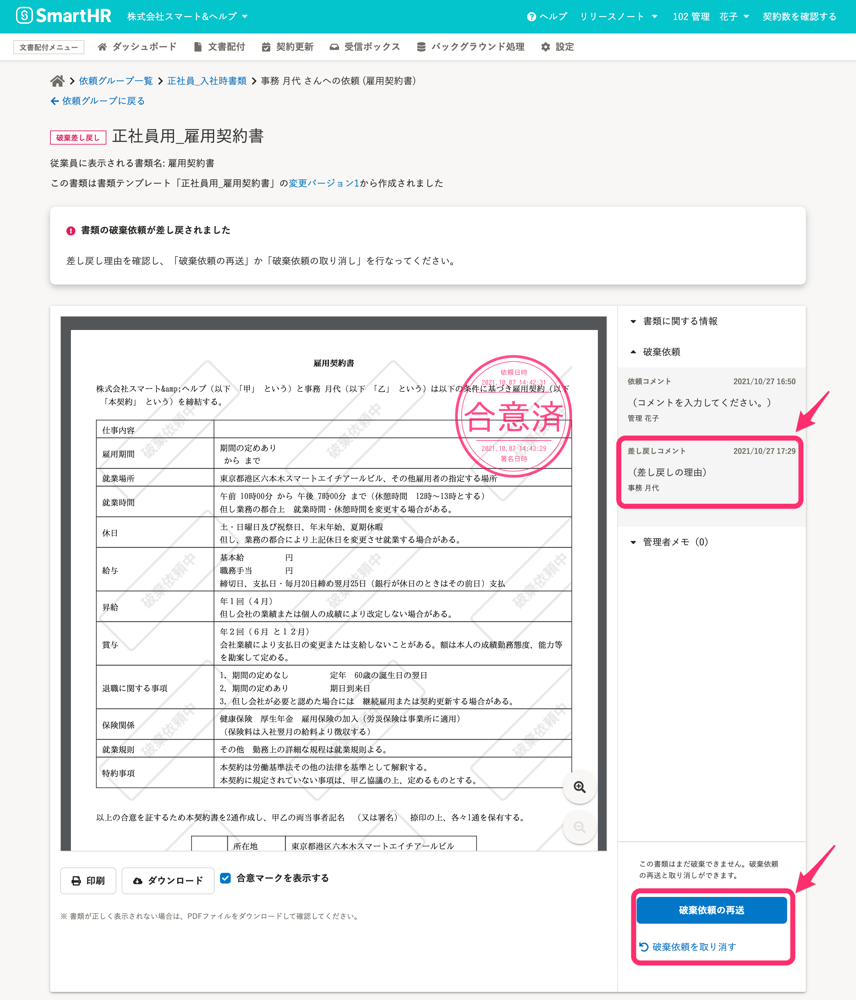

# 破棄依頼を取り消す場合

## 1\. ［破棄依頼を取り消す］をクリック

書類の詳細画面右下にある **［破棄依頼を取り消す］** をクリックすると、確認のモーダルが表示されます。

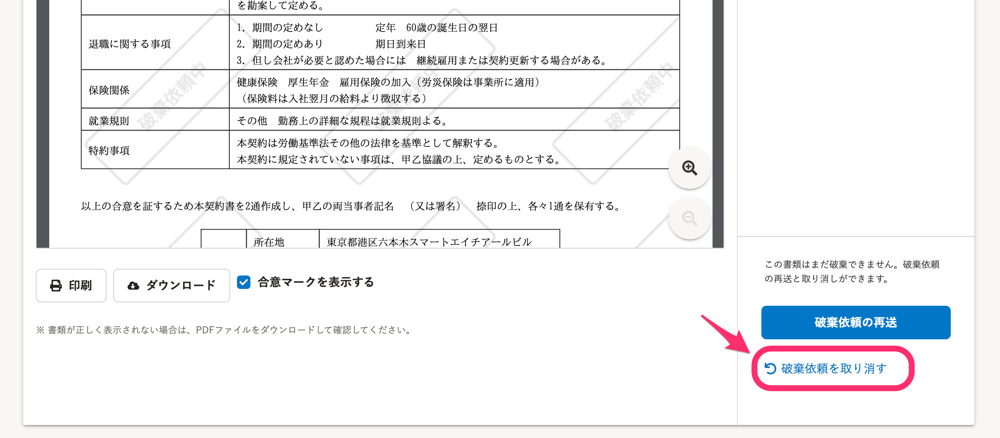

## 2\. ［取り消す］をクリック

モーダルに表示された **［取り消す］** をクリックすると、依頼が取り消されます。

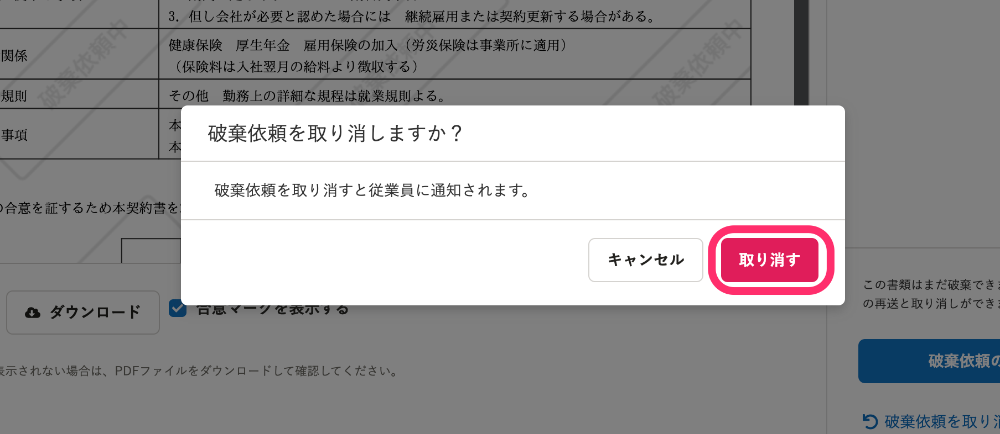

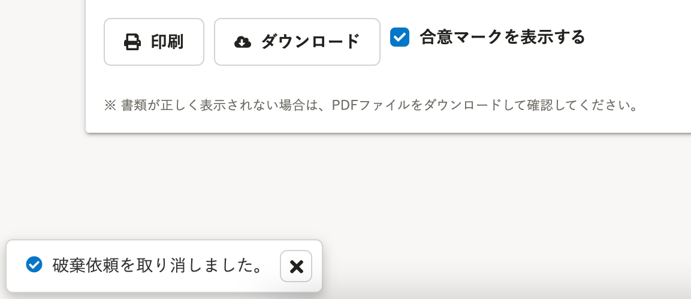

依頼を取り消すと、従業員に通知が送られます。

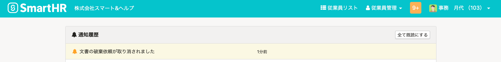

従業員のダッシュボードから、破棄依頼のパネル表示や差し戻しのステータス表示はなくなります。

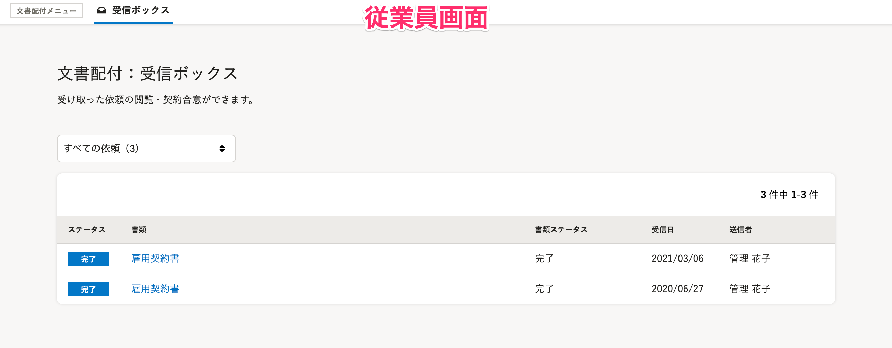

:::tips
破棄を依頼したときの従業員画面を確認するには、下記のページをご覧ください。
[書類の破棄依頼が届いたら？](https://knowledge.smarthr.jp/hc/ja/articles/360047258053)
:::
