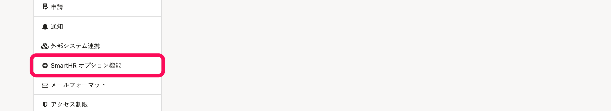
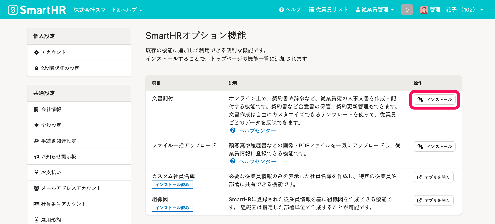
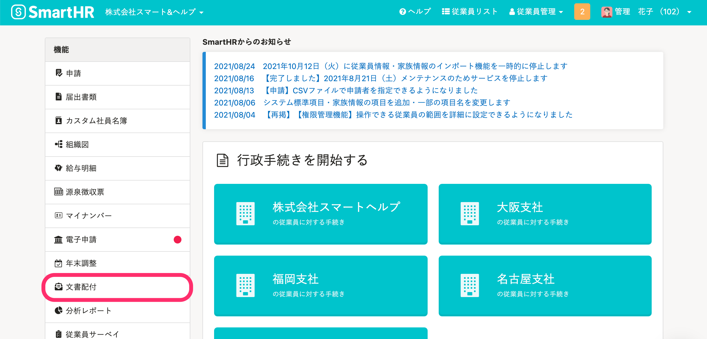

文書配付機能をSmartHRで利用開始する手順を説明します。

# SmartHR に文書配付機能を追加する

文書配付機能は、オプション機能です。

オプション機能を有効にすると、SmartHR の機能メニューに **［文書配付］** が追加されます。

## 1.［共通設定］>［SmartHR オプション機能］をクリック

画面右上の **［アカウント名▼］** \> **［共通設定］** をクリックします。

画面左下にある **［SmartHR オプション機能］** をクリックすると、 **［SmartHR オプション機能］** 画面が表示されます。

## 2\. ［文書配付］の［インストール］をクリック

 **［SmartHR オプション機能］** 画面の中から、 **［文書配付］** の項目の **［インストール］** をクリックすると、機能が追加されます。

 **［アプリを開く］** をクリックすると、文書配付機能のダッシュボードに移動します。

次回以降は、トップページ左側の機能メニューに表示される **［文書配付］** から利用できます。

:::tips
SmartHRにログインしている方であれば誰でも無料でご利用いただけるオンライン学習コンテンツ「SmartHRスクール」にも、文書配付機能についてのコースをご用意しています。
合わせてご活用ください。
[SmartHRスクール 文書配付機能のはじめかた](https://school.smarthr.jp/gu-yong-qi-yue-ji-neng-nohazimekata)
:::
