テンプレート変数とは、テンプレート内に埋め込んだ、代入可能な数値や文字列のことです。

テンプレート変数を利用すると、テンプレートから書類を作成する時に自動的に依頼日、署名日、そしてSmartHRに登録されているデータを呼び出し、書類に反映します。

# テンプレート変数の挿入はツールバーから

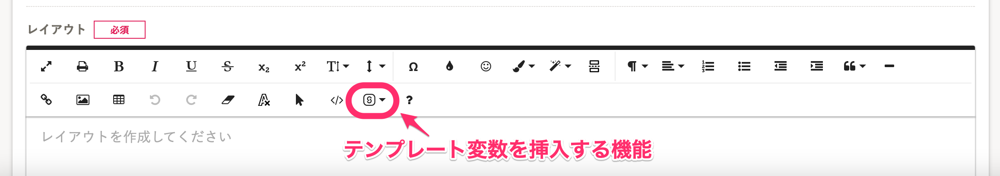

書類テンプレートの作成・編集画面のエディタのツールバーから、テンプレート変数を挿入できます。

テンプレート変数を使って書類テンプレートを作成する手順を以下のとおりです。

## 1\. ［設定］>［書類テンプレート］をクリック

画面上部の文書配付メニューから **［設定］** \> **［書類テンプレート］** をクリックして、書類テンプレート一覧を表示します。

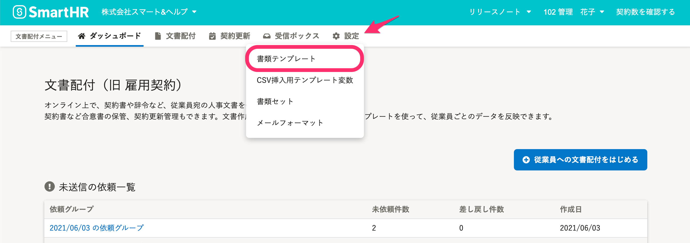

## 2\. ［+ テンプレートの作成］をクリック

書類テンプレート一覧画面右にある、 **［+ テンプレートの作成］** をクリックして、書類テンプレート作成画面を表示します。

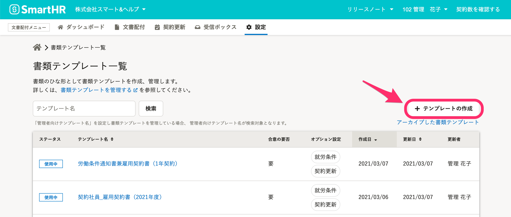

### 既存の書類テンプレートを編集する場合は、プレビュー画面の［  編集］をクリック

書類テンプレート一覧から編集したい書類テンプレート名をクリックして、テンプレート詳細画面右上の **［  編集］** をクリックします。

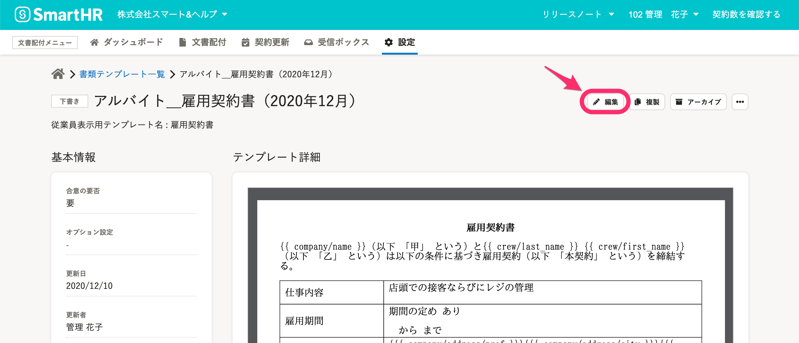

## 3\. 挿入箇所にカーソルを移動し、ツールバーの［SmartHRのデータを挿入する］アイコンをクリック

レイアウト作成画面で書類テンプレートを作成します。

テンプレート変数を挿入したい箇所にカーソルを動かしたら、ツールバーの **［SmartHRのデータを挿入する］** アイコンをクリックします。

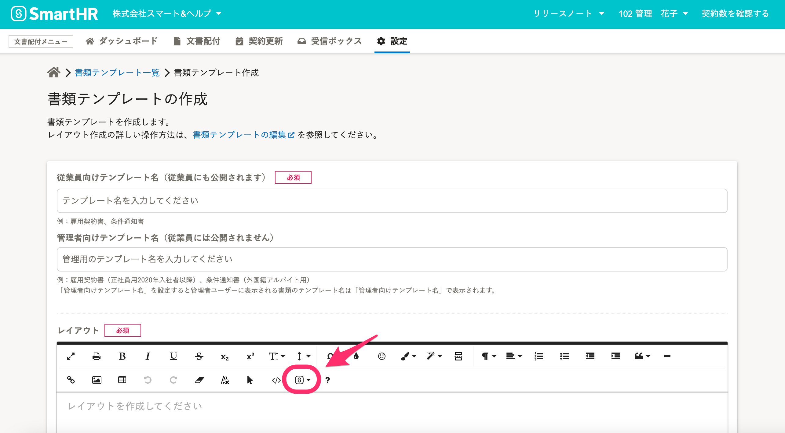

## 4.テンプレート変数を挿入する

 **［SmartHRのデータを挿入する］** アイコンをクリックすると、テンプレート変数の項目が表示され、項目を選ぶと、テンプレート変数が挿入されます。

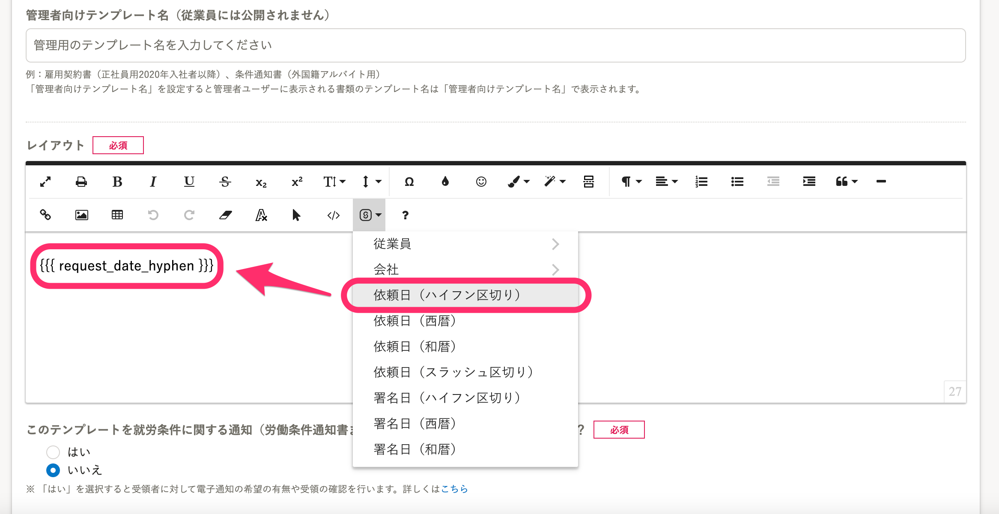

SmartHRに登録されている従業員情報、会社情報の項目を選択する場合は、 **［従業員］** または **［会社］** をクリックし、下層の項目を選択することができます。

例えば、従業員名の場合は、 **［従業員］** \> **［名］** の順に選択してください。

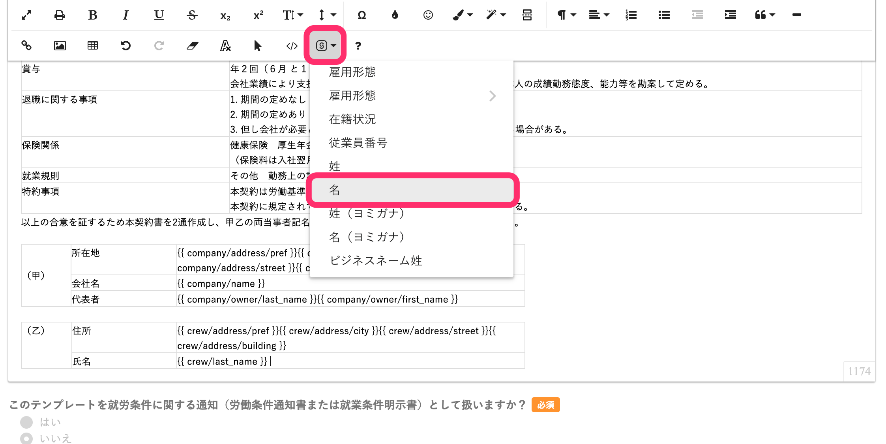

テンプレート作成・編集画面の下にはラベル名とテンプレート変数、サンプルデータの対応表があります。参考にしながら、作成してください。

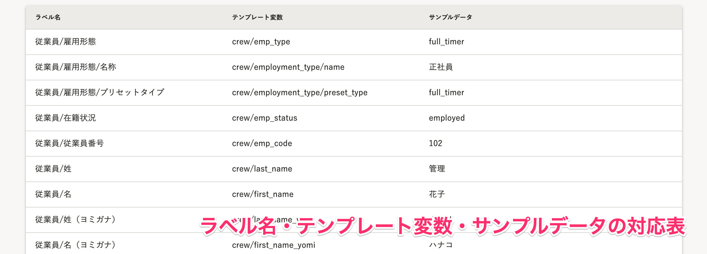

## 5\. 書類テンプレートの内容を入力し終えたら、テンプレート名の設定を確認し、［登録］をクリック

エディタを操作して書類テンプレートを作成し、 **［登録］** をクリックして保存します。

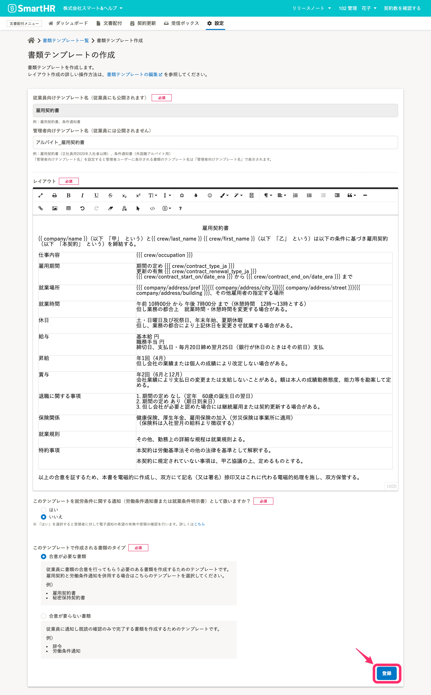

# 従業員が受け取る書類画面での表示

変数を使った書類テンプレートで作成される書類は、プレビュー画面から確認できます。

挿入した変数は、従業員が受け取る書類で以下のように反映されます。

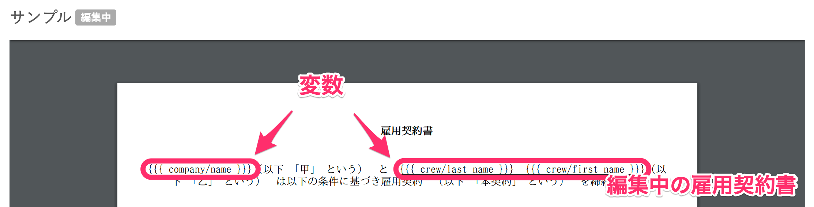

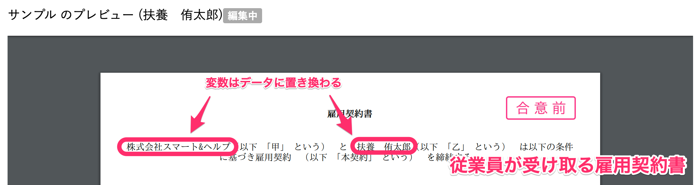

:::related
[データを反映した状態でテンプレートを確認する](https://knowledge.smarthr.jp/hc/ja/articles/360026104494)
:::

# カスタム従業員項目を挿入するには

書類テンプレートには、システム標準の従業員項目に加え、管理者が追加で設定した従業員項目のデータも挿入できます。

## 1\. ［SmartHRのデータを挿入する］>［従業員］の順にクリック

カスタム従業員項目を書類テンプレートに挿入するには、まず編集画面からエディタ機能の **［SmartHRのデータを挿入する］** を押し、 **［従業員］** を選択します。

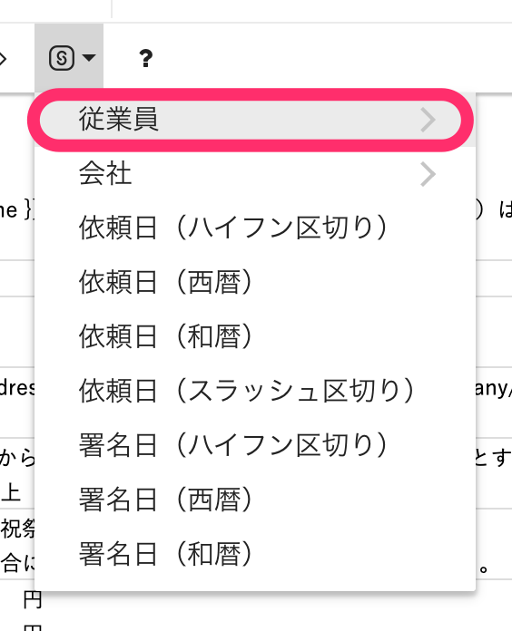

## 2\. ［従業員項目］をクリック

 **［従業員］** をクリックすると開くメニューをスクロールし、一番下にある **［従業員項目］** を選びます。

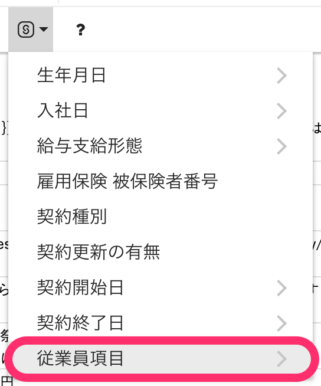

## 3\. ［従業員項目］から挿入したい項目をクリック

 **［従業員項目］** をクリックすると表示される項目から挿入したい項目を選びます。

項目数が多い場合、メニュー内をスクロールする必要があります。

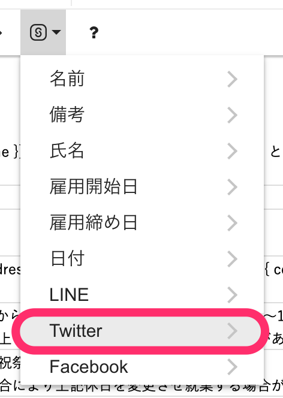

## 4\. ［項目名］か［値］をクリック

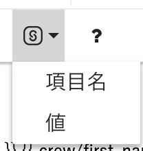

 **［項目名］** を選択すると、従業員項目のラベル名が表示されます。

 **［値］** を選択すると、項目と対応する従業員のデータが表示されます。

:::related
[カスタム従業員項目を追加する](https://knowledge.smarthr.jp/hc/ja/articles/360026265513)
:::
