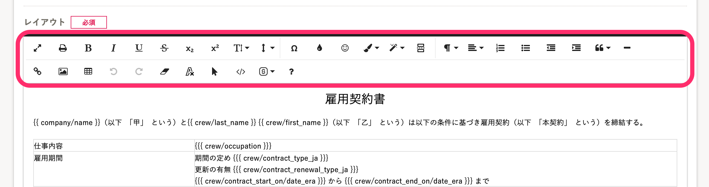
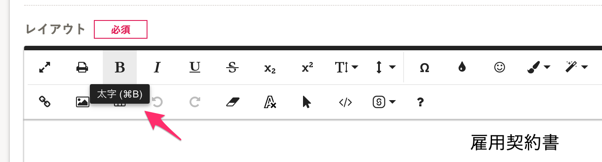
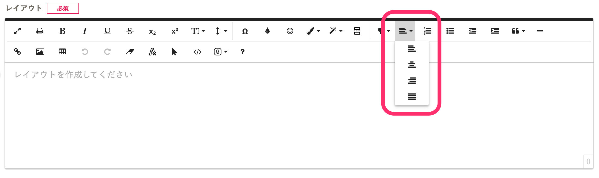
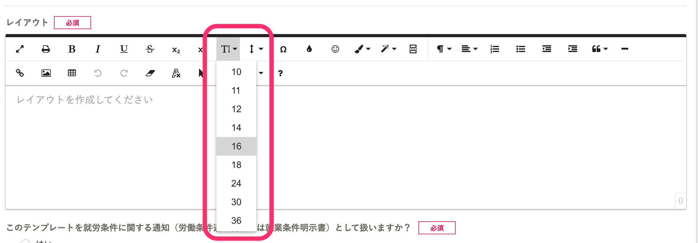
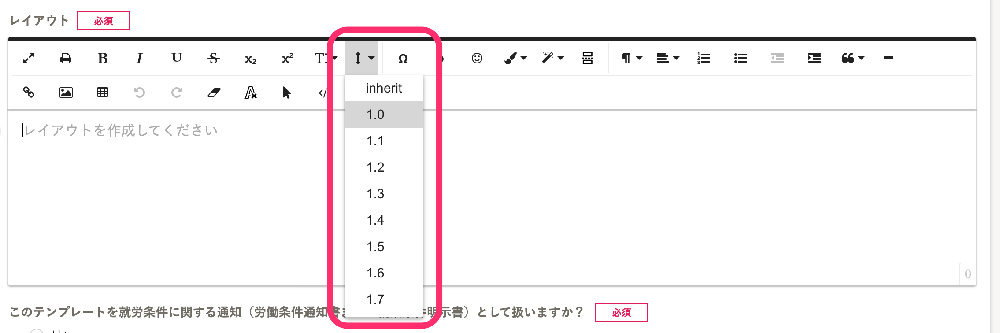
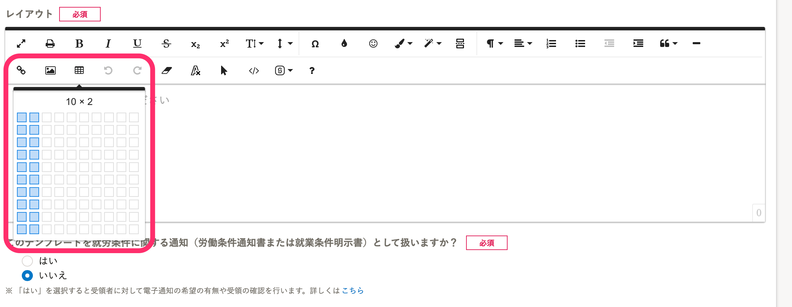
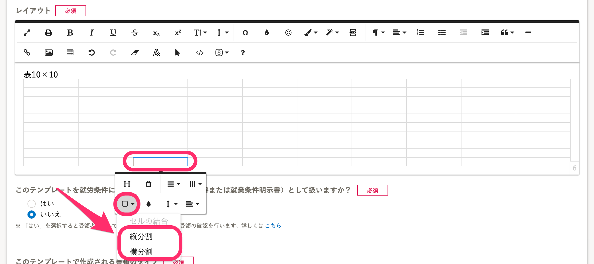
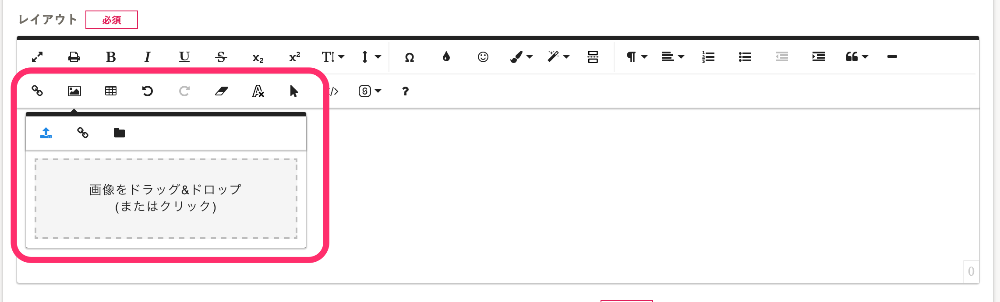
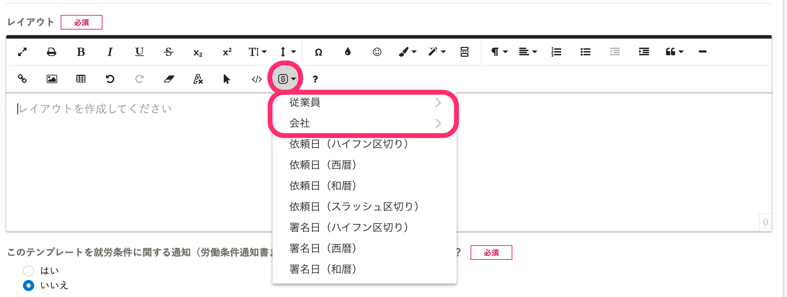
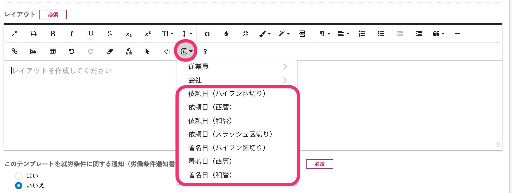

書類テンプレートの文字サイズ変更や、テキストの配置を設定するには、レイアウトエリア上部にある、ツールバーを使います。

カーソルを合わせると、ツール名が表示されます。

# テンプレートのレイアウトを整える主なツール

ツールバーから利用できるツールのうち、使用頻度の高いものを紹介します。

## テキストの配置（左、中央、右揃え）を変更する

## 文字サイズを変更する

## テキストの行間を調整する

## 表組みを作成する

:::tips
エディタの表マークからは 10×10 までの表を作成できます。
10×10 以上の表を作成する場合は、セルを **［縦分割］** または **［横分割］** することによって、縦列、横列を増やせます。

:::

## 画像ファイルを挿入する

挿入できる画像は、jpeg（jpg）、png、gifのいずれかの形式で、サイズ上限は5MBです。

さらに知りたい場合は、エディタツールバーの **［？］** をクリックしてご確認ください。

:::related
[書類テンプレートのフォントや書式を揃える](https://knowledge.smarthr.jp/hc/ja/articles/360037376833)
:::

# 書類テンプレートにテンプレート変数を挿入する

## SmartHR の従業員項目を挿入する

## 書類に紐づく日付を挿入する

:::related
[SmartHRの従業員項目を書類テンプレートに挿入する](https://knowledge.smarthr.jp/hc/ja/articles/360036818773)
[SmartHRの従業員項目以外のデータを書類テンプレートに挿入する](https://knowledge.smarthr.jp/hc/ja/articles/360054592174)
:::
