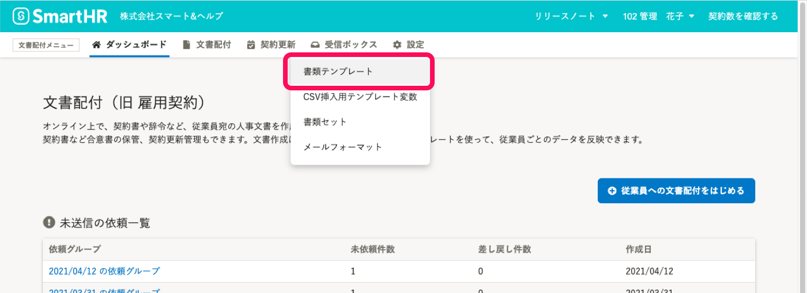
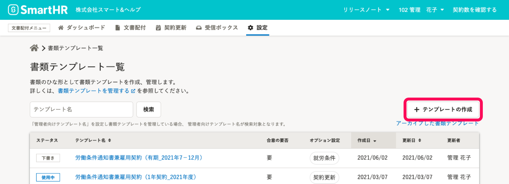
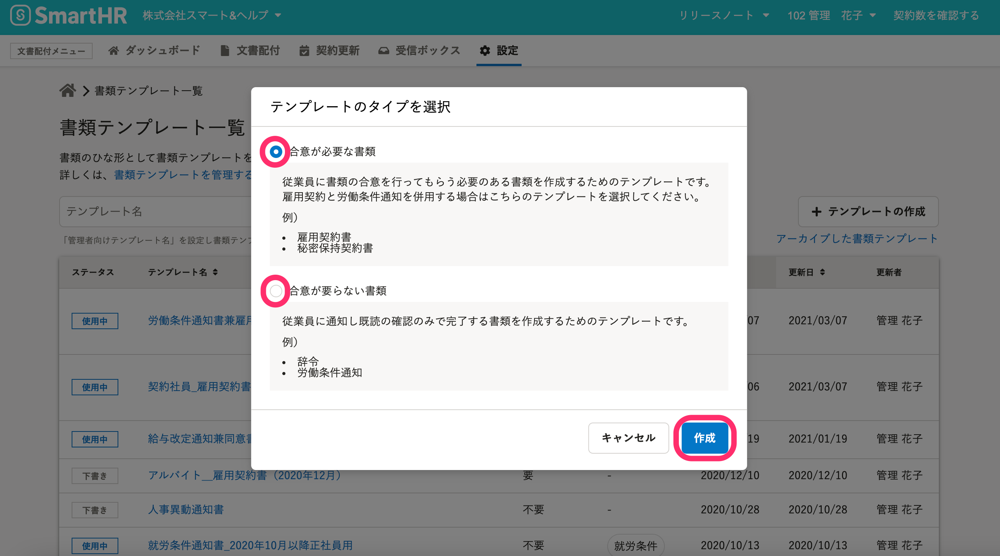
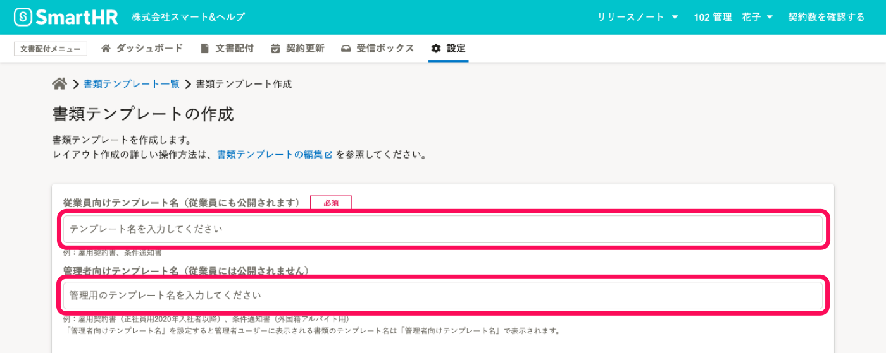
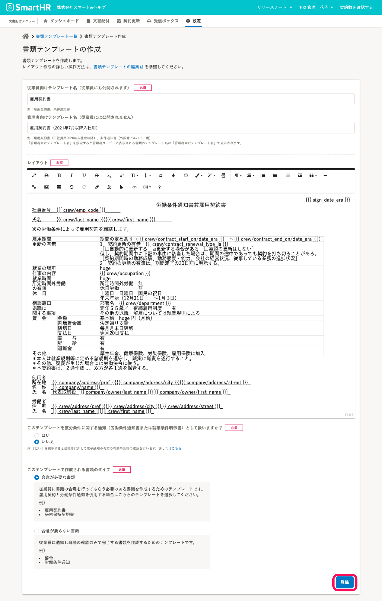
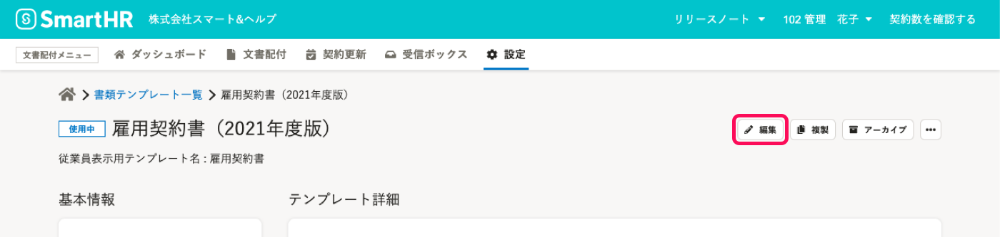
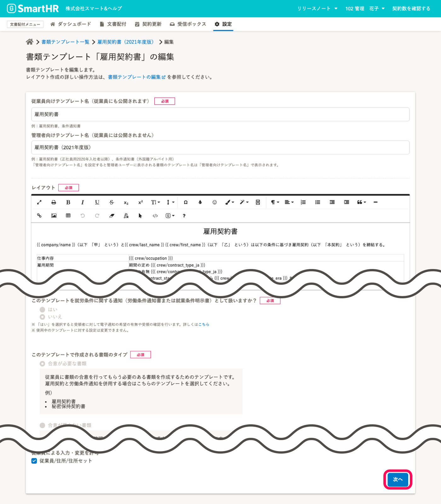
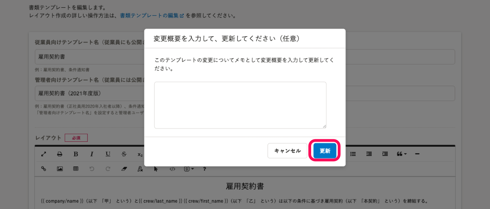

# 書類テンプレートとは

従業員に配付する書類のひな形を **書類テンプレート** と呼びます。

書類テンプレート内に **テンプレート変数** を挿入しておくと、依頼時に従業員ごとの情報を差し込んだ書類を作成できます。

:::related
[SmartHRの従業員項目を書類テンプレートに挿入する](https://knowledge.smarthr.jp/hc/ja/articles/360036818773)
:::
:::tips
## 文書配付機能にあらかじめ用意してある書類テンプレート
- 機密・個人情報に関する誓約
- 雇用契約書
この2つの書類テンプレートは、文書配付機能をインストールした時点で、すぐに書類テンプレート一覧画面から使用できます。
こちらを編集や複製して使うことも可能です。
書類テンプレートの複製に関しては、[書類テンプレートを複製する](https://knowledge.smarthr.jp/hc/ja/articles/360026262193)で説明しています。
:::

# 書類テンプレートを作成する

## 1\. ［設定］ > ［書類テンプレート］をクリック

文書配付メニューから **［設定］** をクリックし、プルダウンリストにある **［書類テンプレート］** をクリックして、書類テンプレート一覧画面を表示します。

## 2\. ［+ テンプレートの作成］をクリック

書類テンプレート一覧画面右にある **［+ テンプレートの作成］** をクリックすると、［ **テンプレートのタイプを選択］** 画面が表示されます。

## 3\. 書類のタイプを選択する

 **［テンプレートのタイプを選択］** 画面で、テンプレートから作成する書類が  **［合意が必要な書類］** か  **［合意がいらない書類］** かを選択します。

 **［作成］** をクリックして、 **書類テンプレートの作成**画面に移動します。

**合意が必要な書類** は、従業員に合意を依頼する書類です。

受け取った従業員は内容を確認し、合意した場合は署名をします。

合意が必要な書類 は、**差し戻し** と **破棄** ができます。

**合意がいらない書類** は、従業員に確認を依頼する書類です。

受け取った従業員は内容を確認します。

:::tips
**書類のタイプ** は、書類テンプレートのステータスが **下書き** の場合のみ、書類テンプレートの編集画面で変更可能です。
[使用中の書類テンプレートの書類タイプは変更できますか？](https://knowledge.smarthr.jp/hc/ja/articles/360056793673)
:::

## 4\. テンプレート名を入力する

**テンプレート名** を入力します。 テンプレート名は2種類設定できます。

**\[従業員向けテンプレート名\]** は、従業員にも公開される名前です。

従業員宛の合意依頼メールに書類の名前として、表示されます。

「雇用契約書」や「条件通知書」などの一般的な名称を入力してください。

**\[管理者向けテンプレート名\]** は、管理者が用途を把握しやすいよう、別途設定できる名前です。

従業員に対しては公開されません。

管理者向けテンプレート名が設定されている場合、ダッシュボードや管理画面上での書類テンプレート名にはこちらが用いられます。

「雇用契約書（2020年4月入社用）」「条件通知書（外国籍アルバイト用）」など、管理用の情報をテンプレート名に含めることができます。

## 5\. 書類の文面を作成し、\[登録\] をクリック

**\[レイアウト\]** エリアで書類の文面を作成し、 **\[登録\]** をクリックして保存します。

:::tips
レイアウトの作成・編集をするツールバーの使い方は別ページで案内しています。
また、Wordからコピーしてレイアウトに貼り付けることもできます。
※Wordのレイアウトを完全に再現するものではなく、書式の情報を保持する機能となります。
詳しくは以下のページをご覧ください。
[書類テンプレート編集ツールバーの使い方](https://knowledge.smarthr.jp/hc/ja/articles/360050625734)
[Wordファイルから書類テンプレートを編集する](https://knowledge.smarthr.jp/hc/ja/articles/360036953313)
:::

**書類テンプレート一覧** 画面に切り替わり、書類テンプレートが追加されます。

登録した書類テンプレートのレイアウトを確認するには、**テンプレート名** をクリックしてテンプレートの詳細画面に移動します。

テンプレート詳細画面では、配付する書類のプレビューやテンプレートの編集などの操作ができます。

# 書類テンプレートを編集する

## 1\. 書類テンプレート詳細画面で［編集］をクリック

書類テンプレート詳細画面右上の［編集］をクリックして、書類テンプレートの編集画面を表示します。

## 2\. 必要な編集をして、［次へ］をクリック

テンプレートの編集画面で、内容を変更します。

更新を終えたら、 **［次へ］** をクリックします。（ステータスが **［下書き］** の場合のボタンは［更新］です）

:::alert
ステータスが **［使用中］** の書類テンプレートは、「テンプレート名」「レイアウト」「必須項目設定」のみ変更できます。
「就労条件通知設定」、「書類のタイプ設定」の変更はできません。
:::

## 3\. 変更概要の入力ダイアログの［更新］をクリック

ステータスが「**使用中**」の書類テンプレートを編集して保存すると、変更履歴のコメントを記入する画面が表示されます。

変更点を記録しておくと、バージョン管理をする際に便利です。

書類テンプレートのバージョン管理に関しては、[書類テンプレートを管理する](https://knowledge.smarthr.jp/hc/ja/articles/360026104474)で説明しています。

