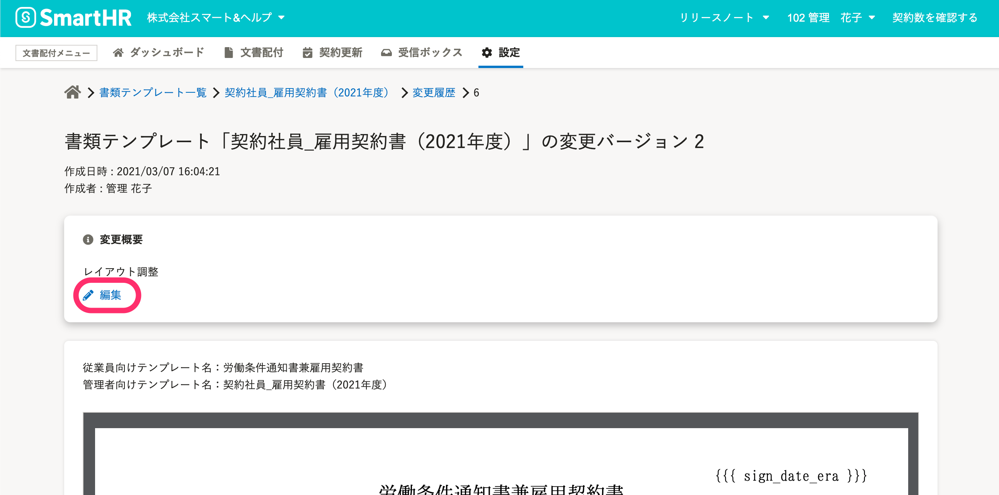

# 書類テンプレート一覧画面の使い方

## 書類テンプレートを検索する

書類テンプレートを検索するには、画面左上の検索フォームにテンプレート名を入力して **［検索］** をクリックします。

:::tips
### 書類テンプレートを検索しやすくする方法
**管理者向けテンプレート名** は、管理者が用途を把握しやすいよう、別途設定できる名前です。
管理者向けテンプレート名が設定されている場合、ダッシュボードや管理画面上での書類テンプレート名にはこちらが用いられます。従業員に対しては公開されません。

「雇用契約書（2020年4月入社用）」「条件通知書（外国籍アルバイト用）」など、管理用の情報をテンプレート名に含めることができます。
一方、 **従業員向けテンプレート名** は、従業員にも公開される名前で、従業員宛の合意依頼メールに書類の名前として、表示されます。
:::

## 書類テンプレートのステータス

書類テンプレートのステータスは2種類あり、それぞれ以下のような状態を表しています。

| ステータス | 意味 | 可能な操作 | 不可能な操作 |
| --- | --- | --- | --- |
| **下書き** | 依頼に使用されていない | テンプレートの編集、コピー、アーカイブ、削除（書類セットに使用されていない場合） | ― |
| **使用中** |   依頼に使用されている、 または合意済み書類に使用されている   | テンプレートの編集、コピー、アーカイブ | テンプレートの削除 |

# 書類テンプレートの変更履歴

同じ目的で使用される書類テンプレートは、適宜内容を更新して利用できます。

書類テンプレートを編集すると、更新・保存されるたびに変更履歴として書類テンプレートの内容が残ります。

書類テンプレートは、書類テンプレート詳細画面右上の **［ 編集］ボタン** から編集できます。

## 変更概要のコメントを添えて［更新］をクリック

ステータスが「**使用中**」の書類テンプレートを編集して保存すると、変更履歴のコメントを記入する画面が表示されます。

更新時の覚え書きを残せます。

## 書類テンプレートの変更バージョンを確認する

変更履歴を確認するには、書類テンプレート詳細画面右上の **［...］メニュー**  から **［変更履歴を表示］** をクリックし、変更履歴画面に移動します。

変更履歴画面では、変更バージョンの **数字** をクリックすると、各バージョンの書類テンプレートの内容を確認できます。

変更概要のコメントは、変更履歴画面の **［変更履歴］** 欄と、書類テンプレートのバージョン詳細画面の上部に表示されます。

作成者本人は、バージョン詳細画面から変更概要を追加・編集できます。

 **［ 編集］** をクリックすると、変更概要の更新画面が表示されます。

変更概要を編集し、 **［更新］** をクリックします。

:::alert
変更概要の編集は作成者本人しかできません。
:::

## 合意済み書類の書類テンプレートのバージョンを確認する

合意済み書類の確認画面では、作成に使われた書類テンプレートのバージョンが表示されます。

# 書類テンプレートをアーカイブする

書類テンプレートのアーカイブは、書類テンプレート詳細画面右上の **［ アーカイブ］** をクリックします。

アーカイブした書類テンプレートの一覧を表示するには、書類テンプレート一覧画面の右上の **［アーカイブした書類テンプレート］** をクリックします。

アーカイブした書類テンプレートを戻すには、書類テンプレート一覧（アーカイブ済み）からアーカイブから戻したいテンプレートの名前をクリックして書類テンプレート詳細画面を開き、画面右上の **［ アーカイブから戻す］** をクリックします。

# 書類テンプレートを削除する

:::alert
削除できる書類テンプレートは、**書類セットに使用していないテンプレート** に限ります。
書類セットに使用している場合、ステータスが「下書き」であっても削除できません。
:::

書類テンプレート詳細画面右上の **\[ 削除\]** をクリックします。

