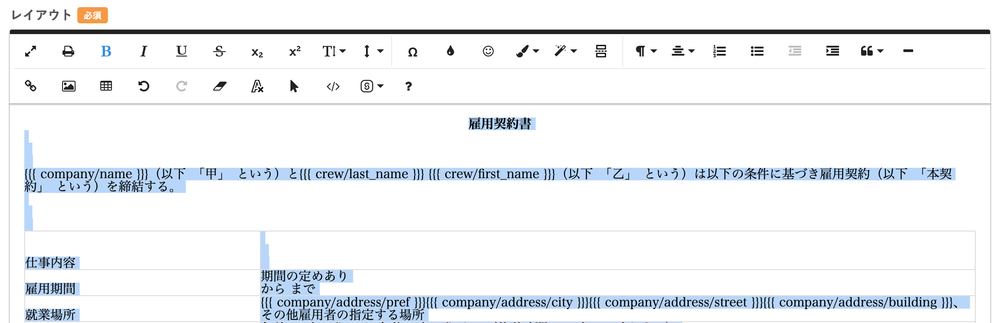
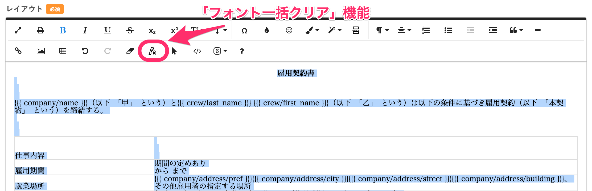
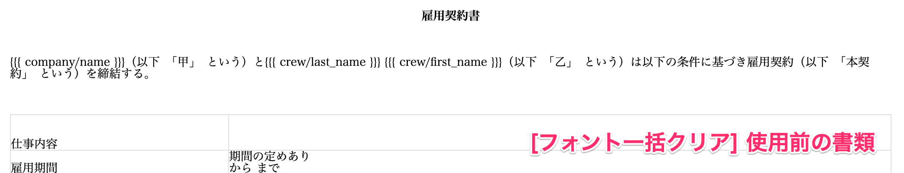
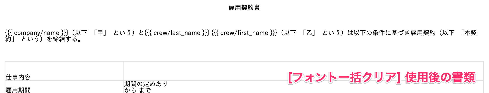
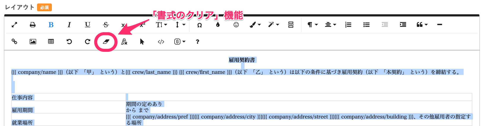
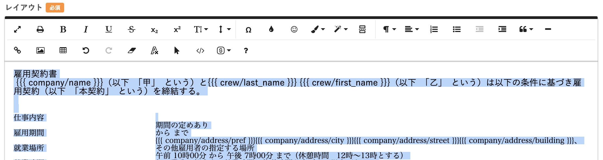
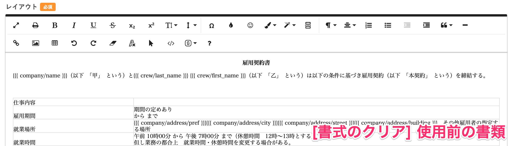
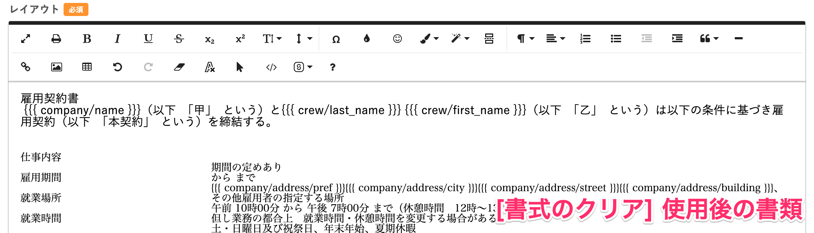

書類テンプレートの書体を揃えるには、ツールバーにある **フォント一括クリア** 機能を使います。

フォントサイズを揃えたいときも、この機能を使ってください。

書体の指定だけでなく、同時に太字、斜体、下線、テキストの配置設定などレイアウトもリセットするには、 **書式のクリア** 機能を使います。

# \[フォント一括クリア\] 機能の操作手順

## 1\. フォントを揃えたいテキストを選択する

書類テンプレート編集画面を表示し、レイアウトエリアのテキストを全選択します。

## 2\. ツールバーの \[フォント一括クリア\] をクリック

テキストを選択した状態のまま、ツールバーの **\[フォント一括クリア\]** 機能のアイコンをクリックします。

選択範囲に適用されていたフォントが解除されます。

# \[書式のクリア\] 機能の操作手順

## 1\. 書式をクリアしたいテキストを選択する

書類テンプレート編集画面を表示し、レイアウトエリアのテキストを全選択します

## 2\. ツールバーの \[書式のクリア\] をクリック

テキストを選択した状態のまま、ツールバーの **\[書式のクリア\]** 機能のアイコンをクリックします。

選択範囲に適用されていたフォント、文字のサイズ指定、レイアウトなどが解除されます。

:::alert
**\[書式のクリア\]** を使用すると、選択範囲に含まれているテーブルも削除されます。

:::
